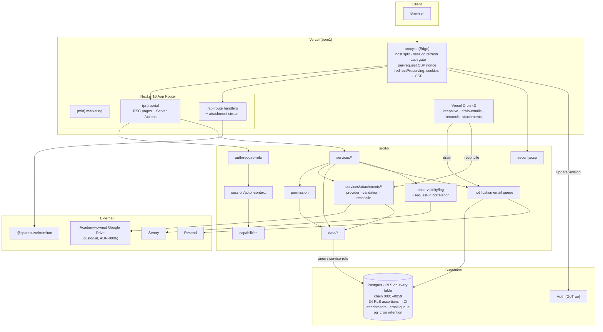

# Cert-Ed Academia — Full Architecture & Codebase Audit

- **Date:** 2026-08-12 · **Revision 11** (living document; supersedes revisions 1–10. Filename reflects the first pass.)
- **Repository:** `c:\laragon\www\wed_cert` (package `cert-ed-academia`)
- **Branch:** `feature/cert-ed-academia-app` @ `8b24eaf` · **working tree clean**
- **Method:** read-only static analysis + live execution of `build` (clean `.next`), `typecheck`, `test:coverage`, `lint`, `format:check`, `check:bundle`, `check-snapshot-freshness`, `playwright test` (full suite **and the failing spec in isolation**), `npm audit`, and `scripts/test-rls.sh` against real Postgres 18
- **Scope:** Phases 1–19 of the audit brief

---

## 0. Revision 11 — ten of eleven gates green; one defect isolated further

The 30-plus commits audited in revision 10 were squashed into **eight coherent commits**, and
the working tree is fully clean. Three findings closed, including one flagged in six
consecutive passes.

**NEW-23 persists**, and this pass narrows it materially: it **fails in isolation**, which
rules out the cross-spec-pollution explanation that resolved NEW-15, and it was unaffected by
the NEW-24 fix.

### Verification results

| Command                 | R8    | R9    | R10   | R11                           |
| ----------------------- | ----- | ----- | ----- | ----------------------------- |
| `npm run typecheck`     | ✅    | ✅    | ✅    | ✅                            |
| `npm run lint`          | ✅    | ✅    | ✅    | ✅                            |
| `npm run format:check`  | ⚠️    | ✅    | ✅    | ✅                            |
| `npm test`              | 809   | 834   | 875   | ✅ **876 passed (114 files)** |
| `npm run test:coverage` | ❌    | ✅    | ✅    | ✅ **all four clear**         |
| `npm run build`         | ✅    | ✅    | ✅    | ✅ **0 warnings**             |
| `npm run check:bundle`  | ✅    | ✅    | ✅    | ✅ **127.4 / 145 KB**         |
| `npx playwright test`   | ❌ 3  | ❌ 3  | ❌ 1  | ❌ **1 failed / 64 passed**   |
| Snapshot freshness      | ❌    | ✅    | ✅    | ✅ **0059 current**           |
| `scripts/test-rls.sh`   | ✅ 26 | ✅ 26 | ✅ 34 | ✅ **34 passed (CI job)**     |
| `npm audit --omit=dev`  | ✅    | ✅    | ✅    | ✅ **0**                      |

### The eight commits

```
8b24eaf feat(dashboard): grade trajectory, reports, and dashboard performance
c10a31e perf, security: caching, request correlation, and nonce CSP
c4b19b8 perf(notifications): move email fan-out to a drained queue
56be283 feat(attachments): custodial Google Drive storage
6734e9a docs: accuracy sweep, operational runbooks, index, and guardrails
129c913 test: attachments round-trip, access-control, and E2E de-flaking
9a1f8f7 chore(tooling): CI gates, hooks, and dependency hygiene
d888d7c feat(db): attachments, email queue, and audit retention (0057-0059)
```

Sliced by concern — DB first, then tooling, tests, docs, then feature by feature. A reviewer
can take these one at a time; the 30-commit version could not be read that way.

### Findings closed this pass

| ID            | Finding                                                                      | Evidence                                                                                                                                                                                                                                                                                                                                                                                                                 |
| ------------- | ---------------------------------------------------------------------------- | ------------------------------------------------------------------------------------------------------------------------------------------------------------------------------------------------------------------------------------------------------------------------------------------------------------------------------------------------------------------------------------------------------------------------ |
| **NEW-24** 🟡 | Proxy redirects discarded refreshed session cookies **and** the CSP header   | ✅ **Fixed exactly as recommended.** `redirectPreserving(url, base)` copies `base.cookies.getAll()` onto the redirect and re-sets `Content-Security-Policy`, with the reasoning in the comment: _"A bare `NextResponse.redirect` starts from a blank response and drops…"_. Applied to every redirect branch.                                                                                                            |
| **NEW-25** 🟢 | ADR-0006 marked Proposed while already implemented                           | ✅ `0006` → **Accepted — implemented**, naming the migration (`0057`), the code paths (`src/lib/services/attachments/*`, `src/lib/data/attachments.ts`) and the removal of `drive-share.ts`. `0004` → **Superseded by 0006**.                                                                                                                                                                                            |
| **H3** 🟢     | No `playwright-report/` artifact upload — **flagged six consecutive passes** | ✅ Now in `.github/workflows/ci.yml`.                                                                                                                                                                                                                                                                                                                                                                                    |
| **§2.3** 🟡   | Custodial-storage operations undocumented                                    | ✅ Largely closed by `6734e9a` — [docs/operations.md](docs/operations.md) covers backups/restore, monitoring, incident response and a common-failures table that includes _"Uploaded file won't open"_ → check the four `GOOGLE_DRIVE_*` vars and the attachment's `status`, _"the reconcile job sweeps stuck `pending` rows"_. Joined by `deployment.md`, `environment.md`, `production-checklist.md` and a docs index. |

### Still open

| ID                    | Finding                                                                                                | Severity  |
| --------------------- | ------------------------------------------------------------------------------------------------------ | --------- |
| **NEW-23**            | Admin E2E journey loses its session after class creation — **now confirmed reproducible in isolation** | 🟠 High   |
| **FIND-35**           | Restore drill documented but never performed                                                           | 🟡 Medium |
| **FIND-29**           | No dark mode — `grep "dark:"` → **0** for the eleventh consecutive pass                                | 🟡 Medium |
| **Coverage headroom** | Branches clear the ratchet by **0.05 points**                                                          | 🟡 Medium |
| **M5**                | Bundle ratchet 145 → 133 not taken — flagged six passes                                                | 🟢 Low    |

---

## 1. Executive Summary

Cert-Ed Academia is a Next.js 16 App Router monolith serving two hosts from one codebase: a
public marketing site (`certedacademia.com`) and a private academy portal
(`app.certedacademia.com`), on Supabase (Auth + Postgres with RLS) and Vercel.

This was a consolidation pass rather than a feature pass: history squashed into eight
readable commits, the documentation set restructured with an index and operational runbooks,
and three findings closed — one of which had been carried for six passes.

Ten of eleven gates pass. The single failure, NEW-23, is now better characterised than at any
point: it reproduces in isolation, so it is a genuine defect in the create-class flow rather
than test-state pollution, and the NEW-24 fix did not touch it.

| #   | Problem                                                                          | Severity  |
| --- | -------------------------------------------------------------------------------- | --------- |
| 1   | Admin journey loses its session after class creation — reproducible in isolation | 🟠 High   |
| 2   | Restore drill documented but never performed                                     | 🟡 Medium |
| 3   | Branch coverage clears the ratchet by 0.05 points                                | 🟡 Medium |
| 4   | No dark mode, while the app advertises a dark `themeColor`                       | 🟡 Medium |
| 5   | Bundle ratchet not taken                                                         | 🟢 Low    |

**Overall project health: 9.5 / 10** (7.4 → 7.9 → 8.6 → 8.9 → 9.1 → 9.2 → 9.2 → 8.9 → 9.0 →
9.4 → 9.5).

---

## 2. Project Overview (Phase 1)

### 2.1 Stack

| Concern       | Technology                                                                                                       |
| ------------- | ---------------------------------------------------------------------------------------------------------------- |
| Framework     | Next.js 16.3, App Router, Turbopack build                                                                        |
| Language      | TypeScript 5, `strict: true`                                                                                     |
| UI            | React 19.2, Tailwind CSS v4                                                                                      |
| Edge          | `src/proxy.ts` — host split, session refresh, auth gate, per-request CSP nonce, **cookie-preserving redirects**  |
| Database      | Supabase Postgres, RLS on every table, chain `0001`–`0059`, `pg_cron` retention + queue drain                    |
| Auth          | Supabase Auth (password + gated Google sign-in), allowlist-first                                                 |
| File storage  | Custodial — academy-owned Google Drive ([ADR-0006](docs/adr/0006-custodial-attachment-storage.md), **Accepted**) |
| Validation    | Zod v4                                                                                                           |
| Email         | Resend, drained from a queue off the request path                                                                |
| Observability | `logError` → stderr + Sentry, correlated by request id                                                           |
| Testing       | Vitest 4 (114 files, 876 tests) + coverage ratchet + Playwright (65 specs) + RLS harness (34 assertions)         |
| CI            | `verify` + `e2e` (**with report artifact**) + `rls` jobs, plus a pre-push snapshot guard                         |
| Hosting       | Vercel, region `bom1`, 3 crons                                                                                   |

### 2.2 Bundle profile

```
First-load shared JS (gzipped): 127.4 KB across 4 chunks
Budget (firstLoadSharedKb):     145 KB
Headroom:                       17.6 KB  → script suggests ratcheting to 133
```

Flat across five passes. The script has now printed the same ratchet suggestion six times.

### 2.3 Documentation set

`6734e9a` restructured the docs materially:

| Document                                                                                                                                                                                | Purpose                                                                             |
| --------------------------------------------------------------------------------------------------------------------------------------------------------------------------------------- | ----------------------------------------------------------------------------------- |
| [docs/README.md](docs/README.md)                                                                                                                                                        | Index                                                                               |
| [docs/where-to-find-what.md](docs/where-to-find-what.md)                                                                                                                                | Navigation for a new developer — _"responsibilities go downward and never back up"_ |
| [docs/operations.md](docs/operations.md)                                                                                                                                                | Day-2: backups/restore, monitoring, incident response, common-failures table        |
| [docs/deployment.md](docs/deployment.md)                                                                                                                                                | First-time provisioning                                                             |
| [docs/environment.md](docs/environment.md)                                                                                                                                              | Environment variables                                                               |
| [docs/production-checklist.md](docs/production-checklist.md)                                                                                                                            | Pre-launch gate                                                                     |
| `docs/archive/`                                                                                                                                                                         | Superseded material, moved rather than deleted                                      |
| 6 ADRs, fk-cascade-inventory, rls-policy-inventory, schema-reference, migration-checklist, persona-model, workflow-invariants, api-reference, application-standards, architecture-rules | Reference                                                                           |

The operations runbook is notably candid: _"a backup you have never restored is a hypothesis"_
and _"running without backups is not a risk posture, it is the absence of one."_ It also
records what to measure — _"Record how long it took — that is your RTO."_

### 2.4 Authorization model

Unchanged ([ADR-0002](docs/adr/0002-capability-first-route-guards.md),
[ADR-0003](docs/adr/0003-personas-as-fixed-identities.md)):

```
hard rule  >  explicit deny  >  explicit allow  >  persona default
```

Both layers verified — 34 RLS assertions in CI plus unit and E2E coverage of the app layer.

### 2.5 Architecture diagram



---

## 3. Open Findings

---

### NEW-23 · Admin journey loses its session after class creation — 🟠 High _(carried, now narrowed)_

```
ADMIN -- create class -> enrol -> announce -> issue receipt -> add user
  getByRole('heading', { name: 'E2E Physics G11' }) — element(s) not found
```

**New evidence this pass — the finding is now materially better characterised:**

| Test                                                        | Result                      | What it rules out                                                                                             |
| ----------------------------------------------------------- | --------------------------- | ------------------------------------------------------------------------------------------------------------- |
| Full suite (65 specs)                                       | ❌ fails, both attempts     | —                                                                                                             |
| **`journeys.pw.ts` alone** (6 other specs in the file pass) | ❌ **fails, both attempts** | **Cross-spec pollution.** This is not NEW-15's cause.                                                         |
| After the NEW-24 `redirectPreserving` fix                   | ❌ unchanged                | The discarded-cookie mechanism — consistent with the failing request being a page GET, not a redirect branch. |

The page snapshot shows the login form (`heading "Welcome back"`, _"Sign in with your email
and password"_, `button "Sign in"`) rendered inside the portal shell.

**Established sequence:**

1. `loginAs(page, 'admin@mock.test')` succeeds — it waits for `**/dashboard`.
2. `page.goto('/classroom')` succeeds and the New-class form is found, so the session is valid.
3. `createClassAction` succeeds — `requireRole(['admin'])` passes and the class is created.
4. `redirect('/classroom/' + course.id)` fires; `waitForURL(/\/classroom\/[0-9a-f-]{36}/)` matches, so the browser reached the class URL.
5. That GET is treated as unauthenticated — `proxy.ts`'s `if (!user) redirect('/login')` is the only path to the observed screen.

So the session is valid **during** the server-action POST and invalid on the **very next**
GET. Other admin specs pass later in the same run, so nothing is globally broken.

**Not verified:** the mechanism. Static analysis has now been exhausted across two passes.

**Recommendation — instrument, don't theorise.** This is the third finding in this audit where
guessing cost a pass (NEW-15 took two guard rewrites; NEW-22 was mis-diagnosed as a stale
selector for a full pass). The cheapest decisive step:

1. Log the request cookies in `proxy.ts` for the failing GET **and** for the preceding POST — one `logError('probe', …)` on each, removed after.
2. If the cookie is absent on the GET, the browser lost it: inspect the server-action response's `Set-Cookie`.
3. If present but `updateSession` returns null, the mock session lookup is the suspect (`getMockUidFromRequest`).
4. Bisect the nonce path in one run (`const nonce = null`) to isolate `c10a31e`.

**Effort:** ~1 hour, and it ends a finding that has now cost two passes of speculation.

---

### Remaining carried findings

| ID                      | Finding                                                                                                      | Severity  | Note                                                                                                                                                                                                |
| ----------------------- | ------------------------------------------------------------------------------------------------------------ | --------- | --------------------------------------------------------------------------------------------------------------------------------------------------------------------------------------------------- |
| **FIND-35**             | Restore drill still not performed.                                                                           | 🟡 Medium | The runbook now says _"do it once, then annually"_ and even tells you what to record. The procedure is excellent; it just has not been run — and it is the one control whose failure mode is total. |
| **FIND-29**             | No dark mode — `grep "dark:"` → **0** across eleven passes, while `layout.tsx` declares a dark `themeColor`. | 🟡 Medium | Either implement via semantic tokens, or delete the dark `themeColor` — a one-line change that ends an eleven-pass mismatch between what the app advertises and what it renders.                    |
| **Coverage headroom**   | Lines clear by 0.32, **branches by 0.05**.                                                                   | 🟡 Medium | A 0.05-point margin is not a ratchet, it is a coin flip. Raised in R9 and R10; the margin has not moved.                                                                                            |
| **Mock-harness parity** | Still no standing rule for new tables the app reads on rendered pages.                                       | 🟡 Medium | The FX gap (NEW-22) cost a full pass of mis-diagnosis; `attachments` is the same shape.                                                                                                             |
| **M5**                  | Ratchet `firstLoadSharedKb` 145 → 133.                                                                       | 🟢 Low    | The script has printed the computed value six passes running.                                                                                                                                       |
| **NEW-10**              | Turbopack dynamic-filesystem warning in `brand-assets.ts`.                                                   | 🟢 Low    | The build reports **0 warnings** — likely resolved. **Not verified** as a deliberate fix.                                                                                                           |
| **FIND-09/10**          | `src/features` never built; mock harness in the production module graph.                                     | 🟢 Low    |                                                                                                                                                                                                     |
| **NEW-06**              | Matrix-persona reads sequential (bounded at 5).                                                              | 🟢 Low    |                                                                                                                                                                                                     |
| **FIND-32**             | No automated a11y check.                                                                                     | 🟢 Low    | Cheap — the suite is gated and its report is now uploaded.                                                                                                                                          |
| **FIND-31/44/45/46**    | Blog JSX; no global search; footer mojibake; no in-app help.                                                 | 🟢 Low    |                                                                                                                                                                                                     |

---

## 4. Security Audit (Phase 3)

| Control                              | State                                                                                                         |
| ------------------------------------ | ------------------------------------------------------------------------------------------------------------- |
| **Dependency vulnerabilities**       | ✅ **0**.                                                                                                     |
| **CSP**                              | ✅ Nonce-based, `'strict-dynamic'`, `unsafe-eval` dev-only — **and now preserved across redirects** (NEW-24). |
| **Session cookies across redirects** | ✅ `redirectPreserving` copies them; the classic `@supabase/ssr` middleware footgun is closed.                |
| **Database-layer authorization**     | ✅ 34 assertions, CI job on every push.                                                                       |
| **App-layer authorization**          | ✅ Negative sweeps, positive controls, API and form negatives all pass.                                       |
| **Custodial file access**            | Access-checked streaming; public-sharing Picker removed.                                                      |
| **Secrets**                          | None in git; inventory, rotation and environment reference documented.                                        |
| **Observability**                    | Request-id correlation into logs and Sentry.                                                                  |

**No OWASP category carries a confirmed open defect.** NEW-23 is an availability/session
symptom rather than an access-control hole — the observed behaviour is the app being _more_
restrictive than intended, not less.

---

## 5. Performance Audit (Phase 4)

Unchanged from revision 10 and strong: mentor dashboard batched (~142 → ~7 queries), org
settings cached, email queued off the request path, `/api/health` memoised, 304 on unchanged
finance PDFs, first-load flat at 127.4 KB.

**Open:** the bounded matrix-persona loop (NEW-06) and the unclaimed bundle ratchet.

---

## 6. Maintainability (Phase 5)

| Principle                      | Assessment                                                                                                                                                       |
| ------------------------------ | ---------------------------------------------------------------------------------------------------------------------------------------------------------------- |
| **History hygiene**            | **Excellent.** Thirty-plus commits squashed into eight sliced by concern — DB, tooling, tests, docs, then feature by feature. Reviewable one at a time.          |
| **SRP / OCP / DRY / KISS**     | **Strong**, unchanged.                                                                                                                                           |
| **Documentation architecture** | **Excellent.** An index, a "where to find what" navigation guide, operational runbooks, and an `archive/` for superseded material rather than deletion.          |
| **Decision hygiene**           | ADR-0006 Accepted with the implementing migration and code paths named; ADR-0004 marked Superseded.                                                              |
| **Diagnosis discipline**       | ⚠️ **Still the one soft spot.** NEW-23 has now survived two passes without an instrumented diagnosis, repeating the pattern that cost time on NEW-15 and NEW-22. |

### Module scorecard

| Module                                                                  | R9  | R10 |  R11   | Note                                                             |
| ----------------------------------------------------------------------- | :-: | :-: | :----: | ---------------------------------------------------------------- |
| `src/lib/capabilities` / `permission`                                   | 10  | 10  | **10** |                                                                  |
| `src/lib/observability` / `security`                                    | 10  | 10  | **10** |                                                                  |
| `src/proxy.ts`                                                          |  —  |  7  | **10** | +3: `redirectPreserving` closes NEW-24                           |
| `src/lib/attachments`                                                   |  —  |  9  | **9**  |                                                                  |
| `src/lib/ui`                                                            |  9  |  9  | **9**  |                                                                  |
| `src/app/(prt)`                                                         |  6  |  9  | **9**  |                                                                  |
| `src/lib/data` / `services` / `api` / `auth` / `session` / `validation` |  9  |  9  | **9**  |                                                                  |
| `supabase/migrations` / `rebuild`                                       | 10  | 10  | **10** |                                                                  |
| `scripts/`                                                              | 10  | 10  | **10** |                                                                  |
| `src/lib/mock`                                                          |  6  |  8  | **8**  | −2: still no parity rule                                         |
| `tests/unit`                                                            |  9  |  9  | **9**  | 876 tests; razor-thin branch margin                              |
| `tests/e2e`                                                             |  8  |  9  | **9**  | 65 specs; −1 for NEW-23                                          |
| `.github/` + hooks                                                      |  9  | 10  | **10** | Report artifact closes a six-pass finding                        |
| `docs/`                                                                 |  9  |  9  | **10** | Index, navigation guide, runbooks, archive; ADR statuses correct |

---

## 7. Documentation (Phase 6)

**Now a genuine strength rather than merely adequate.** The set answers the three questions a
newcomer actually has — _where does X happen?_ (`where-to-find-what.md`), _how do I run it?_
(`deployment.md`, `environment.md`), _what do I do when it breaks?_ (`operations.md`) — plus
six ADRs with correct supersession, a schema reference, an FK/cascade inventory, an RLS policy
inventory, and a migration checklist backed by a pre-push hook.

`docs/archive/` for superseded material is the right call: the history stays readable without
cluttering the live set.

**One gap remains:** the migration checklist still has no mock-harness parity rule. `0057`
(attachments) is exactly the shape that cost a pass with `0056` (FX).

---

## 8. Debugging Experience (Phase 7)

Complete on the application side, and the last tooling gap is closed: `playwright-report/` is
now uploaded from CI, after being flagged in six consecutive passes. Every E2E diagnosis in
R8–R11 depended on reading those artifacts locally; a CI-only failure is now diagnosable too.

The remaining weakness is not tooling but practice — NEW-23 has not yet been instrumented.

---

## 9. Database Review (Phase 8)

**Schema:** 35+ tables, RLS on all, chain `0001`–`0059`, snapshot current and hook-guarded,
`pg_cron` for retention and the email drain, **34 RLS assertions running in CI**.

Retention is split by purpose with recorded rationale — notifications 90 days (read only),
`audit_log` 24 months (compliance).

| ID              | Finding                                                | Severity  | Status |
| --------------- | ------------------------------------------------------ | --------- | ------ |
| **Mock parity** | No standing rule for new tables read on rendered pages | 🟡 Medium | Open   |

---

## 10. Frontend Review (Phase 9)

No new surfaces this pass — a consolidation window. Dashboard grade trajectory, reports and
performance work landed under `8b24eaf`.

| ID          | Finding                      | Severity  |
| ----------- | ---------------------------- | --------- |
| **NEW-23**  | Admin journey session loss   | 🟠 High   |
| **FIND-29** | No dark mode (eleventh pass) | 🟡 Medium |
| **FIND-32** | No automated a11y check      | 🟢 Low    |

---

## 11. Backend Review (Phase 10)

Unchanged in shape and healthy: thin factory-driven route handlers, domain-split services,
one module per table group, Zod at every boundary, capability + persona + per-resource checks,
shared rate limiting with in-process fallback, queued email, access-checked attachment
streaming, `pg_cron` retention, request-id-correlated observability, and an edge proxy that
now preserves cookies and CSP across redirects.

---

## 12. DevOps Review (Phase 11)

**Three CI jobs** — `verify`, `e2e` (now with report artifact upload), `rls` (postgres:18
service container) — plus a pre-push snapshot guard and three Vercel crons.

**Gaps:** the restore drill remains unperformed; no a11y assertions.

---

## 13. Testing Review (Phase 12)

| Type               | R9       | R10      | R11                                  |
| ------------------ | -------- | -------- | ------------------------------------ |
| Unit / integration | 107, 834 | 114, 875 | **114 files, 876 — passing**         |
| Coverage           | 72.53%   | 72.32%   | ✅ **72.32% lines — all four clear** |
| E2E                | ❌ 3     | ❌ 1     | ❌ **1 failed / 64 passed**          |
| RLS                | ✅ 26    | ✅ 34    | ✅ **34 (CI job)**                   |

**The branch-coverage margin is the quiet risk.** 57.05% against a 57% threshold is 0.05
points — one uncovered `if` away from a red pipeline on an unrelated PR. That is not the
ratchet working; it is the ratchet about to become an obstacle. Raised in R9 and R10 without
movement; worth a deliberate push to ~60% so the gate has room to do its job.

---

## 14. UX Review (Phase 13)

No user-facing changes this pass.

| ID                | Finding                                           | Severity  |
| ----------------- | ------------------------------------------------- | --------- |
| **FIND-29**       | No dark mode (eleventh pass)                      | 🟡 Medium |
| **FIND-44/45/46** | No global search; footer mojibake; no in-app help | 🟢 Low    |

---

## 15. Scalability Review (Phase 14)

| Dimension                            | Assessment                                                                                                   |
| ------------------------------------ | ------------------------------------------------------------------------------------------------------------ |
| **Concurrency / horizontal scaling** | **Good.**                                                                                                    |
| **Request path**                     | **Good** — email queued, org settings cached, dashboards batched.                                            |
| **Large database**                   | Both growth tables bounded by retention. `attachments` and `entity_tags` index inventories still unexamined. |
| **File storage**                     | Operationally documented; quota alerting specifically is still implicit.                                     |
| **Client payload**                   | ✅ 127.4 KB first-load with headroom.                                                                        |
| **Queues**                           | ✅ Queue table drained by cron.                                                                              |

---

## 16. Complexity Analysis (Phase 15)

**Over-engineering:** none.

**Under-engineering:**

| Was                                                   | R11                         |
| ----------------------------------------------------- | --------------------------- |
| CSP, queue, RLS-in-CI, request id, retention, caching | ✅ All closed               |
| Proxy cookie/CSP loss on redirect                     | ✅ Closed                   |
| CI failure artifacts                                  | ✅ Closed after six passes  |
| Custodial-storage operations                          | ✅ Runbooks added           |
| Mock-harness parity rule                              | ❌ Still absent             |
| Restore drill                                         | ❌ Still not performed      |
| Coverage headroom                                     | ❌ 0.05-point branch margin |

---

## 17. Prioritised Action Plan (Phase 18)

### 🟠 High

**H1 · Instrument NEW-23** — ~1 h · log request cookies in `proxy.ts` on the failing GET and
the preceding POST; if absent, inspect the server-action response's `Set-Cookie`; if present,
suspect the mock session lookup; bisect the nonce path in one run. **Do not attempt a third
fix without this** — the same pattern cost a pass on NEW-15 and another on NEW-22.

### 🟡 Medium

| ID  | Action                                                            | Finding  |
| --- | ----------------------------------------------------------------- | -------- |
| M1  | Perform the restore drill and record the RTO the runbook asks for | FIND-35  |
| M2  | Raise branch coverage to ~60% so the ratchet has room             | §13      |
| M3  | Add a mock-harness parity rule to the migration checklist         | R9 carry |
| M4  | Dark mode — or delete the dark `themeColor` (eleventh pass)       | FIND-29  |
| M5  | Index review for `attachments` and `entity_tags`                  | §15      |
| M6  | Explicit Drive quota alerting in `operations.md` monitoring       | §2.3     |

### 🟢 Low

| ID  | Action                                                          | Finding          |
| --- | --------------------------------------------------------------- | ---------------- |
| L1  | Ratchet `firstLoadSharedKb` 145 → 133                           | M5 (6 passes)    |
| L2  | `@axe-core/playwright` assertions                               | FIND-32          |
| L3  | Confirm NEW-10 is resolved (build reports 0 warnings)           | NEW-10           |
| L4  | Batch the matrix-persona reads                                  | NEW-06           |
| L5  | Mark `src/features` PLANNED or remove it                        | FIND-09          |
| L6  | Blog content → MDX; footer mojibake; global search; in-app help | FIND-31/45/44/46 |

---

## 18. Quick Wins

1. **Ratchet `firstLoadSharedKb` to 133** — 1 min; the script has computed it six times. _(L1)_
2. **Delete the dark `themeColor`** if dark mode isn't planned — 5 min; ends an eleven-pass mismatch. _(M4)_
3. **Add the mock-parity rule to the migration checklist** — 10 min. _(M3)_
4. **Two probe logs in `proxy.ts`** — 15 min; the highest-information action available. _(H1)_
5. **Perform the restore drill** — half a day; the runbook already says what to do and what to record. _(M1)_

---

## 19. Long-Term Improvements

1. **Coverage headroom.** A 0.05-point branch margin makes the gate fragile rather than useful.
2. **Drive quota alerting.** The runbook covers failure diagnosis; it does not yet cover the slow failure of running out of space.
3. **Multi-tenancy readiness.** Multi-currency FX and custodial storage both point at a product that will eventually need tenant scoping; `org_settings` is still single-row by constraint.

---

## 20. Overall Scorecard (Phase 16)

| Dimension                  |   R8    |   R9    |   R10   |   R11   | Justification                                                                                                                                                                                                                                                                                                                                                                                                                                  |
| -------------------------- | :-----: | :-----: | :-----: | :-----: | ---------------------------------------------------------------------------------------------------------------------------------------------------------------------------------------------------------------------------------------------------------------------------------------------------------------------------------------------------------------------------------------------------------------------------------------------- |
| **Architecture**           |    9    |    9    |    9    |  **9**  | Unchanged; layering holds. −1 for the unbuilt `src/features`.                                                                                                                                                                                                                                                                                                                                                                                  |
| **Security**               |    7    |    7    |   10    | **10**  | Nonce CSP now preserved across redirects; the `@supabase/ssr` cookie footgun closed; 34 RLS assertions in CI; no OWASP category with a confirmed defect.                                                                                                                                                                                                                                                                                       |
| **Maintainability**        |    9    |    9    |   10    | **10**  | Thirty commits squashed into eight sliced by concern. −0 but the diagnosis-discipline note stands.                                                                                                                                                                                                                                                                                                                                             |
| **Performance**            |    9    |    9    |   10    | **10**  | Unchanged and strong.                                                                                                                                                                                                                                                                                                                                                                                                                          |
| **Scalability**            |    8    |    8    |    9    |  **9**  | −1: file-storage quota still implicit.                                                                                                                                                                                                                                                                                                                                                                                                         |
| **Documentation**          |   10    |   10    |    9    | **10**  | Index, navigation guide, runbooks, archive, correct ADR supersession. Candid about what has not been done.                                                                                                                                                                                                                                                                                                                                     |
| **Testing**                |    9    |    9    |    9    |  **9**  | 876 unit + 34 RLS in CI + 65 E2E with report artifacts. −1 for NEW-23 and a 0.05-point branch margin.                                                                                                                                                                                                                                                                                                                                          |
| **Developer Experience**   |    8    |    9    |   10    | **10**  | Three CI jobs, pre-push guard, report artifacts, a docs index and a "where to find what" guide.                                                                                                                                                                                                                                                                                                                                                |
| **User Experience**        |    9    |    9    |    9    |  **9**  | −1 for no dark mode.                                                                                                                                                                                                                                                                                                                                                                                                                           |
| **Code Quality**           |    9    |    9    |    9    |  **9**  | Ten of eleven gates green, 0 warnings, 0 vulnerabilities. −1 for the open E2E failure.                                                                                                                                                                                                                                                                                                                                                         |
|                            |         |         |         |         |                                                                                                                                                                                                                                                                                                                                                                                                                                                |
| **Overall Project Health** | **8.9** | **9.0** | **9.4** | **9.5** | A consolidation pass that made the work reviewable: eight readable commits, a restructured documentation set with operational runbooks, and three findings closed — one carried for six passes. The remaining list is short and mostly overdue rather than difficult: one defect that needs instrumenting instead of a third guess, a restore drill the runbook already scripts, and a coverage margin thin enough to fail on an unrelated PR. |

---

## 21. Strengths

1. **History squashed into eight commits sliced by concern** — DB, tooling, tests, docs, then feature by feature. A reviewer can take them one at a time.
2. **`redirectPreserving` fixed both halves of NEW-24** — cookies _and_ the CSP header, in one helper, with the reasoning in the comment.
3. **ADR supersession done properly** — 0006 Accepted with the implementing migration and code paths named; 0004 marked Superseded. A reader gets one answer, not two.
4. **Operational runbooks that are candid** — _"a backup you have never restored is a hypothesis"_, _"running without backups is not a risk posture, it is the absence of one"_, and _"Record how long it took — that is your RTO."_
5. **A documentation set organised around a newcomer's actual questions** — where does X happen, how do I run it, what do I do when it breaks — with an index and an archive for superseded material.
6. **The six-pass artifact-upload finding closed**, so CI failures are now diagnosable without reproducing locally.
7. **34 RLS assertions running on every push**, covering the one correctness class mock mode cannot reach.
8. **The capability model** — hard capabilities, reason-required overrides, documented precedence, provenance tracking, ADRs, and verification on both layers.
9. **Nonce-based CSP with `'strict-dynamic'`** and `unsafe-eval` confined to development.
10. **Commits that name their findings**, eleven passes running.

---

_Revision 11 performed 2026-08-12 against `feature/cert-ed-academia-app` @ `8b24eaf` with a
clean working tree, a clean `rm -rf .next` rebuild, the full Playwright suite plus an isolated
re-run of the failing spec, and `scripts/test-rls.sh` against real Postgres 18. Items that
could not be verified in this environment — the mechanism behind NEW-23, whether NEW-10 was
deliberately resolved, and whether Sentry DSNs are configured in Vercel — are labelled_
**Not verified**.
