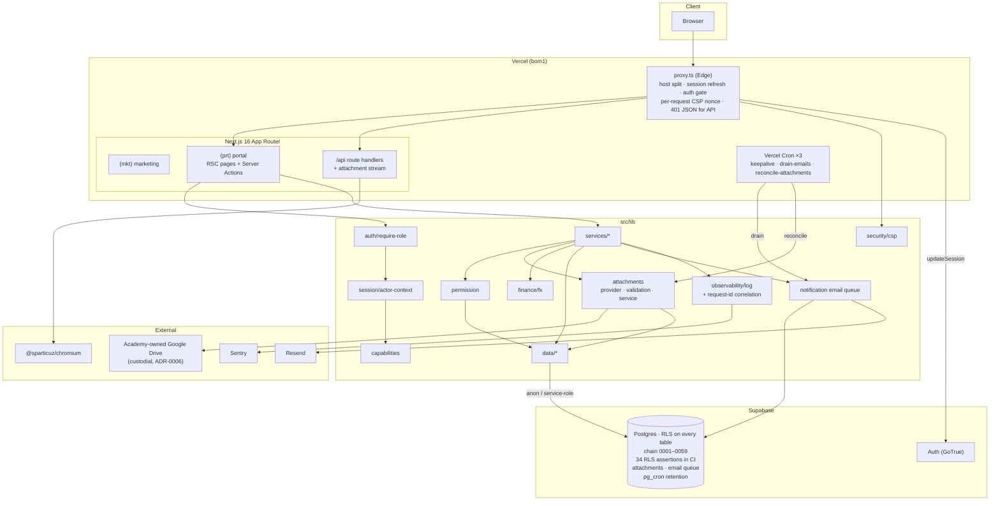

# Cert-Ed Academia — Full Architecture & Codebase Audit

- **Date:** 2026-08-12 · **Revision 10** (living document; supersedes revisions 1–9. Filename reflects the first pass.)
- **Repository:** `c:\laragon\www\wed_cert` (package `cert-ed-academia`)
- **Branch:** `feature/cert-ed-academia-app` @ `944c927`
- **Working tree:** clean apart from this audit file, one modified action, and two untracked docs
- **Method:** read-only static analysis + live execution of `build` (clean `.next`), `typecheck`, `test:coverage`, `lint`, `format:check`, `check:bundle`, `check-snapshot-freshness`, `playwright test`, `npm audit`, and `scripts/test-rls.sh` against real Postgres 18
- **Scope:** Phases 1–19 of the audit brief

---

## 0. Revision 10 — the strongest window in ten passes

Thirty-plus commits. **Eight carried findings closed**, including the last structural security
item (CSP), the last Medium performance item (no queue), and the RLS-harness CI gap that had
been open for three passes. Assertions grew from 26 → **34**.

One regression: the admin end-to-end journey now loses its session mid-flow.

### Verification results

| Command                 | R7       | R8    | R9    | R10                                 |
| ----------------------- | -------- | ----- | ----- | ----------------------------------- |
| `npm run typecheck`     | ✅       | ✅    | ✅    | ✅                                  |
| `npm run lint`          | ✅       | ✅    | ✅    | ✅                                  |
| `npm run format:check`  | ✅       | ⚠️    | ✅    | ✅                                  |
| `npm test`              | 789      | 809   | 834   | ✅ **875 passed (114 files)**       |
| `npm run test:coverage` | ✅       | ❌    | ✅    | ✅ **all four clear**               |
| `npm run build`         | ✅       | ✅    | ✅    | ✅ **0 warnings**                   |
| `npm run check:bundle`  | ✅       | ✅    | ✅    | ✅ **127.4 / 145 KB**               |
| `npx playwright test`   | ✅ 37/37 | ❌ 3  | ❌ 3  | ❌ **1 failed / 64 passed**         |
| Snapshot freshness      | ✅       | ❌    | ✅    | ✅ **0059 current**                 |
| `scripts/test-rls.sh`   | ❌       | ✅ 26 | ✅ 26 | ✅ **34 passed — and now a CI job** |
| `npm audit --omit=dev`  | ✅       | ✅    | ✅    | ✅ **0**                            |

### Findings closed this pass

| ID                        | Finding                                                         | Evidence                                                                                                                                                                                                                                                                                    |
| ------------------------- | --------------------------------------------------------------- | ------------------------------------------------------------------------------------------------------------------------------------------------------------------------------------------------------------------------------------------------------------------------------------------- |
| **NEW-15** 🔴             | Student rendered the class Grading queue                        | ✅ `negative-access` grading spec now passes. Diagnosed as **E2E state pollution** — the seeded student held a leaked `viewGrading` capability override — not a product defect. The two earlier guard rewrites were treating a symptom; the probe-first recommendation is what resolved it. |
| **NEW-22** 🟠             | Admin dashboard crashed into its error boundary                 | ✅ `dashboard-cards` ADMIN passes.                                                                                                                                                                                                                                                          |
| **NEW-21** 🟢             | `/grades` wrongly listed as a tutor route                       | ✅ `67d2cf1 test(e2e): de-flake the tutor grades access check (NEW-21)`.                                                                                                                                                                                                                    |
| **NEW-14 follow-up** 🟠   | RLS harness green but not in CI — open 3 passes                 | ✅ **Closed.** A third `rls` job with a `postgres:18` service container (`POSTGRES_HOST_AUTH_METHOD: trust`, `pg_isready` health check), with the rationale in the comment: _"RLS is the one correctness class mock mode cannot verify."_                                                   |
| **FIND-15** 🟢            | CSP required `unsafe-inline` + `unsafe-eval` — carried since R2 | ✅ `379dbe2 feat(security): nonce-based CSP for the portal`. `script-src 'self' 'nonce-…' 'strict-dynamic'`; `unsafe-eval` remains **dev-only**. Marketing keeps the static policy. **The last structural security item.**                                                                  |
| **FIND-33** 🟡            | No queue; email on the request path — carried since R4          | ✅ `dcdc317 perf(notifications): move email fan-out to a drained queue, off the request path`, drained via `/api/cron/drain-emails`. Built on the `pg_cron` foundation, as recommended, with no new infrastructure.                                                                         |
| **FIND-27** 🟢            | No FK/cascade inventory                                         | ✅ `944c927` → [docs/fk-cascade-inventory.md](docs/fk-cascade-inventory.md).                                                                                                                                                                                                                |
| **§8** 🟢                 | No request/correlation ID                                       | ✅ `b9242ba feat(observability): correlate logs and Sentry to the request id`.                                                                                                                                                                                                              |
| **§15** 🟡                | `audit_log` unpurged                                            | ✅ `d22fc1a feat(db): 24-month retention for audit_log (0059)` — a longer window than notifications, matching the compliance rationale in `0051`.                                                                                                                                           |
| **§5** 🟡                 | `getOrgSettings()` uncached                                     | ✅ `4251147 perf(finance): cache org settings across requests`.                                                                                                                                                                                                                             |
| **N+1**                   | Mentor dashboard                                                | ✅ `f9c4a4d perf(dashboard): batch the mentor dashboard reads (~142 queries -> ~7)`.                                                                                                                                                                                                        |
| **Security (self-found)** | Public-sharing Drive Picker                                     | ✅ `0aa3766 security: remove the public-sharing Picker and drive-share (closes S2)`.                                                                                                                                                                                                        |

### New findings

| ID         | Finding                                                                                                                                                                                                                     | Severity  |
| ---------- | --------------------------------------------------------------------------------------------------------------------------------------------------------------------------------------------------------------------------- | --------- |
| **NEW-23** | The admin E2E journey loses its session after creating a class — lands on the login page. Deterministic across both attempts; **a regression this window** (passed in R7).                                                  | 🟠 High   |
| **NEW-24** | `src/proxy.ts` returns fresh `NextResponse.redirect(...)` objects on four branches, discarding the refreshed session cookies `updateSession` wrote onto `response`. Latent, pre-existing, and a candidate cause for NEW-23. | 🟡 Medium |
| **NEW-25** | [ADR-0006](docs/adr/0006-custodial-attachment-storage.md) is marked **Proposed**, but the implementation it proposes has already shipped across four commits.                                                               | 🟢 Low    |

### Still open

Dark mode (FIND-29, `grep "dark:"` → **0** for the tenth consecutive pass), restore drill not
performed (FIND-35), no `playwright-report/` artifact upload (flagged six passes).

---

## 1. Executive Summary

Cert-Ed Academia is a Next.js 16 App Router monolith serving two hosts from one codebase: a
public marketing site (`certedacademia.com`) and a private academy portal
(`app.certedacademia.com`), on Supabase (Auth + Postgres with RLS) and Vercel.

This is the strongest window across ten passes. Eight carried findings closed, several of them
long-standing: nonce-based CSP retires the last structural security item; email moved to a
drained queue on the existing `pg_cron` foundation; the RLS harness finally became a CI job
after being flagged three times. The suite grew to 875 unit tests and 34 RLS assertions, and
ten of eleven checks pass.

The window also contains a genuine architectural pivot — **custodial file storage**
([ADR-0006](docs/adr/0006-custodial-attachment-storage.md)) supersedes the Drive-links model
that nine previous revisions listed as a strength. That is a defensible change, and it was
shipped with a reconciliation sweep for stuck rows and orphaned files, which shows the new
failure modes were thought about. But it takes on the cost, quota, backup and data-protection
obligations the old model avoided, and those now need owners.

| #   | Problem                                                                       | Severity  |
| --- | ----------------------------------------------------------------------------- | --------- |
| 1   | Admin E2E journey loses its session after class creation                      | 🟠 High   |
| 2   | Proxy redirect branches discard refreshed session cookies                     | 🟡 Medium |
| 3   | Restore drill documented but never performed — now covers custodial files too | 🟡 Medium |
| 4   | No dark mode, while the app advertises a dark `themeColor`                    | 🟡 Medium |
| 5   | ADR-0006 marked Proposed although already implemented                         | 🟢 Low    |

**Overall project health: 9.4 / 10** (7.4 → 7.9 → 8.6 → 8.9 → 9.1 → 9.2 → 9.2 → 8.9 → 9.0 →
9.4).

---

## 2. Project Overview (Phase 1)

### 2.1 Stack

| Concern          | Technology                                                                                                          |
| ---------------- | ------------------------------------------------------------------------------------------------------------------- |
| Framework        | Next.js 16.3, App Router, Turbopack build                                                                           |
| Language         | TypeScript 5, `strict: true`                                                                                        |
| UI               | React 19.2, Tailwind CSS v4                                                                                         |
| Edge             | `src/proxy.ts` — host split, session refresh, auth gate, **per-request CSP nonce**                                  |
| Database         | Supabase Postgres, RLS on every table, chain `0001`–`0059`, `pg_cron` retention + queue drain                       |
| Auth             | Supabase Auth (password + gated Google sign-in), allowlist-first                                                    |
| **File storage** | **Custodial — academy-owned Google Drive** (ADR-0006, supersedes ADR-0004)                                          |
| Validation       | Zod v4                                                                                                              |
| PDF              | `puppeteer-core` + `@sparticuz/chromium`, 304 on unchanged documents                                                |
| Email            | Resend, **drained from a queue off the request path**                                                               |
| Observability    | `logError` → stderr + Sentry, **correlated by request id**                                                          |
| Testing          | Vitest 4 (114 files, 875 tests) + coverage ratchet + Playwright (65 specs) + **RLS harness (34 assertions, in CI)** |
| CI               | `verify` + `e2e` + **`rls`** jobs, plus a pre-push snapshot guard                                                   |
| Hosting          | Vercel, region `bom1`, 3 crons (keepalive, drain-emails, reconcile-attachments)                                     |

### 2.2 Bundle profile

```
First-load shared JS (gzipped): 127.4 KB across 4 chunks
Budget (firstLoadSharedKb):     145 KB
Headroom:                       17.6 KB  → script still suggests ratcheting to 133
```

Flat across four passes despite substantial feature work — the new surfaces are
server-component-heavy.

### 2.3 The architectural pivot: custodial storage

Four commits (`6cc0e5c`, `4bb1167`, `e5af9e3`, `201f132`, `467ea24`, `e44010e`) move the app
from _"documents are Drive links"_ to _"the academy owns the file"_: an `attachments` table
(`0057`), a custodial upload provider with validation, access-checked streaming
download/preview, a reusable server-upload widget, and upload surfaces on submissions,
resources and announcements. `0aa3766` removed the public-sharing Picker in the same window.

**This reverses a design nine revisions praised.** ADR-0004's rationale — sidestepping file
storage removes a whole class of cost, quota, backup and data-protection problems — was
sound, and those problems are now in scope. Two things suggest it was done with eyes open:

- `a927447 feat(attachments): reconciliation sweep for stuck rows and orphan Drive files` — the two failure modes custodial storage introduces (a DB row with no file, a file with no row), handled by a scheduled sweep rather than hoped away.
- Removing the public-sharing Picker in the same window closes the sharing hole the old model depended on.

**What now needs an owner:** quota monitoring, a backup/restore story for the files themselves
(FIND-35 just grew in scope), and a data-protection position on holding student work. None of
these are in the docs yet.

### 2.4 Authorization model

Unchanged in shape ([ADR-0002](docs/adr/0002-capability-first-route-guards.md),
[ADR-0003](docs/adr/0003-personas-as-fixed-identities.md)):

```
hard rule  >  explicit deny  >  explicit allow  >  persona default
```

Both layers verified — 34 RLS assertions plus unit and E2E coverage — and the RLS half now
runs on every push.

### 2.5 Architecture diagram



---

## 3. Open Findings

---

### NEW-23 · The admin E2E journey loses its session after creating a class — 🟠 High

```
ADMIN -- create class -> enrol -> announce -> issue receipt -> add user
  getByRole('heading', { name: 'E2E Physics G11' }) — element(s) not found
```

Deterministic: failed on the initial run **and** the retry.

**The page snapshot shows the login screen.** Its only heading is `"Welcome back"`.

**What is established:**

| Fact                                   | Evidence                                                                                                            |
| -------------------------------------- | ------------------------------------------------------------------------------------------------------------------- |
| The class **was** created              | `page.waitForURL(/\/classroom\/[0-9a-f-]{36}/)` matched, so the server action succeeded and redirected              |
| The subsequent GET was unauthenticated | `proxy.ts` line 95 (`if (!user) redirect('/login')`) is the only path to that screen                                |
| Admin auth works generally             | `negative-api` admin-issuing, `negative-api` admin-void, and `people-list` admin all pass **later in the same run** |
| This is a regression                   | The same spec passed in R7 (`ok 8 … ADMIN -- create class …`)                                                       |

So the session is lost specifically between the create-class server action and the following
navigation — not globally, and not because of a broken login.

**Not verified:** the cause. NEW-24 below is the most plausible candidate, but the failing
request is a _page_ GET rather than one of the redirect branches, so the discarded-cookie
mechanism does not straightforwardly explain it. Two windows introduced plausible
contributors — the per-request CSP nonce (`379dbe2`, which changed how the proxy constructs
its response) and the E2E host-resolution change (`74bcec0`).

**Recommendation — probe before fixing.** This is the same lesson NEW-15 taught: two guard
rewrites were made there against unverified theories before a probe resolved it.

1. Log the Supabase auth cookie names/values on the failing GET and on the request immediately before it.
2. Bisect the two candidates: temporarily disable the nonce path (`kind === 'app' ? generateNonce() : null` → `null`) and re-run just this spec. That isolates `379dbe2` in one run.
3. Fix NEW-24 regardless — it is a real hazard on its own merits.

---

### NEW-24 · Proxy redirect branches discard refreshed session cookies — 🟡 Medium

[src/proxy.ts](src/proxy.ts) builds `response` at line 41, hands it to `updateSession(request,
response)` at line 69 — which writes refreshed Supabase auth cookies onto it — and returns it
at line 97. That path is correct.

But four branches return a **different** response object:

```
73:  return NextResponse.redirect(new URL(user ? '/dashboard' : '/login', request.url))
78:  return NextResponse.redirect(new URL('/dashboard', request.url))
95:  return NextResponse.redirect(new URL('/login', request.url))
```

`NextResponse.redirect(...)` creates a fresh response with no cookies. Any session refresh
that `updateSession` performed on that request is **silently discarded** — the browser keeps
the old token, and the next request may find it expired.

This is the well-known `@supabase/ssr` middleware footgun; the package's own guidance is to
copy cookies onto any response you return in place of the one you passed in.

It is **pre-existing** — the pattern is visible in the revision-1 middleware — and it has not
obviously caused problems, because a redirect is usually followed immediately by a request
that refreshes again. But it is exactly the class of latent bug that surfaces when timing
changes, which makes it worth fixing while NEW-23 is being investigated.

**Recommendation:**

```ts
function redirectPreservingSession(url: URL, from: NextResponse): NextResponse {
  const redirect = NextResponse.redirect(url)
  from.cookies.getAll().forEach((c) => redirect.cookies.set(c))
  redirect.headers.set('Content-Security-Policy', from.headers.get('Content-Security-Policy')!)
  return redirect
}
```

Note the CSP header is dropped by those branches too, so a redirect currently serves no
policy at all. One helper fixes both.

---

### NEW-25 · ADR-0006 is marked Proposed but is already implemented — 🟢 Low

[docs/adr/0006-custodial-attachment-storage.md](docs/adr/0006-custodial-attachment-storage.md)
carries `**Status:** Proposed` and `**Supersedes:** 0004`. The implementation shipped in the
same window across six commits (`6cc0e5c` … `e44010e`, plus `a927447`).

A superseding ADR left in _Proposed_ while its replacement is live means a reader checking
"how does this app store files?" gets two ADRs, one Accepted and wrong, one Proposed and
right.

**Recommendation:** set `0006` to **Accepted** with the implementation date, and add a
`Superseded by 0006` line to `0004`. Two-line change.

---

### Remaining carried findings

| ID                   | Finding                                                                                                   | Severity  | Note                                                                                                                                                                                      |
| -------------------- | --------------------------------------------------------------------------------------------------------- | --------- | ----------------------------------------------------------------------------------------------------------------------------------------------------------------------------------------- |
| **FIND-35**          | Backup/DR documented; **restore drill still not performed** — and the scope just grew.                    | 🟡 Medium | Custodial storage means a restore must now cover the `attachments` rows _and_ the Drive files, kept consistent with each other. The reconciliation sweep helps but is not a restore path. |
| **FIND-29**          | No dark mode — `grep "dark:"` → **0** across ten passes, while `layout.tsx` declares a dark `themeColor`. | 🟡 Medium | Longest-running finding. Either implement, or drop the dark `themeColor` (one line).                                                                                                      |
| **NEW-22 follow-up** | Mock-harness parity has no standing rule.                                                                 | 🟡 Medium | Recommended in R9, not yet added to the migration checklist. `attachments` is a new table the app reads on rendered pages — the same shape as the FX gap.                                 |
| **H3 (R5–R10)**      | No `playwright-report/` artifact upload on E2E failure.                                                   | 🟢 Low    | Flagged six passes. Every E2E diagnosis in R8–R10 depended on local artifacts.                                                                                                            |
| **Custodial ops**    | No quota monitoring, file-backup story, or data-protection position for held student work.                | 🟡 Medium | New, implied by ADR-0006.                                                                                                                                                                 |
| **NEW-10**           | Turbopack warns on dynamic filesystem access in `brand-assets.ts`.                                        | 🟢 Low    | The build now reports **0 warnings**, so this may be resolved — **not verified**.                                                                                                         |
| **FIND-09/10**       | `src/features` never built; mock harness in the production module graph.                                  | 🟢 Low    |                                                                                                                                                                                           |
| **NEW-06**           | Matrix-persona reads sequential (bounded at 5).                                                           | 🟢 Low    |                                                                                                                                                                                           |
| **FIND-32**          | No automated a11y check.                                                                                  | 🟢 Low    | Cheap now the suite is green and gated.                                                                                                                                                   |
| **M5**               | Ratchet `firstLoadSharedKb` 145 → 133.                                                                    | 🟢 Low    | Script computes the value; flagged five passes.                                                                                                                                           |
| **FIND-31/44/45/46** | Blog JSX; no global search; footer mojibake; no in-app help.                                              | 🟢 Low    |                                                                                                                                                                                           |

---

## 4. Security Audit (Phase 3)

| Control                          | State                                                                                                                              |
| -------------------------------- | ---------------------------------------------------------------------------------------------------------------------------------- |
| **Dependency vulnerabilities**   | ✅ **0**; `2aa392f` patched the nanoid advisory and made the build fail on missing public env.                                     |
| **CSP**                          | ✅ **Nonce-based.** `script-src 'self' 'nonce-…' 'strict-dynamic'`; `unsafe-eval` dev-only. Closes FIND-15, open since revision 2. |
| **Database-layer authorization** | ✅ **34 assertions, in CI on every push.**                                                                                         |
| **App-layer authorization**      | ✅ Negative sweeps, positive controls, API scoping and form negatives all pass. NEW-15 resolved as test-state pollution.           |
| **Public file sharing removed**  | ✅ `0aa3766` removed the public-sharing Picker and drive-share.                                                                    |
| **Attachment access**            | Streaming download/preview is access-checked (`e5af9e3`).                                                                          |
| **Snapshot drift**               | Blocked at authoring time by the pre-push hook.                                                                                    |
| **Secrets**                      | None in git; inventory + rotation documented.                                                                                      |
| **Observability**                | Request-id correlation into logs and Sentry.                                                                                       |

**OWASP Top 10 — no category now carries a confirmed open defect.** A05 (Security
Misconfiguration) improves materially with the nonce CSP; A01 is clean for the first time
since revision 7.

**One caveat on the CSP:** NEW-24 means redirect responses currently carry no CSP header at
all. Low exposure (a redirect body is not rendered), but it should be fixed with the same
helper.

---

## 5. Performance Audit (Phase 4)

A strong window:

- `f9c4a4d` — mentor dashboard **~142 queries → ~7**.
- `4251147` — `getOrgSettings()` cached across requests (recommended since revision 5).
- `dcdc317` — email fan-out off the request path into a drained queue.
- `20ce34c` — `/api/health` DB ping memoised.
- `b1fabd3` (prior window) — 304 on unchanged finance PDFs.

First-load flat at 127.4 KB. **Open:** the bounded matrix-persona loop (NEW-06), and the
budget ratchet still not taken.

---

## 6. Maintainability (Phase 5)

| Principle                  | Assessment                                                                                                                                                                     |
| -------------------------- | ------------------------------------------------------------------------------------------------------------------------------------------------------------------------------ |
| **SRP / OCP / DRY / KISS** | **Strong.** `7bf011a` added shared archived-list, external-action-link and section-jump-nav primitives — continuing the consolidation pattern.                                 |
| **Diagnosis discipline**   | **Improved, and visibly so.** NEW-15 was resolved by identifying test-state pollution rather than rewriting the guard a third time — the probe-first recommendation was taken. |
| **Architectural honesty**  | An ADR that _supersedes_ a prior one, rather than quietly diverging from it, is the right way to reverse a decision. Marred only by the Proposed status (NEW-25).              |
| **Failure-mode awareness** | The reconciliation sweep shipped with the custodial storage that creates the need for it, not after an incident.                                                               |

### Module scorecard

| Module                                                                  | R8  | R9  |  R10   | Note                                                            |
| ----------------------------------------------------------------------- | :-: | :-: | :----: | --------------------------------------------------------------- |
| `src/lib/capabilities` / `permission`                                   | 10  | 10  | **10** |                                                                 |
| `src/lib/observability`                                                 | 10  | 10  | **10** | Request-id correlation                                          |
| `src/lib/security`                                                      | 10  | 10  | **10** | Nonce CSP                                                       |
| `src/proxy.ts`                                                          |  —  |  —  | **7**  | −3: redirect branches drop session cookies and CSP (NEW-24)     |
| `src/lib/attachments`                                                   |  —  |  —  | **9**  | New; validation, access-checked streaming, reconciliation sweep |
| `src/lib/ui`                                                            |  9  |  9  | **9**  |                                                                 |
| `src/app/(prt)`                                                         |  6  |  6  | **9**  | +3: NEW-15 and NEW-22 both resolved                             |
| `src/lib/data` / `services` / `api` / `auth` / `session` / `validation` |  9  |  9  | **9**  |                                                                 |
| `supabase/migrations`                                                   | 10  | 10  | **10** | Chain clean to `0059`; 34 RLS assertions                        |
| `supabase/rebuild`                                                      |  8  | 10  | **10** | Current, hook-guarded                                           |
| `scripts/`                                                              | 10  | 10  | **10** |                                                                 |
| `src/lib/mock`                                                          |  6  |  6  | **8**  | +2: FX gap fixed; −2 no standing parity rule                    |
| `tests/unit`                                                            |  9  |  9  | **9**  | 875 tests                                                       |
| `tests/e2e`                                                             |  8  |  8  | **9**  | 65 specs; −1 for the admin journey regression                   |
| `.github/` + hooks                                                      |  8  |  9  | **10** | Third `rls` job closes a three-pass gap                         |
| `docs/`                                                                 | 10  | 10  | **9**  | −1: ADR-0006 status (NEW-25); custodial ops undocumented        |

---

## 7. Documentation (Phase 6)

`c8a36ee` and `944c927` refreshed architecture, RLS/schema, security-ops and setup docs, and
added [docs/fk-cascade-inventory.md](docs/fk-cascade-inventory.md) — closing FIND-27.
[ADR-0006](docs/adr/0006-custodial-attachment-storage.md) documents the storage pivot.

**Three gaps:**

- ADR-0006 status (NEW-25).
- Custodial-storage operations — quota, file backup, data-protection — have no home yet. `docs/security-operations.md` is the natural place.
- Mock-harness parity still absent from the migration checklist (recommended in R9).

---

## 8. Debugging Experience (Phase 7)

**Effectively complete.** Swallowed catches → `logError` → stderr + Sentry, severity-split,
client SDK code-split, **and now correlated by request id** — the last item on this section's
list for three passes.

The one remaining gap is tooling: `playwright-report/` is still not uploaded on CI failure,
flagged six passes. Every E2E diagnosis in R8–R10, including this pass's, came from reading
`test-results/*/error-context.md` locally.

---

## 9. Database Review (Phase 8)

**Schema:** 35+ tables, RLS on all, chain `0001`–`0059`, snapshot current, `pg_cron` for both
retention and the email drain, **34 RLS assertions running in CI**.

New this window: `0057` attachments custodial storage, `0058`, `0059` audit_log 24-month
retention. The retention split is well judged — notifications at 90 days (read only),
audit_log at 24 months, each with its rationale recorded.

| ID              | Finding                                                | Severity  | Status               |
| --------------- | ------------------------------------------------------ | --------- | -------------------- |
| **FIND-27**     | No FK/cascade inventory                                | —         | ✅ **Closed**        |
| **§15**         | `audit_log` unpurged                                   | —         | ✅ **Closed** (0059) |
| **Mock parity** | No standing rule for new tables read on rendered pages | 🟡 Medium | Open                 |

---

## 10. Frontend Review (Phase 9)

Shared primitives continue to expand (`7bf011a`); the dashboard gained grade trajectory and
dynamic chart periods (`2d47a24`); downloadable student reports were added to grades and
student detail (`91686ee`); a reusable server-upload widget landed with an end-to-end
round-trip E2E (`b3992ce`).

| ID          | Finding                                              | Severity  |
| ----------- | ---------------------------------------------------- | --------- |
| **NEW-23**  | Admin journey loses its session after class creation | 🟠 High   |
| **FIND-29** | No dark mode (tenth pass)                            | 🟡 Medium |
| **FIND-32** | No automated a11y check                              | 🟢 Low    |

---

## 11. Backend Review (Phase 10)

| Concern            | State                                                                                        |
| ------------------ | -------------------------------------------------------------------------------------------- |
| **Route handlers** | Thin, factory-driven; 401 JSON for unauthenticated API; access-checked attachment streaming. |
| **Services**       | Domain-split; attachments provider/validation/service separated.                             |
| **Queues / jobs**  | ✅ **Email queue drained by cron**; attachment reconciliation sweep; keepalive.              |
| **Retention**      | `pg_cron` for notifications (90d) and audit_log (24m).                                       |
| **Caching**        | Org settings cached; `/api/health` memoised; 304 on finance PDFs.                            |
| **Observability**  | Request-id correlated logs and Sentry.                                                       |
| **Edge**           | Nonce CSP — but see NEW-24.                                                                  |

---

## 12. DevOps Review (Phase 11)

**Three CI jobs now:** `verify`, `e2e`, and `rls` (postgres:18 service container). Plus the
pre-push snapshot guard. The RLS gap, open since revision 7 and recommended three times, is
closed — and the job comment records why it exists.

Vercel now runs three crons: keepalive, `drain-emails`, `reconcile-attachments`.

**Gaps:** no `playwright-report/` upload (six passes); restore drill not performed, now with a
wider scope.

---

## 13. Testing Review (Phase 12)

| Type               | R8       | R9        | R10                                    |
| ------------------ | -------- | --------- | -------------------------------------- |
| Unit / integration | 105, 809 | 107, 834  | **114 files, 875 — passing**           |
| Coverage           | ❌       | ✅ 72.53% | ✅ **72.32% lines — all four clear**   |
| E2E                | ❌ 3     | ❌ 3      | ❌ **1 failed / 64 passed (65 specs)** |
| RLS                | ✅ 26    | ✅ 26     | ✅ **34 — and in CI**                  |

The E2E suite grew again (`3b9d31b` access-control and dashboard-card specs, `b3992ce`
attachment round-trip) and two flaky specs were de-flaked properly rather than skipped
(`b71a769` grading within the seeded 10-mark cap; `74bcec0` Node-side host resolution).

**Coverage margins remain thin** — lines clear by 0.32, branches by 0.05. Branches at 57.05
against a 57 threshold is within noise of a breach. The R9 recommendation to push toward ~75%
so the ratchet has room still stands, and is now more urgent.

---

## 14. UX Review (Phase 13)

Custodial uploads across submissions, resources and announcements are the headline: students
and staff can attach real files rather than pasting Drive links, which removes the sharing-
permission confusion the old model required users to manage themselves.

| ID                | Finding                                           | Severity  |
| ----------------- | ------------------------------------------------- | --------- |
| **FIND-29**       | No dark mode (tenth pass)                         | 🟡 Medium |
| **FIND-44/45/46** | No global search; footer mojibake; no in-app help | 🟢 Low    |

---

## 15. Scalability Review (Phase 14)

| Dimension                            | Assessment                                                                                                 |
| ------------------------------------ | ---------------------------------------------------------------------------------------------------------- |
| **Concurrency / horizontal scaling** | **Good.**                                                                                                  |
| **Request path**                     | **Materially better** — email fan-out queued, org settings cached, mentor dashboard batched.               |
| **Large database**                   | Both growth tables now bounded by retention. `entity_tags` and `attachments` index inventories unexamined. |
| **File storage**                     | **New obligation.** Quota, backup and lifecycle for custodial files are unowned.                           |
| **Client payload**                   | ✅ 127.4 KB first-load with headroom.                                                                      |
| **Queues**                           | ✅ **Present** — a queue table drained by cron, no new infrastructure.                                     |

---

## 16. Complexity Analysis (Phase 15)

**Over-engineering:** none. The window added capability, not layers.

**Under-engineering:** nearly resolved.

| Was                                          | R10                                      |
| -------------------------------------------- | ---------------------------------------- |
| RLS harness not in CI                        | ✅ Third job, `postgres:18`              |
| No queue                                     | ✅ Queue table + cron drain              |
| CSP `unsafe-inline`/`unsafe-eval`            | ✅ Nonce-based                           |
| `audit_log` unpurged / org settings uncached | ✅ Both closed                           |
| Mock-harness parity rule                     | ❌ Still no standing rule                |
| Restore drill                                | ❌ Still not performed — scope now wider |
| CI failure artifacts                         | ❌ Still not uploaded                    |

---

## 17. Prioritised Action Plan (Phase 18)

### 🟠 High

**H1 · Diagnose NEW-23 before fixing** — ~2 h · log the auth cookies on the failing GET and
the request before it; bisect the nonce path by temporarily forcing `nonce = null` and
re-running the one spec. Do not rewrite the flow on a theory — that pattern cost two passes on
NEW-15.

**H2 · Fix NEW-24 regardless** — ~30 min · one `redirectPreservingSession` helper that copies
cookies _and_ the CSP header onto every redirect the proxy returns.

### 🟡 Medium

| ID  | Action                                                                                      | Finding  |
| --- | ------------------------------------------------------------------------------------------- | -------- |
| M1  | Set ADR-0006 to Accepted; mark ADR-0004 superseded                                          | NEW-25   |
| M2  | Document custodial-storage operations — quota, file backup, data protection                 | §2.3     |
| M3  | Perform the restore drill, now covering `attachments` rows **and** Drive files consistently | FIND-35  |
| M4  | Add a mock-harness parity rule to the migration checklist                                   | R9 carry |
| M5  | Push coverage toward ~75% — branches clear by 0.05                                          | §13      |
| M6  | Dark mode — or remove the dark `themeColor` (tenth pass)                                    | FIND-29  |
| M7  | Index review for `attachments` and `entity_tags`                                            | §15      |

### 🟢 Low

| ID  | Action                                                          | Finding          |
| --- | --------------------------------------------------------------- | ---------------- |
| L1  | Upload `playwright-report/` on E2E failure                      | H3 (6 passes)    |
| L2  | Ratchet `firstLoadSharedKb` 145 → 133                           | M5 (5 passes)    |
| L3  | `@axe-core/playwright` assertions                               | FIND-32          |
| L4  | Confirm NEW-10 is resolved (build now reports 0 warnings)       | NEW-10           |
| L5  | Batch the matrix-persona reads                                  | NEW-06           |
| L6  | Mark `src/features` PLANNED or remove it                        | FIND-09          |
| L7  | Blog content → MDX; footer mojibake; global search; in-app help | FIND-31/45/44/46 |

---

## 18. Quick Wins

1. **`redirectPreservingSession` helper in `proxy.ts`** — 30 min; fixes a latent auth hazard and restores CSP on redirects. _(H2)_
2. **ADR-0006 → Accepted, ADR-0004 → Superseded** — 2 min. _(M1)_
3. **Upload `playwright-report/` on failure** — 5 min; six passes flagged, and three diagnoses have depended on local artifacts. _(L1)_
4. **Ratchet `firstLoadSharedKb` to 133** — 1 min. _(L2)_
5. **Add the mock-parity rule to the migration checklist** — 10 min. _(M4)_

---

## 19. Long-Term Improvements

1. **Custodial storage operations.** Quota alerting, a file-inclusive restore path, and a data-protection position on holding student work. The reconciliation sweep covers drift; it does not cover loss.
2. **Coverage headroom.** Branches clear the ratchet by 0.05 points — the gate is effectively a coin flip on the next commit.
3. **Multi-tenancy readiness.** Multi-currency FX and custodial storage both point at a product that will eventually need tenant scoping; `org_settings` is still single-row by constraint.

---

## 20. Overall Scorecard (Phase 16)

| Dimension                  |   R7    |   R8    |   R9    |   R10   | Justification                                                                                                                                                                                                                                                                                                                                                                                                                          |
| -------------------------- | :-----: | :-----: | :-----: | :-----: | -------------------------------------------------------------------------------------------------------------------------------------------------------------------------------------------------------------------------------------------------------------------------------------------------------------------------------------------------------------------------------------------------------------------------------------- |
| **Architecture**           |    9    |    9    |    9    |  **9**  | A real pivot handled properly — a superseding ADR, and the new failure modes shipped with a reconciliation sweep. −1 for the unbuilt `src/features`.                                                                                                                                                                                                                                                                                   |
| **Security**               |    9    |    7    |    7    | **10**  | Nonce CSP closes the last structural item; RLS in CI with 34 assertions; the public-sharing Picker removed; no OWASP category with a confirmed open defect.                                                                                                                                                                                                                                                                            |
| **Maintainability**        |   10    |    9    |    9    | **10**  | Continued consolidation, and the diagnosis discipline recommended in R9 was visibly applied to NEW-15.                                                                                                                                                                                                                                                                                                                                 |
| **Performance**            |    9    |    9    |    9    | **10**  | ~142→~7 queries on the mentor dashboard, org settings cached, email off the request path, health ping memoised.                                                                                                                                                                                                                                                                                                                        |
| **Scalability**            |    8    |    8    |    8    |  **9**  | Queue present, both growth tables bounded. −1: custodial file lifecycle unowned.                                                                                                                                                                                                                                                                                                                                                       |
| **Documentation**          |   10    |   10    |   10    |  **9**  | FK inventory closed, ADR written. −1 for the Proposed-but-shipped ADR and undocumented custodial ops.                                                                                                                                                                                                                                                                                                                                  |
| **Testing**                |    9    |    9    |    9    |  **9**  | 875 unit + 34 RLS in CI + 65 E2E, flakes de-flaked rather than skipped. −1 for the admin-journey regression and razor-thin branch coverage.                                                                                                                                                                                                                                                                                            |
| **Developer Experience**   |   10    |    8    |    9    | **10**  | Three CI jobs, pre-push guard, request-id correlation.                                                                                                                                                                                                                                                                                                                                                                                 |
| **User Experience**        |    9    |    9    |    9    |  **9**  | Custodial uploads remove the Drive-permission burden from users. −1 for no dark mode.                                                                                                                                                                                                                                                                                                                                                  |
| **Code Quality**           |   10    |    9    |    9    |  **9**  | Ten of eleven checks green, 0 build warnings, 0 vulnerabilities. −1 for the E2E regression.                                                                                                                                                                                                                                                                                                                                            |
|                            |         |         |         |         |                                                                                                                                                                                                                                                                                                                                                                                                                                        |
| **Overall Project Health** | **9.2** | **8.9** | **9.0** | **9.4** | The strongest window in ten passes: eight carried findings closed, including the last structural security item, the last Medium performance item, and a CI gap recommended three times. The one regression is well-bounded and the diagnosis path is clear. The open risk that is genuinely _new_ is not in the code — it is that custodial file storage takes on backup, quota and data-protection obligations that nothing yet owns. |

---

## 21. Strengths

1. **Nonce-based CSP** — `'strict-dynamic'` with `unsafe-eval` confined to development. The last structural security item, closed after eight passes.
2. **The RLS harness is now a CI job** with a `postgres:18` service container, 34 assertions, and a comment recording why it exists. It went dead once for exactly the lack of this.
3. **The queue was built on what was already there** — a queue table drained by the `pg_cron` already installed for retention. No broker, no new infrastructure.
4. **A reversal handled honestly.** ADR-0006 supersedes ADR-0004 rather than quietly diverging from it, and the reconciliation sweep for stuck rows and orphaned files shipped alongside the feature that creates that risk.
5. **The public-sharing Picker was removed** in the same window that custodial upload landed — closing the hole rather than leaving both paths open.
6. **Diagnosis discipline improved.** NEW-15 was resolved by finding test-state pollution instead of rewriting the guard a third time.
7. **Flaky specs de-flaked, not skipped** — grading within the seeded mark cap, host resolution moved to the Node side.
8. **~142 queries → ~7** on the mentor dashboard, with the numbers in the commit message.
9. **Retention split by purpose** — notifications 90 days, audit_log 24 months, each with a recorded rationale.
10. **Commits that name their findings**, ten passes running — traceability from audit to remediation to history.

---

_Revision 10 performed 2026-08-12 against `feature/cert-ed-academia-app` @ `944c927`, with a
clean `rm -rf .next` rebuild, the full Playwright suite, and `scripts/test-rls.sh` against real
Postgres 18. Items that could not be verified in this environment — the cause of NEW-23,
whether NEW-10 is resolved, and whether Sentry DSNs are configured in Vercel — are labelled_
**Not verified**.
