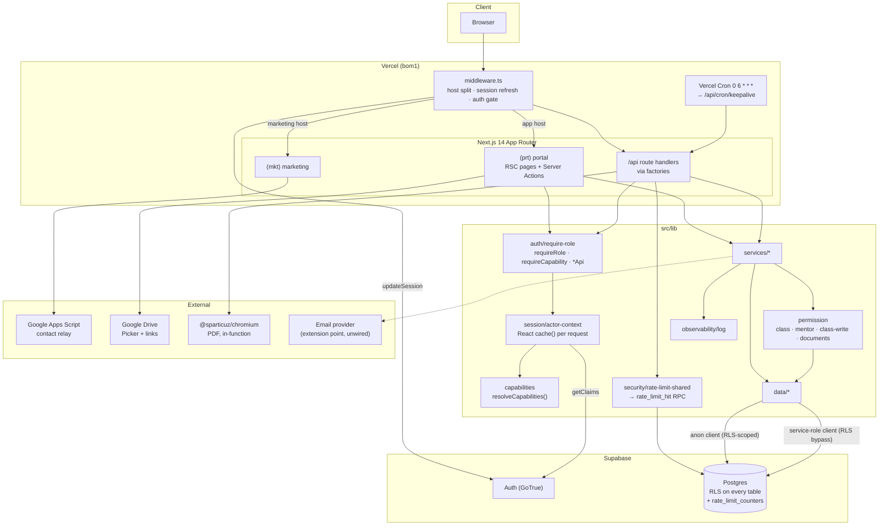

# Cert-Ed Academia — Full Architecture & Codebase Audit

- **Date:** 2026-08-03 · **Revision 2** (supersedes revision 1, same day)
- **Repository:** `c:\laragon\www\wed_cert` (package `cert-ed-academia`)
- **Branch:** `feature/cert-ed-academia-app` @ `e788956` — **unchanged since revision 1**
- **Working tree:** ~55 modified + ~35 untracked paths, including 5 new migrations. Nothing committed.
- **Method:** read-only static analysis + live execution of `build`, `typecheck`, `test`, `lint`, `format:check`, `npm audit`
- **Scope:** Phases 1–19 of the audit brief

> **Note on a moving target.** The working tree changed _during_ this pass — remediation
> was landing while the audit ran. All results below were re-verified immediately before
> writing (15:09). Where a finding depends on a file that may move again, the verification
> command is given so it can be re-checked.

---

## 0. Revision 2 — what changed since the first pass

Substantial remediation landed between the two passes. **Eight** of revision 1's findings
are closed, including six of the seven headline problems. Two new problems appeared, one
critical.

### Verification results, both passes

| Command                | Revision 1                           | Revision 2                   |
| ---------------------- | ------------------------------------ | ---------------------------- |
| `npm run typecheck`    | ❌ exit 2 — 13 errors                | ✅ **exit 0**                |
| `npm test`             | ❌ 19 failed / 666 passed (85 files) | ✅ **741 passed (95 files)** |
| `npm run build`        | ❌ exit 1                            | ✅ **exit 0**                |
| `npm run lint`         | ✅ clean                             | ❌ **exit 1 — 3 errors**     |
| `npm run format:check` | _(not run)_                          | ❌ **exit 1 — 7 files**      |

### Findings closed

| ID             | Finding                               | Evidence of fix                                                                                                                                                                                                                                                                                     |
| -------------- | ------------------------------------- | --------------------------------------------------------------------------------------------------------------------------------------------------------------------------------------------------------------------------------------------------------------------------------------------------- |
| **FIND-01** 🔴 | Working tree did not build            | typecheck 0, build 0, 741 tests pass. The `*Resource*` → `*Document*` rename is complete across every consumer.                                                                                                                                                                                     |
| **FIND-03** 🟠 | No CI                                 | [.github/workflows/ci.yml](.github/workflows/ci.yml) — format, lint, typecheck, test on push + PR, with `concurrency` cancel-in-progress. **See NEW-02.**                                                                                                                                           |
| **FIND-04** 🟠 | No observability                      | [src/lib/observability/log.ts](src/lib/observability/log.ts), adopted at **7 sites** — exactly the ones that previously swallowed silently: `writeAudit`, `notifyBestEffort`, `notifyClassRoleBestEffort`, `apiError`'s unknown branch, `logout.signOut`, plus the two new subsystems. Unit-tested. |
| **FIND-06** 🟠 | Messaging N+1                         | [recipient-policy-resolver.ts](src/lib/messaging/recipient-policy-resolver.ts) now batches via `selectActiveEnrollmentPairsByClassIds` / `…ByStudentIds` / `selectActiveTutorPairsByClassIds`. Per-entity loops gone. **Residual: NEW-06.**                                                         |
| **FIND-07** 🟡 | Five stale migration-range references | README → 0045, [supabase/README.md](supabase/README.md) → 0045 _plus a new regeneration section_, [rls-policy-inventory.md](docs/rls-policy-inventory.md) → 0045, [verify-migrations.ts](scripts/verify-migrations.ts) → new 0018–0045 phase, `run-fresh-environment-test.sh` updated.              |
| **FIND-13** 🟠 | Per-instance rate limiting            | [rate-limit-shared.ts](src/lib/security/rate-limit-shared.ts) + `rate_limit_hit()` RPC, adopted by exactly the two unauthenticated limiters. Authenticated throttles correctly left in-process. **See NEW-04.**                                                                                     |
| **FIND-14** 🟡 | Password policy length-only           | [validation/user.ts](src/lib/validation/user.ts) — floor raised to **10**, plus `passwordAvoidsEmail()` rejecting a password containing the email local part. The comment correctly identifies Supabase's leaked-password protection as the higher-value lever and points at the Auth setting.      |
| **FIND-17** 🟢 | Authenticated open redirect           | `isAllowedDriveUrl()` enforced at **write time** (schema) _and_ re-verified at **redirect time**, explicitly for legacy rows.                                                                                                                                                                       |
| **FIND-21** 🟢 | No bundle measurement                 | Now measurable: shared JS **87.3 kB**, middleware **87 kB**, heaviest route `/calendar` **191 kB** — FullCalendar confirmed code-split to that route only.                                                                                                                                          |
| **FIND-43** 🟡 | No email notifications                | Extension point added (`deliverEmailNotifications`, `EMAIL_NOTIFICATIONS_ENABLED`). Deliberate no-op — pipeline ready, no provider. _Partially_ closed.                                                                                                                                             |

### New features shipped in this window

Documents library (search, fixed categories, staff/class visibility gate, version history,
audited downloads), announcement attachments, attendance working-hours tracking with a new
`class_sessions` table, per-persona dashboard analytics, and a student report engine
(progress + attendance, PDF and print-HTML).

**Every one arrived with tests** — 95 files / 741 tests, up from 85 / 685, with new suites
for observability, shared rate limiting, document permissions, reports, analytics, document
search, attendance hours, and resource versions. That discipline held under delivery
pressure, which is the harder test.

### New findings

| ID         | Finding                                                                             | Severity    |
| ---------- | ----------------------------------------------------------------------------------- | ----------- |
| **NEW-01** | **Two migrations both numbered `0047`**                                             | 🔴 Critical |
| **NEW-02** | The newly-added CI fails on both gates it introduced                                | 🟠 High     |
| **NEW-04** | `rateLimitShared` fails open, and NEW-01 may stop its table from ever being created | 🟠 High     |
| **NEW-05** | ~90 paths still uncommitted; HEAD unmoved across both passes                        | 🟠 High     |
| **NEW-03** | CI omits `build` and has no drift guards                                            | 🟡 Medium   |
| **NEW-06** | Residual sequential fan-out in the messaging matrix branch                          | 🟢 Low      |
| **NEW-07** | `recordDownload` mutates on GET                                                     | 🟢 Low      |

### Unchanged

**FIND-02 (rebuild snapshot drift) is still open and now worse.** The chain moved 0045 →
0048 while the header still reads `0001..0026` (verified: `grep -oE '0001\.\.[0-9]{4}'`
→ `0001..0026`). A regeneration script and documented procedure were added; the artifact
itself was never regenerated. Now **22 migrations behind**.

---

## 1. Executive Summary

Cert-Ed Academia is a Next.js 14 App Router monolith serving two hosts from one codebase:
a public marketing site (`certedacademia.com`) and a private academy portal
(`app.certedacademia.com`), on Supabase (Auth + Postgres with RLS) and Vercel.

The application design remains **unusually strong**: ~36k lines of TypeScript with a
genuinely enforced `app → services → data` layering, a persona+capability authorization
model kept deliberately in agreement across nav, page guards, API guards and RLS, 741
passing tests, an RLS harness running the real migration chain against real Postgres, and
comment quality that records _why_ — frequently naming the specific outage that motivated
the code.

Revision 1's central criticism was that **delivery discipline lagged the engineering**.
That gap has narrowed sharply. What remains is concentrated and specific:

| #   | Headline problem                                                                                                                | Severity    |
| --- | ------------------------------------------------------------------------------------------------------------------------------- | ----------- |
| 1   | Two migrations share version `0047` — the chain cannot be applied deterministically                                             | 🔴 Critical |
| 2   | `supabase/rebuild/0000_full_rebuild.sql` is 22 migrations stale (script added, snapshot not regenerated)                        | 🔴 Critical |
| 3   | The new CI is red on both gates it introduced (`format:check`, `lint`)                                                          | 🟠 High     |
| 4   | Shared rate limiting fails open, and NEW-01 may prevent its migration applying — silently removing the control it was built for | 🟠 High     |
| 5   | ~90 paths uncommitted; HEAD has not moved across two audit passes                                                               | 🟠 High     |

**Overall project health: 7.9 / 10** (up from 7.4). Items 1–5 are roughly one day; that
would put this at approximately **8.8**.

---

## 2. Project Overview (Phase 1)

### 2.1 Stack

| Concern         | Technology                                                          | Evidence                                                                                   |
| --------------- | ------------------------------------------------------------------- | ------------------------------------------------------------------------------------------ |
| Framework       | Next.js 14.2.35, App Router                                         | [package.json](package.json)                                                               |
| Language        | TypeScript 5, `strict: true`                                        | [tsconfig.json](tsconfig.json)                                                             |
| UI              | React 18.2, Tailwind CSS v4                                         | [package.json](package.json)                                                               |
| Runtime         | Node.js (Vercel serverless); `runtime='nodejs'` on the 4 PDF routes | [api/reports/[type]/[studentId]/route.ts](src/app/api/reports/[type]/[studentId]/route.ts) |
| Package manager | npm                                                                 | [package-lock.json](package-lock.json)                                                     |
| Build           | `next build` behind a custom env guard                              | [scripts/validate-build-env.mjs](scripts/validate-build-env.mjs)                           |
| Database        | Supabase Postgres, RLS on every table                               | [supabase/migrations/](supabase/migrations/)                                               |
| Auth            | Supabase Auth (password + Google OAuth), allowlist-first            | [src/lib/supabase/](src/lib/supabase/)                                                     |
| Validation      | Zod v4                                                              | [src/lib/validation/](src/lib/validation/)                                                 |
| Calendar        | FullCalendar 6.1.21                                                 | code-split to `/calendar`                                                                  |
| PDF             | `puppeteer-core` + `@sparticuz/chromium`                            | [src/lib/pdf/render-pdf.ts](src/lib/pdf/render-pdf.ts)                                     |
| Observability   | Hand-rolled `logError` → stderr → Vercel logs                       | [src/lib/observability/log.ts](src/lib/observability/log.ts)                               |
| Testing         | Vitest 4 (95 files, 741 tests) + Playwright 1.61 (9 specs)          |                                                                                            |
| CI              | GitHub Actions — format, lint, typecheck, test                      | [.github/workflows/ci.yml](.github/workflows/ci.yml)                                       |
| Hosting         | Vercel, region `bom1`, 1 cron                                       | [vercel.json](vercel.json)                                                                 |

Runtime dependencies remain at **16**. No state library, no component library, no ORM, no
logging framework — the observability module added this window is 18 lines rather than a
dependency. That restraint is a strength.

### 2.2 Bundle profile (measured this pass)

```
First Load JS shared by all                87.3 kB
  chunks/fd9d1056…                         53.6 kB
  chunks/2117…                             31.7 kB
Middleware                                 87 kB

Heaviest routes:
  /calendar                    93 kB route  → 191 kB first load   (FullCalendar)
  /login/reset                 18.3 kB      → 187 kB
  /login, /login/forgot, /register           ~171 kB              (Supabase browser client)
  /classroom/[id]/classwork    8.25 kB      → 112 kB
  everything else                            ~96–106 kB
```

87.3 kB shared is healthy for a React 18 App Router app. FullCalendar is correctly isolated
to `/calendar`; the three auth routes carry the Supabase browser client, which is
unavoidable.

### 2.3 Modules & features

**Marketing:** home, about, classes, contact (rate-limited + honeypotted, relayed to Google
Apps Script), 3 SEO blog articles, `sitemap.ts` + `robots.ts`.

**Portal:**

- Dashboard — per-persona widget modules, now with per-persona analytics (admin: resources/announcements/downloads; tutor: teaching hours, sessions held, attendance rate; student: learning hours, sessions attended, downloads)
- Classroom per class: Stream (announcements + meetings + threaded comments + **attachments**), Classwork, People, **Attendance with working-hours tracking**, Grading, Meet
- Assignments — hard deadlines, max marks, submissions, grading, report cards
- **Documents** — global search across accessible classes, fixed categories, staff/class visibility gate, **version history**, audited downloads
- **Reports** — student progress + attendance, PDF or print-friendly HTML
- Calendar + Timetable, Messaging (direct + group, admin-configurable matrix), Notifications, Reminders, Settings, Mentees
- Admin: Users, per-user permission overrides, Finance, History, Messaging matrix
- Auth: login, self-registration with setup code, forgot/reset, access-pending/revoked

### 2.4 Authorization model

Two layers ([docs/persona-model.md](docs/persona-model.md)):

1. **Fixed identity** — `profiles.role` ∈ `admin | sub_admin | tutor | mentor | student`, set at creation, never reassigned.
2. **Authorization personas** — `persona_assignments`, global or scoped (`global | class | student`). A tutor who mentors holds _student-scoped_ mentor personas, never a global one; the `hasPersona` / `hasAnyPersona` distinction in [permission/personas.ts](src/lib/permission/personas.ts) enforces this.

On top: a **16-capability set** with explicit precedence
([capabilities/index.ts](src/lib/capabilities/index.ts)):

```
hard rule  >  explicit deny  >  explicit allow  >  persona default
```

`manageAdminTier` is a hard capability no override can touch. Five capabilities require a
written, audited reason to grant. `sourceByCapability` records _why_ each capability
resolved as it did, for the admin UI. This remains the strongest single design here.

### 2.5 Architecture diagram



**Request lifecycle (portal page)** — unchanged and still correct:

```
Request
  → middleware: host resolve → updateSession → auth gate
  → page: requireCapability(cap)
      → getActorContext()   [React cache — once per request]
          → auth.getClaims()            (local JWT verify, asymmetric keys)
          → selectOwnProfileByAuthUserId
          → Promise.all[ personas, overrides ]   (RLS client, FAIL-LOUD)
          → resolveCapabilities({ personas, overrides })
  → page-data loader → services → data → Postgres
  → RSC render
```

### 2.6 Infrastructure inventory

| Concern                | State                                                                                                                 |
| ---------------------- | --------------------------------------------------------------------------------------------------------------------- |
| **Deployment**         | Vercel, git-push triggered. Dual-host split in middleware; `PORTAL_ONLY=1` for previews.                              |
| **CI/CD**              | **Present** — format, lint, typecheck, test. Omits `build`. **Currently red** (NEW-02) and **untracked** (NEW-05).    |
| **Caching**            | Router cache disabled for dynamic routes; React `cache()` per request; `revalidatePath` after mutations. No Redis/KV. |
| **File storage**       | None owned — documents are Drive links; PDFs rendered in-memory per request.                                          |
| **Scheduled jobs**     | One: `/api/cron/keepalive`, secret-gated, constant-time compare. Plus public `/api/health`.                           |
| **Background workers** | **None.** Notifications synchronous, best-effort.                                                                     |
| **Logging**            | `logError` → stderr → Vercel logs. Structured shape, 7 adoption sites.                                                |
| **Monitoring**         | **None.** No Sentry / Datadog / OTel.                                                                                 |
| **Error handling**     | Typed `ServiceError` hierarchy → `apiError` / `toActionError` envelope; now logged.                                   |
| **Config**             | `src/lib/env.ts` fail-fast (`server-only`); build guard; `next.config.js` warn.                                       |

---

## 3. Critical & High Findings

---

### NEW-01 · Two migrations share version `0047` — 🔴 CRITICAL

**Affected:**

```
supabase/migrations/0047_attendance_working_hours.sql
supabase/migrations/0047_rate_limit_counters.sql
```

Verify with: `ls supabase/migrations | awk -F_ '{print $1}' | sort | uniq -d` → `0047`.

**Why it's critical.** The Supabase CLI records applied migrations in
`supabase_migrations.schema_migrations`, keyed on `version` — the numeric filename prefix.
Two files claiming `0047` leaves the chain with no deterministic order and no unambiguous
applied-state. Depending on CLI version, `supabase db push` / `db reset` will either
**error on the duplicate key** or **record `0047` once and skip the second file**. Both are
bad; the second is worse, because it is _silent_.

`scripts/test-rls.sh` iterates `for f in supabase/migrations/00*.sql`, which glob-sorts — so
`attendance_working_hours` applies before `rate_limit_counters` there, and the RLS harness
would pass while the real CLI path diverges. The two environments would disagree.

**This has already happened once in this repository.** Commit `4a73871` is titled
_"fix(db): renumber messaging-matrix migration 0034 → 0041 (number collision)"_. It was
diagnosed, fixed, and has recurred — because nothing checks for it.

**Compounding — see NEW-04.** If `0047_rate_limit_counters.sql` is the file silently
skipped, `rate_limit_counters` and `rate_limit_hit()` never exist. `rateLimitShared`
**fails open**, so registration and the public contact form run with _no_ rate limiting at
all, logging one line per request and otherwise behaving normally.

**Risk:** Non-deterministic schema; silent loss of an abuse control. **Difficulty:**
Trivial. **Effort:** 5 minutes.

**Recommendation:**

1. Rename `0047_rate_limit_counters.sql` → `0049_rate_limit_counters.sql` (0048 is taken by `document_versions`). Rate limiting has no ordering dependency on the attendance migration.
2. **Add the guard to CI so this cannot recur a third time:**

   ```yaml
   - name: Migration versions must be unique
     run: |
       dupes=$(ls supabase/migrations | awk -F_ '{print $1}' | sort | uniq -d)
       test -z "$dupes" || { echo "Duplicate migration version(s): $dupes"; exit 1; }
   ```

3. Verify with a real `supabase db reset` that the whole chain applies, then confirm `rate_limit_counters` exists.

---

### FIND-02 · Rebuild snapshot now 22 migrations stale — 🔴 CRITICAL _(carried, worse)_

**Affected:** [supabase/rebuild/0000_full_rebuild.sql](supabase/rebuild/0000_full_rebuild.sql)

Header still reads `GENERATED from the numbered migrations (supabase/migrations/0001..0026)`.
The chain is at **0048**. Drift grew from 19 to 22 migrations since revision 1.

**Real progress was made — the process is fixed, the artifact is not.** Two of revision 1's
three recommendations landed:

- [scripts/rebuild-snapshot.sh](scripts/rebuild-snapshot.sh) — regenerates via `supabase db dump`, refuses to run without the CLI, writes a header crediting the script, and restates the drift history as a warning. Wired as `npm run db:rebuild-snapshot`.
- [supabase/README.md](supabase/README.md) — a new "Regenerating the rebuild snapshot" section with the exact two-command procedure.

**What is missing is the run itself**, plus the CI guard that would make skipping it
impossible.

**What a snapshot-built environment lacks** (0027–0048): messaging matrix,
`revoke_profile_guarded`, the `teaches_class` widening, announcement comment policies, the
entire document library, announcement attachments, attendance working hours, document
versions, **and `rate_limit_counters`**.

The `teaches_class` gap remains the security-relevant one:
[class-write.ts](src/lib/permission/class-write.ts) documents that migration 0043 is what
makes RLS agree with the app guard. On a snapshot-built environment that stated agreement
is false.

**One snag for the CI guard:** `rebuild-snapshot.sh`'s new header heredoc **omits** the
machine-readable `0001..NNNN` range the old header carried. Add it back, so the drift check
has something to parse.

**Recommendation:** `supabase db reset && npm run db:rebuild-snapshot` (blocked on NEW-01 —
`db reset` may itself fail on the duplicate), commit, add the CI guard, re-run
`scripts/test-rls.sh`.

---

### NEW-02 · The new CI fails on both gates it introduced — 🟠 High

[.github/workflows/ci.yml](.github/workflows/ci.yml) runs four steps, cheapest-first.
Against the current tree (re-verified 15:09):

| CI step                | Result                   |
| ---------------------- | ------------------------ |
| `npm run format:check` | ❌ **exit 1** — 7 files  |
| `npm run lint`         | ❌ **exit 1** — 3 errors |
| `npm run typecheck`    | ✅ exit 0                |
| `npm run test`         | ✅ 741 passed            |

**Unformatted** (all new this window): `src/lib/pdf/report.ts`,
`src/lib/reports/builders.ts`, `src/lib/reports/render.ts`,
`src/lib/services/attendance/sessions.ts`,
`src/lib/services/page-data/document-search.ts`, `tests/unit/reports.test.ts`,
`tests/unit/services/list-my-classes.test.ts`.

**Lint** — all three are `react-hooks/purity` in
[src/app/(prt)/classroom/[id]/page.tsx](<src/app/(prt)/classroom/[id]/page.tsx>), lines
157, 158, 164, from the new announcement scheduled/expired badges calling `Date.now()`
inline during render.

**Why this matters beyond the red X.** A pipeline red on its first run trains the team to
ignore it — worse than no CI, because it manufactures false assurance. The workflow's own
header says it exists because _"the document-management refactor once landed a tree that
did not type-check"_. It only serves that purpose if green is the default.

**On the lint errors specifically — the rule is catching something real.** Reading
`Date.now()` inline means the badges are computed against a moment that varies within a
render pass and can disagree between server HTML and any re-render. That is the same
hydration-mismatch class the team already fixed deliberately in commit `bc916be`
("hydration-safe clocks/ids"). It is not pedantry.

**Recommendation:**

1. `npm run format` — clears all 7.
2. In `classroom/[id]/page.tsx`, hoist one `const now = Date.now()` at the top of the component and compare against it in all three places. The page is already `force-dynamic`, so one timestamp per request is exactly the intended semantics — and it matches what `loadDashboardViewData` already does (`const now = Date.now()` in the view model).
3. Re-run all five commands and confirm green **before** the first push.

**Effort:** ~20 minutes.

---

### NEW-04 · Shared rate limiting fails open, and its migration may never apply — 🟠 High

**Affected:** [src/lib/security/rate-limit-shared.ts](src/lib/security/rate-limit-shared.ts),
`supabase/migrations/0047_rate_limit_counters.sql`

The implementation deserves credit first — it is well built:

- Atomic check-and-increment in a single `INSERT … ON CONFLICT DO UPDATE … RETURNING`, so concurrent requests cannot race a read/modify/write. Window reset and increment are both expressed in that one upsert.
- `rate_limit_counters` has RLS enabled with **no policies** — anon/authenticated denied outright.
- `revoke all … from public` + `grant execute … to service_role` on the RPC. Without that, a callable `security definer` function would let any authenticated client manipulate other clients' counters. Subtle hole, closed deliberately.
- Adopted at exactly the right two call sites; authenticated per-user throttles correctly left on the cheaper in-process limiter.

**The problem is the failure mode in combination with NEW-01.** `rateLimitShared` catches
everything and allows:

```ts
} catch (error) {
  logError('rateLimitShared', error, { key })
  return { ok: true, retryAfterSec: 0 }
}
```

The stated reasoning is sound for the case it was written for — a DB outage already
degrades these endpoints downstream, so blocking signup adds nothing. But it does not
distinguish _"the database is briefly unreachable"_ from _"this function does not exist"_.
If NEW-01 causes the migration to be skipped, every call returns `function
public.rate_limit_hit(...) does not exist`, is logged, and is allowed. **Both
unauthenticated rate limits vanish**, and the only symptom is a log line that reads like
transient noise.

Note the in-process `rateLimit()` was _removed_ from both call sites rather than retained
as a fallback — so there is no second layer.

**Recommendation:**

1. Fix NEW-01 first; verify `rate_limit_hit` exists in every environment.
2. **Distinguish missing-function from transient.** Postgres `42883` / PostgREST `PGRST202` is a _configuration_ error — log it under a distinct, alertable context (`logError('rateLimitShared.MISSING_RPC', …)`), not folded in with blips.
3. **Fall back to the in-process limiter** on the catch path instead of unconditional allow:
   `return rateLimit(key, { limit, windowMs: windowSeconds * 1000 })`. That degrades to
   revision-1 behaviour (per-instance, imperfect) rather than to nothing. Three lines, and
   it removes the entire silent-loss scenario.

---

### NEW-05 · Nothing has been committed across two audit passes — 🟠 High

`git log --oneline -1` → `e788956` at both revision 1 and revision 2.
`git status --short` → ~55 modified, ~35 untracked.

Uncommitted and unversioned right now:

- **5 migrations** — `0045`, `0046`, `0047_attendance…`, `0047_rate_limit…`, `0048` — including RLS policy rewrites on `announcements` and `resources`, and three new tables
- The whole `src/lib/documents/`, `src/lib/reports/`, `src/lib/observability/` trees
- `src/lib/permission/documents.ts`, `src/lib/security/rate-limit-shared.ts`, `src/lib/data/analytics.ts`, `src/lib/data/class-sessions.ts`, `src/lib/data/resource-versions.ts`
- 10 new test files
- **The CI workflow itself** and `scripts/rebuild-snapshot.sh`

**Why High, not a process nit.** (a) `.github/workflows/ci.yml` is untracked — **CI cannot
run at all**, so every gate discussed above is currently theoretical. (b) Several files
carry security-relevant RLS changes (the staff-only document visibility gate, the
`rate_limit_counters` grants) that no one has reviewed. (c) A single `git clean -fd`, disk
failure, or branch switch loses roughly a week of work. (d) No bisect, no revert, no review.

**Recommendation:** Commit in coherent slices today, on a branch:

```
feat(documents): document library, categories, visibility, versions   # 0045, 0048
feat(classroom): announcement attachments                             # 0046
feat(attendance): session times and working hours                     # 0047_attendance
feat(security): cross-instance rate limiting + password floor         # 0049 (renamed)
feat(reports): student progress and attendance reports
feat(dashboard): per-persona analytics
chore(observability): structured error logging
chore(ci): add GitHub Actions verification workflow
docs+db: refresh migration references, add rebuild-snapshot script
```

Fix NEW-01 and NEW-02 first so CI's first run is green.

---

## 4. Security Audit (Phase 3)

### 4.1 Posture

Every control verified in revision 1 still holds, and four were strengthened:

| Control                                 | State                                                                                                                                                                                                                                                                                                                                                                                                                                             |
| --------------------------------------- | ------------------------------------------------------------------------------------------------------------------------------------------------------------------------------------------------------------------------------------------------------------------------------------------------------------------------------------------------------------------------------------------------------------------------------------------------- |
| **Every Server Action guarded**         | Still true. `registerAction` remains the only unauthenticated one, by design, now with _shared_ rate limiting and a stronger password schema.                                                                                                                                                                                                                                                                                                     |
| **Every portal page guarded**           | Still true. The new `/documents` page gates on `requireCapability('viewClasses')`, with RLS narrowing results per persona.                                                                                                                                                                                                                                                                                                                        |
| **New report endpoint correctly gated** | [api/reports/[type]/[studentId]/route.ts](src/app/api/reports/[type]/[studentId]/route.ts) uses `assertActiveProfile` at transport, then delegates authorization to `getReportCardData(actor, studentId)` → `canViewReportCard()`. **Verified** — same gate as the existing report-card PDF, and it additionally rejects any target whose `role !== 'student'`. Correct pattern: transport = "signed in", authorization = ownership/relationship. |
| **New document RBAC**                   | `recordDownload` → `assertCanDocument(actor, 'download', doc)`, so a student is blocked on a staff-only file even though the coarse `viewClasses` gate passed. The route returns 404 for both "denied" and "missing", never revealing which.                                                                                                                                                                                                      |
| **Open redirect closed**                | `isAllowedDriveUrl()` at write time _and_ re-verified at redirect time, explicitly for legacy rows. Host allowlist, scheme allowlist, `www.` normalised. Defence at both layers rather than one.                                                                                                                                                                                                                                                  |
| **Rate-limit RPC hardened**             | `revoke all from public` + `grant to service_role` — closes the callable-security-definer hole.                                                                                                                                                                                                                                                                                                                                                   |
| **Password floor raised**               | 10 chars + `passwordAvoidsEmail()`. The comment correctly names Supabase's leaked-password protection as the higher-value lever and points at the setting rather than hand-rolling complexity rules.                                                                                                                                                                                                                                              |
| **Errors now logged**                   | `apiError`'s unknown branch calls `logError` before returning a generic 500, closing the biggest diagnostic blind spot.                                                                                                                                                                                                                                                                                                                           |
| **Analytics not over-exposed**          | `getAdminAnalytics()` is only rendered from `AdminDashboard`, selected by `kind === 'admin'` from `loadDashboardViewData` (persona-gated on `flags.isAdmin`). It is an RSC, not an endpoint. **Acceptable** — see note.                                                                                                                                                                                                                           |

**Note on `getAdminAnalytics()`:** safe _today_ because of where it is rendered, not
because of anything it enforces — it takes no actor and has no internal guard. If reused
from a Server Action or route handler it carries none. Consider taking `actor: Profile`
and asserting `isAdmin` internally, consistent with `getTutorAnalytics(me)` /
`getStudentAnalytics(me)`. 🟢 Low.

**OWASP Top 10:**

| Category                      | Status                                                                                                                                  |
| ----------------------------- | --------------------------------------------------------------------------------------------------------------------------------------- |
| A01 Broken Access Control     | **Strong.** Guard-per-action verified; RLS second layer; new document RBAC and report gate both verified. FIND-11/12 (middleware) open. |
| A02 Cryptographic Failures    | **Improved.** Password floor raised; setup codes still SHA-256 over ~40 bits, justified by rate limiting.                               |
| A03 Injection                 | **Strong.** No raw SQL interpolation; PostgREST builder + 6 named RPCs; `escapeIlike` on search.                                        |
| A04 Insecure Design           | **Strong.**                                                                                                                             |
| A05 Security Misconfiguration | **Adequate.** Good headers; CSP still needs `unsafe-inline`/`unsafe-eval` (Next 14).                                                    |
| A06 Vulnerable Components     | **Attention needed.** 2 high advisories, transitive via next (FIND-16).                                                                 |
| A07 Auth Failures             | **Improved** — cross-instance registration limit + stronger password, _conditional on NEW-01/NEW-04_.                                   |
| A08 Data Integrity            | **Strong.** Atomic RPCs with advisory locks; `assertMutated`.                                                                           |
| A09 Logging & Monitoring      | **Much improved** — was the biggest gap; now structured logging at every swallow point. Still no error tracker or alerting.             |
| A10 SSRF                      | **Low risk.** One outbound fetch to a configured URL.                                                                                   |

### 4.2 Carried security findings

| ID          | Finding                                                                                                                                                                                                                      | Severity  | Status   |
| ----------- | ---------------------------------------------------------------------------------------------------------------------------------------------------------------------------------------------------------------------------- | --------- | -------- |
| **FIND-11** | Middleware matcher `.*\..*` skips any path containing a dot → no session refresh, no auth gate on e.g. `/classroom/a.b`. Harmless today because every page guards itself, but the middleware reads like a boundary it isn't. | 🟡 Medium | Open     |
| **FIND-12** | `PUBLIC_APP_PATHS.some(p => pathname.startsWith(p))` — `/login` also matches `/login-anything`. No such routes exist.                                                                                                        | 🟢 Low    | Open     |
| **FIND-15** | CSP requires `unsafe-inline` + `unsafe-eval` (Next 14 runtime). No XSS sink exists. Revisit at Next 15+.                                                                                                                     | 🟢 Low    | Accepted |
| **FIND-16** | 2 high postcss advisories, transitive via `next@14.2.35`, build-time paths only. Also `eslint-config-next@16.0.8` against `next@14.2.35` — a mismatched pair.                                                                | 🟡 Medium | Open     |
| **FIND-18** | No documented secret-rotation procedure for `SUPABASE_SECRET_KEY` / `CRON_SECRET`.                                                                                                                                           | 🟡 Medium | Open     |

---

## 5. Performance Audit (Phase 4)

### 5.1 The N+1 fix — verified

[recipient-policy-resolver.ts](src/lib/messaging/recipient-policy-resolver.ts) was rewritten
as recommended. The three per-entity query loops are gone, replaced by batched pair-fetches
plus in-memory grouping:

| Branch                  | Revision 1                                          | Revision 2                                                                          |
| ----------------------- | --------------------------------------------------- | ----------------------------------------------------------------------------------- |
| Tutor                   | one query **per student** taught                    | `selectActiveEnrollmentPairsByClassIds(taughtClassIds)` — 1 query                   |
| Mentor (mentee classes) | one query **per mentee**                            | `selectActiveEnrollmentPairsByStudentIds(menteeIds)` — 1 query                      |
| Mentor (tutor overlap)  | one query **per tutor**, inside a loop over mentees | `selectActiveTutorPairsByClassIds(classIds)` — 1 query, then in-memory intersection |

For the modelled case (tutor with 4 classes × 30 students) that is ~120 sequential
round-trips → ~3. Since `resolveEligibleRecipients` runs on every `/messages` load _and_
every message send _and_ every new conversation, this was the highest-value performance fix
available, and it landed cleanly with tests updated.

---

#### NEW-06 · Residual sequential fan-out in the matrix branch — 🟢 Low

Lines 161–162 still await inside a loop:

```ts
for (const persona of targets) {
  for (const id of await selectActiveProfileIdsByPersona(persona)) addMatrixRecipient(recipients, id)
}
```

Bounded at 5 (the messaging persona set), so worst case is 5 sequential queries rather than
N — small next to what was fixed.

**Recommendation:** `Promise.all([...targets].map(selectActiveProfileIdsByPersona))` then
flatten, or a single `selectActiveProfileIdsByPersonas(targets[])` matching the plural
helpers introduced for the other branches. ~30 minutes.

---

#### NEW-07 · `recordDownload` mutates on a GET — 🟢 Low

```ts
export async function recordDownload(actor: Profile, id: string): Promise<Document> {
  const doc = await getResource(id)
  if (!doc) throw new NotFoundError('Document not found')
  await assertCanDocument(actor, 'download', doc)
  await incrementResourceDownloadCount(id)
  await auditPrivilegedAction(actor, 'resource.download', 'resource', id)
  return doc
}
```

`GET /api/resources/[id]/download` now performs two writes:

1. **Link prefetch would inflate the count.** Next.js prefetches `<Link>` targets on hover/viewport. If any document list renders these as `<Link>` rather than a plain `<a>`, hovering inflates `download_count` and writes a spurious audit row. **Not verified** which element the list uses.
2. **Three sequential round-trips** before a redirect whose whole purpose is speed.

Neither is severe — the count is analytics, and over-counting an audit row is the safer
error direction. Flagged for awareness.

**Recommendation:** Confirm the list uses `<a>` (or `prefetch={false}`), and consider not
awaiting the increment + audit before redirecting.

### 5.2 Other performance state

Still well-tuned: 36+ purpose-documented indexes, request-scoped memoisation via
`React.cache()`, conditional parallel fan-out on the dashboard, bounded pickers, 400-day
calendar cap, lazy-imported PDF deps.

New indexes this window — `resource_versions (resource_id, version_no desc)`,
`class_sessions (class_id, session_date desc)`, `resources_class_category_idx`,
`resources_subject_idx` — all matching their read paths.

| ID          | Carried finding                                                                                                                                                                                                                                                                 | Severity  |
| ----------- | ------------------------------------------------------------------------------------------------------------------------------------------------------------------------------------------------------------------------------------------------------------------------------- | --------- |
| **FIND-20** | PDF cold-start cost is structural, now across **4** endpoints. Receipts/payslips are immutable after issuance yet re-rendered on every download — render once at issue time and store the bytes. Report cards and the new reports are genuinely dynamic; leave those on demand. | 🟡 Medium |
| **FIND-21** | Bundle now measurable (§2.2); still no enforced budget or `@next/bundle-analyzer`.                                                                                                                                                                                              | 🟢 Low    |
| §15         | `getOrgSettings()` is effectively static and now on even more paths (reports, documents) — the best `unstable_cache` candidate, with tag invalidation on settings write.                                                                                                        | 🟡 Medium |

---

## 6. Maintainability (Phase 5)

| Principle        | Assessment                                                                                                                                                                                                                                                                                                                               |
| ---------------- | ---------------------------------------------------------------------------------------------------------------------------------------------------------------------------------------------------------------------------------------------------------------------------------------------------------------------------------------- |
| **SRP**          | **Strong.** New modules follow the established split: `data/analytics.ts` + `services/analytics.ts`; `lib/documents/` (categories, policy) separate from `services/resources.ts`; `lib/reports/` split into `registry` / `builders` / `render`.                                                                                          |
| **OCP**          | **Strong.** `lib/reports/registry.ts` + a `BUILDERS` map means a third report type is one builder plus one map entry; `isStudentReportType` narrows at the boundary.                                                                                                                                                                     |
| **DRY**          | **Strong.** The report engine reuses `getReportCardData`, `renderReportHtml`, `brandAssets`, `htmlToPdf` rather than duplicating the PDF stack. `passwordField` shared by register and change-password.                                                                                                                                  |
| **KISS**         | **Strong.** `observability/log.ts` is 18 lines and adds no dependency — right-sized for "make stderr greppable".                                                                                                                                                                                                                         |
| **YAGNI**        | **Good.** The email extension point is an explicit, documented no-op. `src/features` (FIND-09) remains documented-but-unbuilt.                                                                                                                                                                                                           |
| **Magic values** | **Good.** `MIN_PASSWORD_LENGTH`, `EMAIL_NOTIFICATIONS_ENABLED`, `ALLOWED_DRIVE_HOSTS`, `DOCUMENT_CATEGORIES`, `MESSAGING_PERSONAS` all named.                                                                                                                                                                                            |
| **Readability**  | **Exceptional, and sustained.** Every new module carries the same why-first commenting — `rate-limit-shared.ts` explains its fail-open tradeoff, `0047_rate_limit_counters.sql` explains the service-role-only grant, `rebuild-snapshot.sh` restates the drift history, `validation/user.ts` explains why length beats complexity rules. |
| **Complexity**   | **Trending down.** The resolver rewrite removed two nesting levels; the report registry means new report types add no branching.                                                                                                                                                                                                         |

### Module scorecard

| Module                     | Rev 1 | Rev 2  | Note                                                                                              |
| -------------------------- | :---: | :----: | ------------------------------------------------------------------------------------------------- |
| `src/lib/capabilities`     |  10   | **10** | Unchanged, still model code                                                                       |
| `src/lib/api`              |   9   | **9**  | `apiError` now logs                                                                               |
| `src/lib/auth` + `session` |   9   | **9**  | Unchanged                                                                                         |
| `src/lib/permission`       |   9   | **9**  | `documents.ts` added, tested, same shape                                                          |
| `src/lib/data`             |   9   | **9**  | 3 new modules, same conventions                                                                   |
| `src/lib/validation`       |   9   | **9**  | Password schema strengthened, helper exported and testable                                        |
| `src/lib/observability`    |   —   | **9**  | New. Minimal, tested, correctly scoped                                                            |
| `src/lib/security`         |   6   | **8**  | Shared limiter well built; −2 for the fail-open silent-loss path (NEW-04)                         |
| `src/lib/reports`          |   —   | **8**  | Clean registry/builder/render split; −2 unformatted                                               |
| `src/lib/documents`        |   —   | **8**  | Categories + policy separated from the service                                                    |
| `src/lib/services`         |   8   | **9**  | `resources.ts` rewrite finished cleanly                                                           |
| `src/lib/messaging`        |   7   | **9**  | N+1 fixed; −1 for NEW-06 residual                                                                 |
| `src/lib/ui`               |   8   | **8**  | Unchanged — still no dark mode                                                                    |
| `src/app/(prt)`            |   8   | **7**  | −1: the 3 lint errors live here                                                                   |
| `supabase/migrations`      |   8   | **6**  | −2: duplicate `0047` (NEW-01); snapshot drift worse                                               |
| `scripts/`                 |   5   | **8**  | `rebuild-snapshot.sh` added; `verify-migrations.ts` and `run-fresh-environment-test.sh` refreshed |
| `.github/`                 |   —   | **7**  | Correct shape, good comments; −3 red on arrival, no build step, no drift guards                   |

---

## 7. Documentation (Phase 6)

**FIND-07 is closed.** All five stale artefacts were corrected, and
[supabase/README.md](supabase/README.md) gained a "Regenerating the rebuild snapshot"
section documenting the exact procedure — turning a recurring failure into a scripted,
written one.

`verify-migrations.ts` gained a `Later hardening & features (0018-0045)` phase with an
honest note that those migrations _"refine policies and columns on existing tables rather
than adding new base tables, so the checks above still cover the schema."_ That is the right
way to extend a table-existence checker without overclaiming.

**Two follow-ups:**

- That phase says `0018-0045`; the chain is at `0048`, and the three new tables — `class_sessions`, `resource_versions`, `rate_limit_counters` — are **not** in any `tables:` list, so the verifier would not catch their absence. Worth adding, since NEW-01 makes exactly that failure plausible.
- `docs/rls-policy-inventory.md` still says _"Confirm the policy count matches the inventory (~40 policies)"_ while the chain now defines well over 70, and the three new tables are absent from the policy-family list.

| ID             | Carried finding                                                                                                                                                                                                                                 | Severity |
| -------------- | ----------------------------------------------------------------------------------------------------------------------------------------------------------------------------------------------------------------------------------------------- | -------- |
| **FIND-22**    | ADR directory is scaffolding only — zero ADRs, while several ADR-worthy decisions live only as code comments (fail-loud persona reads, capability precedence, structural admin-only finance writes, **the new rate-limit fail-open tradeoff**). | 🟢 Low   |
| **FIND-23**    | No `CONTRIBUTING.md`; 45 KB of standards docs with no "read these three first" path. More valuable now that CI defines the required gates.                                                                                                      | 🟢 Low   |
| **FIND-24**    | No API reference. Now 14 route files including `/api/reports/[type]/[studentId]`.                                                                                                                                                               | 🟢 Low   |
| **FIND-27/28** | No FK/cascade inventory; `org_settings` initialisation undocumented.                                                                                                                                                                            | 🟢 Low   |

---

## 8. Debugging Experience (Phase 7)

**FIND-04 is substantially closed.** [logError](src/lib/observability/log.ts) gives every
call a consistent `[context] message` + structured meta shape, appends the stack when
present, and is documented as _"use it in a catch that intentionally does NOT rethrow."_
Adoption covers exactly the blind spots revision 1 identified:

| Site                        | Was silent | Now                                                                 |
| --------------------------- | ---------- | ------------------------------------------------------------------- |
| `writeAudit` failure        | ✅         | `logError('writeAudit', …, { action, entity_type })`                |
| `notifyBestEffort`          | ✅         | `logError('notifyBestEffort', …, { kind, recipients })`             |
| `notifyClassRoleBestEffort` | ✅         | `logError('notifyClassRoleBestEffort', …, { classId, role, kind })` |
| `apiError` unknown branch   | ✅         | `logError('apiError', error)` before the generic 500                |
| `logout.signOut`            | ✅         | `logError('logout.signOut', error)`                                 |
| new email dispatch          | —          | `logError('notify.email', …)`                                       |
| new shared rate limit       | —          | `logError('rateLimitShared', …, { key })`                           |

The silently-failing-audit-log compliance exposure from revision 1 is resolved.

**Remaining gaps:**

- **No error tracker.** Vercel log search is the only surface — no alerting, no grouping, no regression detection. `@sentry/nextjs` remains the recommendation.
- **No request/correlation ID.** Vercel supplies `x-vercel-id`; putting it in `logError`'s meta would let a user report be traced to its exact invocation.
- **No severity distinction.** Everything is `console.error`, so `logError('rateLimitShared', …)` firing because a function _does not exist_ (NEW-04) is indistinguishable from a transient blip — precisely the case where it matters most.

| ID             | Carried finding                                                                                                                                                                                                                        | Severity  |
| -------------- | -------------------------------------------------------------------------------------------------------------------------------------------------------------------------------------------------------------------------------------- | --------- |
| **FIND-25/26** | `audit_log` has no `(entity_type, entity_id)` index, so "everything that happened to this document" is unanswerable — more valuable now that every download writes an audit row. No retention policy on `audit_log` / `notifications`. | 🟡 Medium |

---

## 9. Database Review (Phase 8)

**Schema:** 31 tables (28 + `class_sessions`, `resource_versions`, `rate_limit_counters`),
RLS enabled on all, 6 RPCs called from app code.

**Quality of the new migrations is high — with one process failure:**

- `0045_document_management` — enums for category and visibility (_"An enum (not free text) enforces 'no custom categories' at the database boundary"_), backward-compatible defaults, index matching the read path, and an RLS rewrite where **only the student clause gains the gate**, explicitly preserving admin and teacher access.
- `0046_announcement_attachments` — additive column + `announcements_read` policy rewrite.
- `0047_attendance_working_hours` — new `class_sessions` with RLS read/write policies; backward compatible (_"existing rows get null times"_).
- `0048_document_versions` — new table, RLS, index on `(resource_id, version_no desc)`.
- `0047_rate_limit_counters` — RLS-with-no-policies + revoke/grant is textbook; see NEW-04.

Every one carries a header explaining _why_ and stating backward compatibility. The
discipline is real — which makes NEW-01 the more frustrating, since it is purely a naming
slip that nothing checks for.

| ID             | Finding                                          | Severity    | Status       |
| -------------- | ------------------------------------------------ | ----------- | ------------ |
| **NEW-01**     | Duplicate migration version `0047`               | 🔴 Critical | New          |
| **FIND-02**    | Rebuild snapshot 22 migrations stale             | 🔴 Critical | Open (worse) |
| **FIND-25/26** | No `audit_log` entity index; no retention policy | 🟡 Medium   | Open         |
| **FIND-27**    | No FK/cascade inventory in schema docs           | 🟢 Low      | Open         |

---

## 10. Frontend Review (Phase 9)

Strengths hold: server-first, small real design system, capability-driven nav with unit
tests enforcing nav↔route agreement, deliberate hydration handling, focus trapping,
`error.tsx` + `global-error.tsx`, progressive enhancement via native `<form action>`.

**New surfaces are consistent** — the documents page, attendance session-times form,
version history, and analytics blocks all reuse `Card` / `Badge` / `EmptyState` /
`FilterBar` / `StatGrid` rather than introducing new primitives. New async widgets are
wrapped in `<Suspense fallback={<WidgetSkeleton />}>` — good streaming discipline.

| ID          | Finding                                                                                                                                                                                                   | Severity     | Status |
| ----------- | --------------------------------------------------------------------------------------------------------------------------------------------------------------------------------------------------------- | ------------ | ------ |
| **NEW-02**  | 3 `react-hooks/purity` errors in `classroom/[id]/page.tsx` (inline `Date.now()` in the new scheduled/expired badges)                                                                                      | 🟠 High (CI) | New    |
| **FIND-29** | No dark mode — `grep "dark:"` still returns 0, while `layout.tsx` still declares a dark `themeColor`. Implement via semantic tokens (migrate `src/lib/ui` first), or drop the dark `themeColor` (1 line). | 🟡 Medium    | Open   |
| **FIND-30** | 320 px horizontal overflow (QA-2026-004). Not verified this pass; nothing in the tree addresses it.                                                                                                       | 🟡 Medium    | Open   |
| **FIND-31** | Blog content is hard-coded JSX (968 lines).                                                                                                                                                               | 🟢 Low       | Open   |
| **FIND-32** | Good ARIA coverage, no automated a11y check (`@axe-core/playwright`).                                                                                                                                     | 🟢 Low       | Open   |

---

## 11. Backend Review (Phase 10)

| Concern             | State                                                                                                                                                  |
| ------------------- | ------------------------------------------------------------------------------------------------------------------------------------------------------ |
| **Route handlers**  | 14 files, still 1–4 lines via factories. The reports route is hand-written because its response is polymorphic (string HTML vs PDF bytes) — justified. |
| **Services**        | Barrel-split by domain; new `analytics`, `attendance/sessions`, `page-data/document-search` follow the pattern.                                        |
| **Repositories**    | `data/` unchanged in shape; 3 new modules.                                                                                                             |
| **Validation**      | Zod at every boundary; document schema enforces the Drive host allowlist; password schema strengthened.                                                |
| **Permissions**     | `permission/documents.ts` adds `assertCanDocument(actor, action, doc)` — action-based, tested.                                                         |
| **Queues / jobs**   | **Still none** (FIND-33). Notification fan-out remains synchronous and on the request path.                                                            |
| **Email**           | Extension point only.                                                                                                                                  |
| **API consistency** | `{success, data}` / `{success, error, code}`; text envelopes for downloads; `Retry-After` on 429. Consistent.                                          |
| **Error handling**  | Typed hierarchy, now logged.                                                                                                                           |

---

## 12. DevOps Review (Phase 11)

**CI now exists** — [.github/workflows/ci.yml](.github/workflows/ci.yml), on push to `main`
and all PRs, with `concurrency: cancel-in-progress`, npm caching, and steps ordered
cheapest-first. The header comment ties it to the incident it prevents. Good shape.

---

#### NEW-03 · CI omits `build` and has no drift guards — 🟡 Medium

Three gaps, all cheap:

1. **No `npm run build` step.** `next build` catches what `tsc` alone does not — route config errors, `outputFileTracingIncludes` problems, RSC/client boundary violations, and the "Attempted import error" warnings that preceded revision 1's failure. Vercel catches these, but only _after_ merge.
2. **No migration-version uniqueness check** — would have caught NEW-01.
3. **No rebuild-snapshot drift check** — would have caught FIND-02, twice.

**Recommendation** — append to the `verify` job:

```yaml
- name: Build
  run: npm run build
  env:
    MOCK_MODE: '1'
    NEXT_PUBLIC_MOCK_MODE: '1'

- name: Migration versions must be unique
  run: |
    dupes=$(ls supabase/migrations | awk -F_ '{print $1}' | sort | uniq -d)
    test -z "$dupes" || { echo "Duplicate migration version(s): $dupes"; exit 1; }

- name: Rebuild snapshot must track the migration chain
  run: |
    latest=$(ls supabase/migrations | sort | tail -1 | cut -c1-4)
    claimed=$(grep -oE '0001\.\.[0-9]{4}' supabase/rebuild/0000_full_rebuild.sql | tail -1 | cut -d. -f3)
    test "$latest" = "$claimed" || { echo "snapshot claims $claimed, chain is at $latest"; exit 1; }
```

The third check needs the snapshot header to carry a machine-readable `0001..NNNN` range —
`rebuild-snapshot.sh`'s new heredoc currently omits it. Add it there.

---

| ID          | Carried finding                                                                                                                         | Severity  |
| ----------- | --------------------------------------------------------------------------------------------------------------------------------------- | --------- |
| **FIND-35** | No documented backup / restore / DR procedure, no RPO/RTO, no restore drill. Blocked on FIND-02 — the runbook needs a working snapshot. | 🟠 High   |
| **FIND-36** | No secret-rotation procedure.                                                                                                           | 🟡 Medium |
| **FIND-37** | Single region; Vercel rollback available but undocumented, and with no monitoring there is no signal to act on.                         | 🟢 Low    |

---

## 13. Testing Review (Phase 12)

| Type               | Rev 1                 | Rev 2                                 |
| ------------------ | --------------------- | ------------------------------------- |
| Unit / integration | 89 files, 685 tests   | **95 files, 741 tests — all passing** |
| E2E                | 9 Playwright specs    | 9 specs — **not run this pass**       |
| RLS                | `scripts/test-rls.sh` | unchanged — **not run this pass**     |

New suites landed alongside the new features: `observability/log.test.ts`,
`security/rate-limit-shared.test.ts`, `permission/documents.test.ts`, `reports.test.ts`,
`services/analytics.test.ts`, `services/document-search.test.ts`,
`services/resource-versions.test.ts`, `attendance-hours.test.ts`,
`services/list-my-classes.test.ts`, plus password-schema coverage. Features arriving with
tests is the right habit, and it survived a high-throughput window.

| ID          | Carried finding                                                                                                                                                                                           | Severity  |
| ----------- | --------------------------------------------------------------------------------------------------------------------------------------------------------------------------------------------------------- | --------- |
| **FIND-39** | Still no coverage measurement — no `@vitest/coverage-v8`, no threshold. File coverage looks excellent; line/branch coverage remains unknown and the 80% target unverifiable.                              | 🟡 Medium |
| **FIND-40** | E2E state pollution — no `globalSetup`, `.mock-db.json` still not reset between runs. Nothing in the tree addresses it.                                                                                   | 🟠 High   |
| **FIND-41** | QA-2026-002/003 still un-retriaged; likely harness artefacts.                                                                                                                                             | 🟡 Medium |
| **FIND-42** | `middleware.ts` still untested — the highest-value untested file, since FIND-11 and FIND-12 both live there. No concurrency test for the atomic RPCs; `rate_limit_hit`'s window-reset is a new candidate. | 🟡 Medium |

---

## 14. UX Review (Phase 13)

**New capability worth calling out:** global document search across every accessible class,
with RLS doing the per-persona scoping so one page serves all five personas — category
filters, subject filter, pagination. A genuine improvement over per-class-only materials.

Also new: attendance records real session/working hours rather than only
present/late/absent, and each persona's dashboard leads with numbers that mean something to
them (teaching hours vs learning hours vs library activity).

| ID             | Finding                                                                                                                                                                      | Severity  | Status  |
| -------------- | ---------------------------------------------------------------------------------------------------------------------------------------------------------------------------- | --------- | ------- |
| **FIND-43**    | Email notifications — extension point added, still unwired. Remains the largest _product_ gap: a student who does not open the portal never learns an assignment was posted. | 🟡 Medium | Partial |
| **FIND-29/30** | Dark mode; 320 px overflow                                                                                                                                                   | 🟡 Medium | Open    |
| **FIND-44**    | No global cross-entity search (document search is scoped to documents).                                                                                                      | 🟢 Low    | Open    |
| **FIND-45**    | Footer mojibake (QA-2026-007) — likely an artefact-encoding issue.                                                                                                           | 🟢 Low    | Open    |
| **FIND-46**    | No in-app onboarding/help; `sourceByCapability` could cheaply power "why can't I see this?"                                                                                  | 🟢 Low    | Open    |

---

## 15. Scalability Review (Phase 14)

| Dimension               | Assessment                                                                                                                                                       |
| ----------------------- | ---------------------------------------------------------------------------------------------------------------------------------------------------------------- |
| **Concurrency**         | **Improved.** The last in-process mutable state affecting _correctness_ — the unauthenticated rate limiters — now lives in Postgres behind an atomic upsert.     |
| **Horizontal scaling**  | **Good**, conditional on NEW-04.                                                                                                                                 |
| **Vertical scaling**    | Still constrained by in-function Chromium; the reports route adds a **fourth** PDF endpoint sharing that budget, each at 20/min/user.                            |
| **Large database**      | Good index coverage including the new tables. `audit_log` growth **accelerates** now that every download writes a row — FIND-26 retention becomes more pressing. |
| **File storage**        | N/A by design — documents remain Drive links; versions store metadata, not bytes.                                                                                |
| **Caching**             | Per-request only. `getOrgSettings()` is now on more paths and remains the best caching candidate.                                                                |
| **Queues**              | Still none. Notification fan-out is synchronous; email will force the decision.                                                                                  |
| **Module independence** | Good — new domains slot into the existing layering without cross-cutting.                                                                                        |

---

## 16. Complexity Analysis (Phase 15)

**Over-engineering:** still minimal. The email extension point is the only speculative
construct — 6 lines with an explicit TODO, appropriate. `src/features` (FIND-09) remains
documented-but-unbuilt in two architecture docs.

**Under-engineering:** narrowed considerably.

| Was                         | Now                                              |
| --------------------------- | ------------------------------------------------ |
| No CI                       | Present (needs to go green, and to be committed) |
| No observability            | Structured logging at every swallow point        |
| No coverage measurement     | **Still zero** (FIND-39)                         |
| No backup/DR documentation  | **Still zero** (FIND-35)                         |
| No error tracker / alerting | **Still zero**                                   |

**Large files:** the codebase still respects its own thresholds
([docs/architecture-rules.md §9.1](docs/architecture-rules.md)); the new modules are all
well under 300 lines and split by concern.

---

## 17. Prioritised Action Plan (Phase 18)

### 🔴 Critical — today

**C1 · Renumber the duplicate `0047` migration** — NEW-01

|                  |                                                                                                                            |
| ---------------- | -------------------------------------------------------------------------------------------------------------------------- |
| **Problem**      | `0047_attendance_working_hours.sql` and `0047_rate_limit_counters.sql` share a version.                                    |
| **Impact**       | Non-deterministic chain; the CLI may error or silently skip one file.                                                      |
| **Risk**         | If the rate-limit migration is skipped, `rateLimitShared` fails open and both unauthenticated rate limits vanish silently. |
| **Difficulty**   | Trivial · **Effort** 5 min                                                                                                 |
| **Files**        | rename → `0049_rate_limit_counters.sql`                                                                                    |
| **Solution**     | Rename; add the uniqueness guard to CI; verify with `supabase db reset`.                                                   |
| **Dependencies** | None. Do first.                                                                                                            |

**C2 · Regenerate the rebuild snapshot** — FIND-02

|                  |                                                                                                                                                                                    |
| ---------------- | ---------------------------------------------------------------------------------------------------------------------------------------------------------------------------------- |
| **Problem**      | Header reads `0001..0026`; chain is at 0048.                                                                                                                                       |
| **Impact**       | Any fresh environment gets a schema the app does not match — including the missing `teaches_class` widening the app guard depends on.                                              |
| **Difficulty**   | Low · **Effort** ~2 h                                                                                                                                                              |
| **Solution**     | `supabase db reset && npm run db:rebuild-snapshot`; add the `0001..NNNN` marker back to the script's header heredoc; commit; add the CI drift guard; re-run `scripts/test-rls.sh`. |
| **Dependencies** | C1.                                                                                                                                                                                |

### 🟠 High — this week

**H1 · Make CI green, then commit and push everything** — NEW-02 + NEW-05

|                          |                                                                                                                                                                                           |
| ------------------------ | ----------------------------------------------------------------------------------------------------------------------------------------------------------------------------------------- |
| **Problem**              | `format:check` fails (7 files); `lint` fails (3 errors). ~90 paths uncommitted, including the CI workflow itself — so CI cannot run at all.                                               |
| **Difficulty**           | Trivial · **Effort** ~1 h + commit time                                                                                                                                                   |
| **Solution**             | `npm run format`; hoist one `const now = Date.now()` in `classroom/[id]/page.tsx` for all three badge comparisons; verify all five commands; commit in the slices listed at NEW-05; push. |
| **Expected improvement** | CI becomes real; a week of work becomes recoverable and reviewable.                                                                                                                       |
| **Dependencies**         | C1 (so migration filenames are final before commit).                                                                                                                                      |

**H2 · Make the shared rate limiter degrade instead of disappear** — NEW-04

|                          |                                                                                                                                                 |
| ------------------------ | ----------------------------------------------------------------------------------------------------------------------------------------------- |
| **Problem**              | Fail-open returns `{ok: true}` for _any_ error, including "function does not exist".                                                            |
| **Difficulty**           | Low · **Effort** ~1 h                                                                                                                           |
| **Files**                | `src/lib/security/rate-limit-shared.ts`                                                                                                         |
| **Solution**             | Fall back to the in-process `rateLimit()` on the catch path; log missing-RPC errors (`42883` / `PGRST202`) under a distinct, alertable context. |
| **Expected improvement** | Worst case degrades to revision-1 behaviour rather than to no protection.                                                                       |

**H3 · Add `build` + drift guards to CI** — NEW-03 · ~30 min · closes the recurrence path for C1 and C2.

**H4 · Fix E2E state pollution, then re-triage QA-2026-002/003/006** — FIND-40/41 · ~4 h · `globalSetup` that deletes and re-seeds `.mock-db.json`.

**H5 · Document and drill backup / disaster recovery** — FIND-35 · ~1 d · depends on C2.

### 🟡 Medium — next quarter

| ID  | Action                                                                                                         | Finding          |
| --- | -------------------------------------------------------------------------------------------------------------- | ---------------- |
| M1  | Fix the middleware dotted-path matcher + prefix matching                                                       | FIND-11, FIND-12 |
| M2  | Add coverage measurement with a ratcheting threshold                                                           | FIND-39          |
| M3  | Align `eslint-config-next` to 14.x; plan Next 14→16                                                            | FIND-16          |
| M4  | Enable Supabase leaked-password protection (the schema change already points at it)                            | FIND-14          |
| M5  | Dark mode — or remove the dark `themeColor`                                                                    | FIND-29          |
| M6  | Verify + fix the 320 px overflow                                                                               | FIND-30          |
| M7  | `audit_log (entity_type, entity_id, created_at desc)` index + entity filter                                    | FIND-25          |
| M8  | Retention/archival for `audit_log` + `notifications` (now growing faster)                                      | FIND-26          |
| M9  | Test `middleware.ts`; add a concurrency test for `rate_limit_hit`                                              | FIND-42          |
| M10 | Add the 3 new tables to `verify-migrations.ts`; refresh the RLS policy-family list and the "~40 policies" note | §7               |
| M11 | Wire an email provider behind the existing extension point                                                     | FIND-43          |
| M12 | Adopt `@sentry/nextjs`; propagate `x-vercel-id` into `logError`                                                | §8               |
| M13 | Cache `getOrgSettings()` with tag invalidation                                                                 | §15              |
| M14 | Store finance PDFs at issue time instead of re-rendering                                                       | FIND-20          |
| M15 | Document secret rotation                                                                                       | FIND-36          |

### 🟢 Low — backlog

| ID  | Action                                                                                            | Finding |
| --- | ------------------------------------------------------------------------------------------------- | ------- |
| L1  | Batch the matrix-persona reads in the resolver                                                    | NEW-06  |
| L2  | Confirm the documents list uses `<a>` / `prefetch={false}`; don't await the download side effects | NEW-07  |
| L3  | Give `getAdminAnalytics()` an actor + internal admin assertion                                    | §4.1    |
| L4  | Backfill 5 ADRs — including the rate-limit fail-open tradeoff                                     | FIND-22 |
| L5  | `CONTRIBUTING.md` with the CI gates and a guard-selection table                                   | FIND-23 |
| L6  | `docs/api-reference.md`                                                                           | FIND-24 |
| L7  | Dynamic-import the mock clients                                                                   | FIND-10 |
| L8  | Mark `src/features` PLANNED or remove it from the docs                                            | FIND-09 |
| L9  | `@axe-core/playwright` assertions                                                                 | FIND-32 |
| L10 | Blog content → MDX                                                                                | FIND-31 |
| L11 | `@next/bundle-analyzer` + enforced budget                                                         | FIND-21 |
| L12 | Verify/close the footer mojibake                                                                  | FIND-45 |
| L13 | In-app help via `sourceByCapability`                                                              | FIND-46 |

---

## 18. Quick Wins

1. **Rename `0047_rate_limit_counters.sql` → `0049_…`** — 5 min. Removes a critical. _(C1)_
2. **`npm run format`** — 1 min. Clears 7 of the CI failures. _(H1)_
3. **Hoist `const now = Date.now()` in `classroom/[id]/page.tsx`** — 10 min. Clears the other 3. _(H1)_
4. **Add the migration-uniqueness guard to CI** — 5 min. Permanently ends the collision class. _(H3)_
5. **Add `npm run build` to CI** — 5 min. _(H3)_
6. **Fall back to in-process `rateLimit()` on the shared limiter's catch path** — 15 min. Removes the silent-loss scenario. _(H2)_
7. **Commit and push** — the CI workflow is untracked, so nothing above takes effect until this happens. _(H1)_
8. **Align `eslint-config-next` to 14.x** — 1 min. _(M3)_

Items 1–7 total under two hours and close both criticals plus two highs.

---

## 19. Long-Term Improvements

1. **Next.js 14 → 16.** Unlocks nonce-based CSP (dropping `unsafe-inline`), clears the postcss advisories, brings React 19. Do it with E2E green first.
2. **Email delivery.** The extension point exists; wiring a provider forces the queue decision. Prefer Supabase `pg_cron` + a queue table over a broker.
3. **Observability maturity.** Error tracker, request IDs, severity levels, and alerting — specifically on `writeAudit` and `rateLimitShared.MISSING_RPC`.
4. **Shared cache layer.** `rate_limit_counters` proved Postgres suffices for shared counters; `getOrgSettings` caching may not need Redis at all.
5. **Retention and archival.** `audit_log` growth accelerated when download auditing landed.
6. **Multi-tenancy readiness.** The persona/capability model would scale; `org_settings` is single-row by constraint and nothing is tenant-scoped. Decide before the schema grows further.

---

## 20. Overall Scorecard (Phase 16)

| Dimension                  |  Rev 1  |  Rev 2  | Justification                                                                                                                                                                                                                                                                                                                                                                                                                                                                                                                      |
| -------------------------- | :-----: | :-----: | ---------------------------------------------------------------------------------------------------------------------------------------------------------------------------------------------------------------------------------------------------------------------------------------------------------------------------------------------------------------------------------------------------------------------------------------------------------------------------------------------------------------------------------- |
| **Architecture**           |    9    |  **9**  | Layering still enforced; new domains (`documents`, `reports`, `observability`) slot in without cross-cutting. −1 still for the documented-but-unbuilt `src/features`.                                                                                                                                                                                                                                                                                                                                                              |
| **Security**               |    8    |  **8**  | Open redirect closed at two layers; rate-limit RPC locked to service_role; password floor raised with an email-substring check; new document RBAC and report gate both verified. Offset by NEW-04's silent-loss path, NEW-01's effect on it, and the carried middleware gaps.                                                                                                                                                                                                                                                      |
| **Maintainability**        |    9    |  **9**  | Comment discipline held under pressure; resolver rewrite reduced complexity; new modules split by concern.                                                                                                                                                                                                                                                                                                                                                                                                                         |
| **Performance**            |    7    |  **8**  | The headline N+1 is fixed and the fix is clean. −2 for PDF cold starts (now 4 endpoints), uncached `getOrgSettings`, and the NEW-06/07 residuals.                                                                                                                                                                                                                                                                                                                                                                                  |
| **Scalability**            |    7    |  **8**  | Cross-instance rate limiting removes the last correctness-affecting in-process state. Still no queue; `audit_log` growth accelerating.                                                                                                                                                                                                                                                                                                                                                                                             |
| **Documentation**          |    7    |  **8**  | All five stale references fixed; a scripted, documented snapshot-regeneration procedure added. −2 for zero ADRs, no CONTRIBUTING, and the verifier/policy-inventory not yet covering 0046–0048.                                                                                                                                                                                                                                                                                                                                    |
| **Testing**                |    7    |  **8**  | 741 tests; every new feature shipped with a suite. −2 for no coverage measurement, unresolved E2E pollution, untested `middleware.ts`.                                                                                                                                                                                                                                                                                                                                                                                             |
| **Developer Experience**   |    6    |  **7**  | CI exists, structured logging exists, `db:rebuild-snapshot` exists. −3 because CI is red on arrival, untracked, omits `build`, and nothing has been committed across two passes.                                                                                                                                                                                                                                                                                                                                                   |
| **User Experience**        |    7    |  **8**  | Document search, attendance hours, per-persona analytics, student reports — all real usability gains. −2 still for no dark mode, the 320 px overflow, and email unwired.                                                                                                                                                                                                                                                                                                                                                           |
| **Code Quality**           |    9    |  **8**  | Typecheck clean, build clean, 741 green, no XSS/eval sinks. **−1**: `lint` and `format:check` both fail — the first regression in these gates across the two passes.                                                                                                                                                                                                                                                                                                                                                               |
|                            |         |         |                                                                                                                                                                                                                                                                                                                                                                                                                                                                                                                                    |
| **Overall Project Health** | **7.4** | **7.9** | Substantial, well-executed remediation: eight findings closed including six of seven headline problems, with new features arriving at the same standard as the existing code. The remaining risk is concentrated in two places — a five-minute migration-naming slip that could silently disable a security control, and the fact that **none of this work is committed**, so neither the CI nor the fixes are in effect anywhere but this disk. Closing C1, C2 and H1–H3 — under a day — would put this at approximately **8.8**. |

---

## 21. Strengths — sustained across both passes

1. **The capability model** — hard capabilities, reason-required overrides, documented precedence, `sourceByCapability` provenance.
2. **Three authorization layers kept in deliberate agreement** — nav, guards, RLS, with the coupling named in code.
3. **Fail-loud over fail-quiet on authorization reads**, with the originating outage recorded in the comment.
4. **Atomic operations with advisory locks** for every multi-write invariant — the new `rate_limit_hit()` upsert continues the pattern.
5. **`assertMutated()`** — turning PostgREST's silent 0-row update into a loud error.
6. **`scripts/test-rls.sh`** — a real-Postgres harness for the one correctness class mock mode cannot cover.
7. **Comment quality, sustained under delivery pressure.** Every module added this window explains its tradeoffs — including the debatable ones. `rate-limit-shared.ts` states its fail-open reasoning plainly enough that this audit could critique it; that is exactly what good comments enable.
8. **Features ship with tests.** 56 new tests across 5 new feature areas, with no regression in the existing suite.
9. **Remediation was thorough, not cosmetic.** The N+1 fix used the right batched primitives rather than wrapping the same queries in `Promise.all`; the open-redirect fix was applied at _both_ write and redirect time with an explicit note about legacy rows; the snapshot fix added a script and a documented procedure rather than a one-off manual dump; the password fix identified length + leaked-password protection as the high-value levers instead of reaching for complexity rules.
10. **The Google Drive storage model** — sidestepping file storage entirely removes a whole class of cost, quota, backup and data-protection problems.

---

_Revision 2 performed 2026-08-03 against `feature/cert-ed-academia-app` @ `e788956` plus
the uncommitted working tree, with all gates re-verified at 15:09. Items that could not be
verified in this environment are labelled_ **Not verified**.
