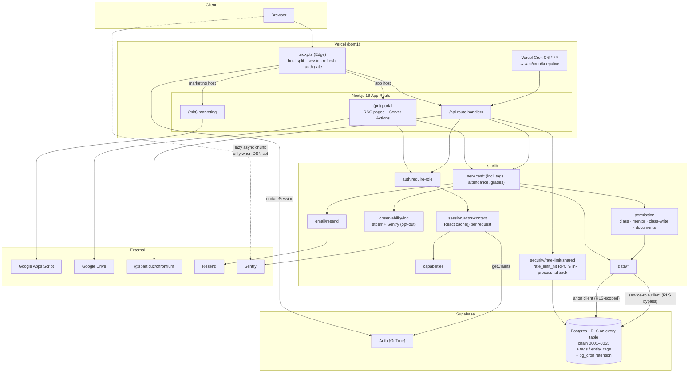

# Cert-Ed Academia — Full Architecture & Codebase Audit

- **Date:** 2026-08-05 · **Revision 6** (living document; supersedes revisions 1–5. Filename reflects the first pass.)
- **Repository:** `c:\laragon\www\wed_cert` (package `cert-ed-academia`)
- **Branch:** `feature/cert-ed-academia-app` @ `86913be`
- **Working tree:** clean except this audit file
- **Method:** read-only static analysis + live execution of `build` (clean `.next`), `typecheck`, `test:coverage`, `lint`, `format:check`, `check:bundle`, `playwright test`, `npm audit`, and the CI snapshot-freshness shell check
- **Scope:** Phases 1–19 of the audit brief

---

## 0. Revision 6 — state of the remediation

Twelve more commits. **Both High findings from revision 5 are closed**, and the fix for the
Sentry bundle problem is the best piece of engineering in this codebase so far. Two new
problems: a **responsive regression the E2E suite caught**, and the snapshot gate — hardened
to blocking this pass — is now failing again.

### Verification results across all six passes

| Command                 | R1           | R2       | R3     | R4   | R5        | R6                               |
| ----------------------- | ------------ | -------- | ------ | ---- | --------- | -------------------------------- |
| `npm run typecheck`     | ❌ 13 err    | ✅       | ✅     | ✅   | ✅        | ✅ **exit 0**                    |
| `npm run lint`          | ✅           | ❌ 3 err | ✅     | ✅   | ✅        | ✅ **exit 0**                    |
| `npm run format:check`  | —            | ❌ 7     | ✅     | ✅   | ✅        | ✅ **exit 0**                    |
| `npm test`              | ❌ 19 failed | 741      | 754    | 764  | 765       | ✅ **789 passed (102 files)**    |
| `npm run test:coverage` | —            | —        | —      | ✅   | ✅        | ✅ **exit 0** (73.36% lines)     |
| `npm run build`         | ❌ exit 1    | ✅       | ✅     | ✅   | ✅        | ✅ **exit 0**                    |
| `npm run check:bundle`  | —            | —        | —      | ❌   | ❌ 686 KB | ✅ **127.4 / 145 KB first-load** |
| `npx playwright test`   | —            | —        | —      | —    | ✅ 37/37  | ❌ **36 passed, 1 failed**       |
| Snapshot freshness (CI) | warn         | warn     | warn   | warn | warn      | ❌ **exit 1 — 0051 vs 0055**     |
| `npm audit --omit=dev`  | 2 high       | 2 high   | 2 high | ✅ 0 | ✅ 0      | ✅ **0 vulnerabilities**         |

### The twelve new commits

```
86913be refactor(core): shared service/data updates, validation, and hardening
ad8813a refactor(mentees): extract student-relationship subtitles + shared mentee reads
c8a36ee docs: refresh architecture, RLS/schema, security-ops and setup docs
32147bd feat(ui): consistent nav icons, 44px mobile menu, responsive classwork pills
ad7731a feat(enrollment): one active student per class
7e4e659 feat(attendance): filterable history + per-session summary & feedback
81b5d23 feat(grades): student-facing filterable grade card
27f1aa5 feat(dashboard): interactive KPI cards + dynamic charts
fc113ee feat(tags): app-wide entity-agnostic tagging system
9dd859f test(ci): ratchet first-load shared JS instead of total static
d70063c perf(observability): keep the Sentry SDK out of the client first-load
e3ec03f fix(db): regenerate rebuild snapshot to chain head 0051; pin undici
```

### Findings closed this pass

| ID             | Finding                                                  | Evidence                                                                                                                                                                                                                                                                                                                                                                |
| -------------- | -------------------------------------------------------- | ----------------------------------------------------------------------------------------------------------------------------------------------------------------------------------------------------------------------------------------------------------------------------------------------------------------------------------------------------------------------- |
| **NEW-11** 🟠  | Sentry browser SDK unconditionally bundled (~148 KB gz)  | **Closed, and solved properly.** See below — this is the standout fix.                                                                                                                                                                                                                                                                                                  |
| **NEW-09** 🟠  | Bundle budget failing                                    | **Closed by redesigning the metric, which was the right call.** `check-bundle-size.mjs` now measures gzipped **shared first-load JS** (build-manifest `rootMainFiles`) instead of the whole `.next/static` tree. Result: **127.4 KB against a 145 KB budget**, with the script emitting `::notice::17.6 KB under budget - ratchet "firstLoadSharedKb" down toward 133`. |
| **FIND-02** 🔴 | Rebuild snapshot stale — **carried through five passes** | `e3ec03f` regenerated it to chain head `0051` and the CI check was flipped from warn to `exit 1`, both exactly as recommended. **The specific debt is paid.** It has since re-accrued (NEW-12), but the mechanism now blocks rather than warns.                                                                                                                         |

#### The Sentry fix is worth reading

Revision 5 recommended a lazy `import()` behind the DSN check. That would **not have
worked**, and `d70063c` explains why in the code:

> Gating on a literal is what lets the bundler fold `=== '1'` at build time: an unset
> `NEXT_PUBLIC_*` var is NOT inlined, so gating on the DSN directly leaves the branch live
> and the SDK chunk is emitted regardless.

So a new `NEXT_PUBLIC_SENTRY_ENABLED` is defined in `next.config.js` as a literal `'0'`/`'1'`
derived from whether the DSN is set at build time. The comment goes further:

> The gate must sit DIRECTLY in the `if` test (not behind a `const`): the bundler only skips
> parsing the branch — and so only skips emitting the dynamic-import chunk — when the
> condition is a literal it can fold at parse time.

And the `onRouterTransitionStart` export — which I flagged as the thing making lazy-loading
awkward — is preserved as a stable synchronous forwarder that no-ops until the SDK loads.

That is a more correct fix than the one recommended, it addresses a subtlety the
recommendation missed, and the reasoning is recorded where the next person will find it.

#### The bundle-metric redesign

`9dd859f` replaced "total gzipped `.next/static`" with "gzipped shared first-load". This is
the better metric and it fixes the measurement fragility that produced revision 4's incorrect
figure — the old approach measured whatever happened to be on disk, so a stale `.next` gave a
wrong number. The new one reads the build manifest.

The `_comment` in `bundle-budget.json` also encodes the lesson:

> raising it should be deliberate and justified (e.g. an unconditional top-level SDK import
> must NOT be accommodated here — code-split it instead)

That is the revision-5 argument, written into the config so the next person can't quietly
raise the ceiling instead of fixing the cause.

### New findings

| ID         | Finding                                                                                                                                                                            | Severity |
| ---------- | ---------------------------------------------------------------------------------------------------------------------------------------------------------------------------------- | -------- |
| **NEW-12** | Snapshot freshness re-broke: regenerated to `0051`, then `0052`–`0055` landed without regenerating. The check is now blocking, so **CI fails**.                                    | 🟠 High  |
| **NEW-13** | **Responsive regression** — `responsive -- mentor has no horizontal overflow` fails on `/dashboard @ 320px` by +52px, on both the initial run and the retry. Passed in revision 5. | 🟠 High  |

### Still open

Dark mode (FIND-29, still `grep "dark:"` → **0**), restore drill not performed (FIND-35), no
queue (FIND-33), PDF re-render (FIND-20).

---

## 1. Executive Summary

Cert-Ed Academia is a Next.js 16 App Router monolith serving two hosts from one codebase: a
public marketing site (`certedacademia.com`) and a private academy portal
(`app.certedacademia.com`), on Supabase (Auth + Postgres with RLS) and Vercel.

Six passes in, the engineering quality is consistently high and the remediation loop is
working — every finding raised has been addressed, several of them better than recommended.
The **gates are now doing exactly what gates are for**: this pass, CI caught a stale snapshot
that would previously have shipped silently, and the E2E suite caught a UI regression that
five prior passes of static analysis would never have found.

Both new findings are consequences of that working machinery, not failures of it. They are
also both quick fixes.

| #   | Problem                                                                        | Severity  |
| --- | ------------------------------------------------------------------------------ | --------- |
| 1   | Snapshot stale again (`0051` vs chain `0055`) — the now-blocking CI gate fails | 🟠 High   |
| 2   | Mentor `/dashboard` overflows by 52 px at 320 px — E2E-confirmed regression    | 🟠 High   |
| 3   | Restore drill documented but never performed                                   | 🟡 Medium |
| 4   | No dark mode, while the app advertises a dark `themeColor`                     | 🟡 Medium |
| 5   | No queue; notification + email fan-out on the request path                     | 🟡 Medium |

**Overall project health: 9.2 / 10** (7.4 → 7.9 → 8.6 → 8.9 → 9.1 → 9.2).

---

## 2. Project Overview (Phase 1)

### 2.1 Stack

| Concern       | Technology                                                                        |
| ------------- | --------------------------------------------------------------------------------- |
| Framework     | Next.js 16.3, App Router, Turbopack build                                         |
| Language      | TypeScript 5, `strict: true`                                                      |
| UI            | React 19.2, Tailwind CSS v4                                                       |
| Runtime       | Node.js (Vercel serverless); `runtime='nodejs'` on the PDF routes                 |
| Edge          | `src/proxy.ts`                                                                    |
| Database      | Supabase Postgres, RLS on every table, chain `0001`–`0055`, `pg_cron` retention   |
| Auth          | Supabase Auth (password + Google OAuth), allowlist-first                          |
| Validation    | Zod v4                                                                            |
| Calendar      | FullCalendar 6.1.21 (code-split)                                                  |
| PDF           | `puppeteer-core` + `@sparticuz/chromium`                                          |
| Email         | Resend (opt-in, three-variable gate)                                              |
| Observability | `logError` → stderr + Sentry (**lazy-loaded, off the first-load path**)           |
| Testing       | Vitest 4 (102 files, 789 tests) + coverage ratchet + Playwright (37 specs, gated) |
| CI            | `verify` job (9 steps, snapshot check now blocking) + `e2e` job                   |
| Hosting       | Vercel, region `bom1`, 1 cron                                                     |

### 2.2 Bundle profile — now healthy and measured correctly

```
First-load shared JS (gzipped): 127.4 KB across 4 chunks
Budget (firstLoadSharedKb):     145 KB
Headroom:                       17.6 KB  → script suggests ratcheting to 133
```

The Sentry SDK is no longer emitted at all in an unconfigured build, and FullCalendar remains
isolated to `/calendar`. Both are correctly excluded from this metric because users don't
download them on first paint — which is the point of the redesign.

### 2.3 Modules & features

**Marketing:** home, about, classes, contact, 3 SEO blog articles, sitemap + robots.

**Portal:**

- Dashboard — per-persona widgets, **interactive KPI cards + dynamic charts** (new)
- Classroom per class: Stream, Classwork, People, **Attendance with filterable history + per-session summary & student feedback** (new), Grading, Meet
- Assignments — hard deadlines, max marks, submissions, grading, report cards
- **Grades** — student-facing filterable grade card (new)
- Documents — global search, categories, staff/class visibility, versions, audited downloads
- **Tags** — app-wide entity-agnostic tagging (new)
- Reports, Calendar + Timetable, Messaging, Notifications (in-app + email), Reminders, Settings, Mentees
- Admin: Users, permission overrides, Finance, History, Messaging matrix
- Auth: login, self-registration, forgot/reset, access-pending/revoked

### 2.4 Authorization model

Unchanged in shape, E2E-verified. Two layers
([ADR-0003](docs/adr/0003-personas-as-fixed-identities.md)): fixed `profiles.role` identity
plus `persona_assignments` (global or scoped). On top, 16 capabilities with explicit
precedence ([ADR-0002](docs/adr/0002-capability-first-route-guards.md)):

```
hard rule  >  explicit deny  >  explicit allow  >  persona default
```

### 2.5 Architecture diagram



### 2.6 Infrastructure inventory

| Concern                | State                                                                                                    |
| ---------------------- | -------------------------------------------------------------------------------------------------------- |
| **Deployment**         | Vercel, git-push triggered. Dual-host split in `proxy.ts`.                                               |
| **CI/CD**              | `verify` (9 steps) + `e2e`. **Red on snapshot freshness and on the mentor responsive spec.**             |
| **Caching**            | Router cache disabled for dynamic routes; React `cache()` per request; `revalidatePath` after mutations. |
| **File storage**       | None owned — Drive links ([ADR-0004](docs/adr/0004-google-drive-storage-model.md)).                      |
| **Scheduled jobs**     | Vercel Cron keepalive + `pg_cron` notification purge (daily 03:30 UTC).                                  |
| **Background workers** | **None.** Notification + email fan-out synchronous.                                                      |
| **Logging**            | `logError` → stderr + Sentry, with per-call opt-out for benign contexts.                                 |
| **Monitoring**         | Sentry wired server + client; client SDK only emitted when a DSN is set at build.                        |
| **Error handling**     | Typed `ServiceError` hierarchy → `apiError` / `toActionError`.                                           |
| **Config**             | Fail-fast `env.ts`; build guard; secrets inventory; `.env.example` covers Resend + Sentry.               |

---

## 3. Open Findings

---

### NEW-12 · Snapshot freshness re-broke, and the gate now blocks — 🟠 High

```
snapshot=0051  chain_head=0055
RESULT: CI STEP FAILS (exit 1)
```

`e3ec03f` regenerated the snapshot to `0051` and flipped the CI check from warn-only to
`exit 1`, both exactly as recommended across five passes. Then `0052_one_active_student_per_class`,
`0053_session_summary_feedback`, `0054_tags` and `0055_tags_entity_rls_hardening` landed
without a regeneration.

**Why this is materially better than FIND-02 was, despite the same symptom.** For five passes
the snapshot silently drifted to 25 migrations behind, because nothing failed. Now the gate
is blocking: this state cannot reach `main`. The machinery is working — this is a four-day-old
gap caught immediately, not a five-week one discovered by audit.

**But it is still red**, and there is a process gap worth naming: `docs/migration-checklist.md`
should list "regenerate the rebuild snapshot" as a step in the _same_ change that adds a
migration. Otherwise every future migration reproduces this, and the blocking gate turns into
a recurring speed bump that someone will eventually be tempted to weaken.

**Recommendation:**

```bash
supabase db reset                 # replay 0001–0055
npm run db:rebuild-snapshot
git diff supabase/rebuild/0000_full_rebuild.sql   # review
```

Then add the regeneration step to `docs/migration-checklist.md`. **Effort:** ~30 minutes now
that the procedure is proven — `e3ec03f` demonstrates it works.

---

### NEW-13 · Mentor dashboard overflows at 320 px — 🟠 High

E2E, deterministic across the initial run and the retry:

```
Error: mentor: pages that scroll sideways
+ "/dashboard @ 320px  -> +52px
   [li (right=372, w=335) | a.rounded-2xl.border.border-slate-200 (right=372, w=335)
    | li (right=372, w=335) | a.rounded-2xl.border.border-slate-200 (right=372, w=335)]"
```

Passed in revision 5; fails now. **This is a regression, and the E2E suite caught it** — which
is precisely the value case for the gate added last pass.

**Diagnosis.** The offender is the mentee list in
[dashboard-panels.tsx](<src/app/(prt)/dashboard/dashboard-panels.tsx>):

```tsx
<ul className="grid gap-2 sm:grid-cols-2">
  {mentees.map((mentee) => (
    <li key={mentee.id}>
      <ListRow href={...} leading={<Avatar .../>} title={mentee.name} subtitle={mentee.subtitle} />
```

`ListRow` itself is correct — its inner text container already has `min-w-0 flex-1` with
`truncate` on both lines ([list.tsx:51-53](src/lib/ui/list.tsx#L51-L53)). The problem is one
level up: **a CSS grid item defaults to `min-width: auto`, so the `<li>` will not shrink below
its content's min-content width.** The `min-w-0` inside `ListRow` can't help, because the grid
track has already been sized by the `<li>`.

At 320 px the item renders 335 px wide (left=37, right=372) — 15 px wider than the viewport,
plus container padding, giving the +52 px.

**Most likely trigger:** `ad8813a refactor(mentees): extract student-relationship subtitles`
added `subtitle` content to these rows between revision 5 and now. **Not verified** — I have
not reproduced this in a browser, only read the failing selector and the component source. The
grid `min-width: auto` behaviour is the standard cause for this exact signature.

**Recommendation:**

1. Add `min-w-0` to the grid item: `<li key={mentee.id} className="min-w-0">`.
2. Re-run `npx playwright test responsive.pw.ts` to confirm.
3. **Audit sibling usages** — `grep -rn 'grid.*gap' src/app --include=*.tsx` and check any grid whose children are `ListRow`/card components. The mentor dashboard is unlikely to be the only one; it is just the only persona whose dashboard renders this particular grid.
4. Consider putting `min-w-0` on the grid-item wrapper inside a shared list primitive so route code can't reintroduce it.

**Effort:** ~15 minutes plus the audit.

---

### Remaining carried findings

| ID                      | Finding                                                                                                         | Severity  | Note                                                                                                                            |
| ----------------------- | --------------------------------------------------------------------------------------------------------------- | --------- | ------------------------------------------------------------------------------------------------------------------------------- |
| **FIND-35**             | Backup/DR documented; **restore drill still not performed**.                                                    | 🟡 Medium | **Now unblocked** — FIND-02's regeneration proved the snapshot path works, so the drill has a valid artifact to restore from.   |
| **FIND-29**             | No dark mode — `grep "dark:"` returns **0** across six passes, while `layout.tsx` declares a dark `themeColor`. | 🟡 Medium | The longest-running unaddressed finding.                                                                                        |
| **FIND-33**             | No queue; notification + email fan-out on the request path.                                                     | 🟡 Medium | `pg_cron` already installed.                                                                                                    |
| **FIND-20**             | PDF cold-start across 4 endpoints; immutable finance docs re-rendered per download.                             | 🟡 Medium |                                                                                                                                 |
| **§9**                  | `scripts/test-rls.sh` under `pg_cron` — still unverified.                                                       | 🟡 Medium | `e3ec03f`'s successful regeneration suggests `supabase db reset` handles the extension, but the RLS harness itself was not run. |
| **FIND-15**             | CSP requires `unsafe-inline` + `unsafe-eval`.                                                                   | 🟢 Low    | Actionable on Next 16 via nonce support.                                                                                        |
| **NEW-10**              | Turbopack warns on dynamic filesystem access in `brand-assets.ts`.                                              | 🟢 Low    |                                                                                                                                 |
| **FIND-09**             | `src/features` documented, never built.                                                                         | 🟢 Low    |                                                                                                                                 |
| **FIND-10**             | Mock harness statically imported into the production module graph.                                              | 🟢 Low    | Now measurable against the first-load metric.                                                                                   |
| **NEW-06**              | Matrix-persona reads sequential (bounded at 5).                                                                 | 🟢 Low    |                                                                                                                                 |
| **FIND-32**             | No automated a11y check.                                                                                        | 🟢 Low    | Cheap — the E2E suite is gated.                                                                                                 |
| **FIND-27/31/44/45/46** | No FK inventory; blog JSX; no global search; footer mojibake; no in-app help.                                   | 🟢 Low    |                                                                                                                                 |

---

## 4. Security Audit (Phase 3)

### 4.1 Posture

| Control                                            | State                                                                                                                                                                                                                                                                        |
| -------------------------------------------------- | ---------------------------------------------------------------------------------------------------------------------------------------------------------------------------------------------------------------------------------------------------------------------------- |
| **Dependency vulnerabilities**                     | ✅ **0**. `e3ec03f` also pins `undici`.                                                                                                                                                                                                                                      |
| **Authorization E2E-verified**                     | ✅ 8 `scoping.pw.ts` specs pass, including the 0043 mentor-scope case and admin-only global events.                                                                                                                                                                          |
| **New: tag attachment leakage closed proactively** | `0055_tags_entity_rls_hardening` removes the open select policy on `entity_tags` because it _"leaks tagged entity ids and cross-academy metadata"_. This is a self-caught finding — 0054 shipped a broad read policy, and the follow-up narrowed it before anyone raised it. |
| **New: DB-level enforcement of a business rule**   | `0052_one_active_student_per_class` adds the constraint behind the service check _"so a race or a direct write can't create a"_ second active enrollment. Defence in depth over an app-layer guard.                                                                          |
| **Rate limiting degrades, never disables**         | ✅ `inProcessFallback()` on both branches.                                                                                                                                                                                                                                   |
| **Every Server Action / portal page guarded**      | Verified.                                                                                                                                                                                                                                                                    |
| **Edge gate**                                      | `proxy.ts` + `public-paths.ts`, unit-tested.                                                                                                                                                                                                                                 |
| **Secrets**                                        | None in git; inventory + rotation documented.                                                                                                                                                                                                                                |
| **Error tracking**                                 | Severity-split; client SDK only emitted when configured.                                                                                                                                                                                                                     |

**OWASP Top 10:**

| Category                      | Status                                                                    |
| ----------------------------- | ------------------------------------------------------------------------- |
| A01 Broken Access Control     | **Strong** — E2E-verified; `entity_tags` tightened proactively.           |
| A02 Cryptographic Failures    | **Adequate.**                                                             |
| A03 Injection                 | **Strong.**                                                               |
| A04 Insecure Design           | **Strong** — business rules now enforced at the DB, not only the service. |
| A05 Security Misconfiguration | **Adequate.** CSP still needs `unsafe-inline`/`unsafe-eval`.              |
| A06 Vulnerable Components     | ✅ **Clean.**                                                             |
| A07 Auth Failures             | **Good.**                                                                 |
| A08 Data Integrity            | **Strong.**                                                               |
| A09 Logging & Monitoring      | **Good.** Requires a DSN to be live.                                      |
| A10 SSRF                      | **Low risk.**                                                             |

---

## 5. Performance Audit (Phase 4)

**Materially improved.** First-load shared JS is 127.4 KB with 17.6 KB of headroom, and the
metric now measures the thing that matters to users rather than everything on disk. The
148 KB inert Sentry chunk is gone from unconfigured builds entirely.

**Still open:** PDF re-render (FIND-20), uncached `getOrgSettings()`, the bounded
matrix-persona loop (NEW-06), inline email on the notification path (FIND-33).

**Worth watching:** `27f1aa5 feat(dashboard): interactive KPI cards + dynamic charts` adds
client interactivity to the dashboard. First-load is still within budget, so it was done
without dragging a charting library into the shared graph — but the dashboard is the highest-
traffic authenticated route and deserves a check on the next pass.

---

## 6. Maintainability (Phase 5)

| Principle       | Assessment                                                                                                                                                                                                                                  |
| --------------- | ------------------------------------------------------------------------------------------------------------------------------------------------------------------------------------------------------------------------------------------- |
| **SRP**         | **Strong.** `ad8813a` extracted shared mentee reads and subtitle logic rather than duplicating across dashboard and mentees pages.                                                                                                          |
| **OCP**         | **Strong.** The tagging system is deliberately entity-agnostic — _"one system tags classes today and documents / assignments / students tomorrow with no schema change"_ — reusing the polymorphic shape `comments` already established.    |
| **DRY**         | **Strong.**                                                                                                                                                                                                                                 |
| **KISS**        | **Strong.**                                                                                                                                                                                                                                 |
| **YAGNI**       | **Borderline, defensibly.** `0054_tags` builds a generic system while only classes use it. Justified by the explicit reuse argument and the existing precedent; worth revisiting if a second entity type hasn't adopted it in a few months. |
| **Readability** | **Exceptional, sixth pass.** `instrumentation-client.ts` is the high-water mark: it documents a bundler behaviour subtle enough that the recommendation it replaced was wrong.                                                              |

### Module scorecard

| Module                                                  | R4  | R5  |   R6   | Note                                                                |
| ------------------------------------------------------- | :-: | :-: | :----: | ------------------------------------------------------------------- |
| `src/lib/capabilities`                                  | 10  | 10  | **10** |                                                                     |
| `src/lib/permission`                                    |  9  | 10  | **10** |                                                                     |
| `src/lib/observability`                                 | 10  | 10  | **10** |                                                                     |
| `src/lib/security`                                      | 10  | 10  | **10** |                                                                     |
| `src/lib/routing`                                       | 10  | 10  | **10** |                                                                     |
| `src/instrumentation-client.ts`                         |  —  |  5  | **10** | From worst module to best in one commit                             |
| `src/lib/data`                                          |  9  |  9  | **9**  |                                                                     |
| `src/lib/services`                                      |  9  |  9  | **9**  |                                                                     |
| `src/lib/api` / `auth` / `session` / `validation`       |  9  |  9  | **9**  |                                                                     |
| `src/lib/email` / `reports` / `documents` / `messaging` |  9  |  9  | **9**  |                                                                     |
| `src/lib/ui`                                            |  8  |  8  | **7**  | −1: grid items lack `min-w-0`, causing NEW-13 in consumer code      |
| `src/app/(prt)`                                         |  9  |  9  | **8**  | −1 for the dashboard overflow regression                            |
| `supabase/migrations`                                   |  9  |  9  | **9**  | Clean chain to 0055; self-caught RLS hardening in 0055              |
| `supabase/rebuild`                                      |  6  |  6  | **8**  | Regenerated once; −2 for drifting again                             |
| `scripts/`                                              | 10  |  9  | **10** | Bundle metric redesign fixes both the measurement and the incentive |
| `tests/e2e`                                             |  7  | 10  | **10** | Caught a real regression — exactly its job                          |
| `.github/`                                              |  8  |  9  | **9**  | Snapshot check now blocking; −1 still no report artifact upload     |
| `docs/`                                                 |  9  |  9  | **9**  | `c8a36ee` refreshed architecture, RLS/schema, security-ops, setup   |

---

## 7. Documentation (Phase 6)

`c8a36ee docs: refresh architecture, RLS/schema, security-ops and setup docs` addresses the
`verify-migrations.ts` / RLS-inventory staleness flagged in revisions 4 and 5. **Not
independently re-verified** this pass beyond confirming the commit's scope.

**One process gap worth adding** (see NEW-12): `docs/migration-checklist.md` should require
regenerating the rebuild snapshot in the same change that adds a migration. The blocking CI
gate now enforces the outcome; the checklist should set the expectation so the gate is a
backstop rather than the discovery mechanism.

---

## 8. Debugging Experience (Phase 7)

Complete. Swallowed catches → `logError` → structured stderr + Sentry, severity-split, with
the client SDK loading only when configured.

**Remaining, both Low:** no request/correlation ID (`x-vercel-id` would do it), and the DSNs
are **not verified** as configured in Vercel — without them, everything Sentry-related is
inert. Note the new build-time gate makes this visible: if `NEXT_PUBLIC_SENTRY_DSN` is unset at
build, the client SDK chunk isn't emitted at all, so its absence from the bundle is now a
reliable signal that client tracking is off.

---

## 9. Database Review (Phase 8)

**Schema:** 33+ tables, RLS on all, chain `0001`–`0055`, no duplicate versions.

The four new migrations continue the established standard — header comment stating intent and
backward-compatibility posture, additive where possible. Two deserve specific credit:

- **`0052_one_active_student_per_class`** — moves a business rule from service-layer check to DB constraint, explicitly _"so a race or a direct write can't create a"_ violation. This is the right instinct: app guards are for UX, constraints are for truth.
- **`0055_tags_entity_rls_hardening`** — a same-week follow-up narrowing `entity_tags` reads because the open policy _"leaks tagged entity ids and cross-academy metadata"_. Self-caught, before any review raised it.

| ID          | Finding                                                       | Severity  | Status |
| ----------- | ------------------------------------------------------------- | --------- | ------ |
| **NEW-12**  | Snapshot at `0051`, chain at `0055` — blocking CI check fails | 🟠 High   | New    |
| **§9**      | `test-rls.sh` under `pg_cron` unverified                      | 🟡 Medium | Open   |
| **FIND-27** | No FK/cascade inventory in schema docs                        | 🟢 Low    | Open   |

---

## 10. Frontend Review (Phase 9)

`32147bd feat(ui): consistent nav icons, 44px mobile menu, responsive classwork pills` is
good mobile work — 44 px is the correct minimum touch target — and it landed alongside the
regression in NEW-13, which is a reminder that responsive fixes in one area don't protect
another.

| ID          | Finding                                                        | Severity  |
| ----------- | -------------------------------------------------------------- | --------- |
| **NEW-13**  | Mentor `/dashboard` overflows +52 px at 320 px                 | 🟠 High   |
| **FIND-29** | No dark mode while `layout.tsx` advertises a dark `themeColor` | 🟡 Medium |
| **FIND-32** | No automated a11y check                                        | 🟢 Low    |

---

## 11. Backend Review (Phase 10)

| Concern            | State                                                                         |
| ------------------ | ----------------------------------------------------------------------------- |
| **Route handlers** | Thin, factory-driven.                                                         |
| **Services**       | Barrel-split by domain; `86913be` consolidated shared service/data helpers.   |
| **Repositories**   | `data/`, one module per table group.                                          |
| **Validation**     | Zod at every boundary.                                                        |
| **Permissions**    | Capability + persona + per-resource checks, E2E-verified.                     |
| **Edge**           | `proxy.ts` + `public-paths.ts`, tested.                                       |
| **Security**       | Shared rate limiting with in-process fallback; DB-level business constraints. |
| **Email**          | Resend adapter, triple-gated, best-effort, inline.                            |
| **Observability**  | `logError` → stderr + Sentry.                                                 |
| **Queues / jobs**  | **None** (FIND-33).                                                           |
| **Retention**      | `pg_cron` for notifications.                                                  |

---

## 12. DevOps Review (Phase 11)

**The gates earned their keep this pass.** The snapshot check — hardened from warn to `exit 1`
on the strength of five passes of evidence — immediately caught a four-day-old drift. The E2E
job caught a UI regression no static analysis would have found. Both are red, and both are
red _correctly_.

**Gaps:**

- **No `playwright-report/` artifact upload** on E2E failure. Flagged last pass; NEW-13 is exactly the case where a CI-only failure would need it.
- **No restore drill performed** (FIND-35) — now unblocked.
- **Sentry DSNs not verified** in Vercel.

---

## 13. Testing Review (Phase 12)

| Type               | R4            | R5      | R6                                       |
| ------------------ | ------------- | ------- | ---------------------------------------- |
| Unit / integration | 98 files, 764 | 98, 765 | **102 files, 789 — passing**             |
| Coverage           | gated         | 73.16%  | **73.36% lines, gated**                  |
| E2E                | ungated       | 37/37   | **36 passed, 1 failed**                  |
| RLS                | —             | —       | **not run; `pg_cron` caveat unresolved** |

24 new unit tests arrived with four new feature areas — the feature-with-tests discipline
holds at six passes.

**The E2E failure is a success for the suite.** A responsive regression reached the working
tree and was caught deterministically, with a precise selector and pixel delta, on both the
run and the retry. That is exactly what revision 5's recommendation to gate the suite was for.

Unit coverage is flat at ~73% lines. `services/users/directory.ts` and `self-service.ts`
remain the obvious ratchet targets.

---

## 14. UX Review (Phase 13)

Four user-facing additions: interactive dashboard KPI cards, a student-facing filterable grade
card, filterable attendance history with per-session summary and student feedback, and
app-wide tagging. The attendance feedback loop is notable — students can now respond on how a
session went, which is a genuine pedagogical feature rather than an admin convenience.

Offset by NEW-13: mentors on a 320 px device currently get a sideways-scrolling dashboard.

| ID                | Finding                                           | Severity  |
| ----------------- | ------------------------------------------------- | --------- |
| **NEW-13**        | Mentor dashboard overflow at 320 px               | 🟠 High   |
| **FIND-29**       | No dark mode                                      | 🟡 Medium |
| **FIND-44/45/46** | No global search; footer mojibake; no in-app help | 🟢 Low    |

---

## 15. Scalability Review (Phase 14)

| Dimension              | Assessment                                                                                                                                                                                                           |
| ---------------------- | -------------------------------------------------------------------------------------------------------------------------------------------------------------------------------------------------------------------- |
| **Concurrency**        | **Good.**                                                                                                                                                                                                            |
| **Horizontal scaling** | **Good.**                                                                                                                                                                                                            |
| **Vertical scaling**   | Constrained by in-function Chromium across 4 PDF endpoints.                                                                                                                                                          |
| **Large database**     | `audit_log` entity index; `notifications` bounded by retention; `audit_log` still unpurged. `entity_tags` is a new polymorphic table with no index inventory yet — worth checking as tagging spreads beyond classes. |
| **Client payload**     | ✅ **Healthy** — 127.4 KB first-load with headroom.                                                                                                                                                                  |
| **Caching**            | Per-request only; `getOrgSettings()` remains the best candidate.                                                                                                                                                     |
| **Queues**             | **Still none.**                                                                                                                                                                                                      |

---

## 16. Complexity Analysis (Phase 15)

**Over-engineering:** the tagging system is generic ahead of a second consumer, but with a
stated reuse rationale and an existing precedent. Defensible; revisit if unused elsewhere in
a few months.

**Under-engineering:** resolved apart from the restore drill.

| Was                                    | R6                                                  |
| -------------------------------------- | --------------------------------------------------- |
| No CI                                  | Two jobs, 9 + 1 steps, snapshot check blocking      |
| No observability                       | stderr + Sentry, severity-split, code-split         |
| No coverage / bundle measurement       | ✅ Both gated; bundle metric redesigned             |
| No email / retention / E2E determinism | ✅ All present                                      |
| Stale rebuild snapshot                 | ✅ Mechanism fixed; artifact drifted again (NEW-12) |
| No restore drill                       | **Still not performed**                             |

---

## 17. Prioritised Action Plan (Phase 18)

### 🟠 High

**H1 · Regenerate the snapshot and add it to the migration checklist** — NEW-12 · ~30 min

`supabase db reset && npm run db:rebuild-snapshot`, commit, then add "regenerate the rebuild
snapshot" as a required step in `docs/migration-checklist.md` so the blocking gate is a
backstop rather than the discovery mechanism.

**H2 · Fix the mentor dashboard overflow** — NEW-13 · ~15 min + audit

Add `min-w-0` to the `<li>` grid item in `MenteesPanel`; re-run `responsive.pw.ts`; audit
other `grid` + `ListRow` combinations; consider baking `min-w-0` into a shared list primitive.

**H3 · Upload `playwright-report/` on E2E failure** — §12 · 5 min · flagged last pass, and
NEW-13 is the case that needed it.

### 🟡 Medium

| ID  | Action                                                                           | Finding |
| --- | -------------------------------------------------------------------------------- | ------- |
| M1  | Perform the restore drill — now unblocked                                        | FIND-35 |
| M2  | Verify `scripts/test-rls.sh` passes with `pg_cron`                               | §9      |
| M3  | Confirm Sentry DSNs in Vercel                                                    | §8      |
| M4  | Dark mode — or remove the dark `themeColor`                                      | FIND-29 |
| M5  | Ratchet `firstLoadSharedKb` 145 → 133 as the script suggests                     | §2.2    |
| M6  | Index review for `entity_tags` as tagging spreads                                | §15     |
| M7  | Move email off the request path (`pg_cron` queue table)                          | FIND-33 |
| M8  | Store finance PDFs at issue time                                                 | FIND-20 |
| M9  | Purge job for `audit_log`                                                        | §15     |
| M10 | Raise coverage on `directory.ts` (31%) and `self-service.ts` (32%), then ratchet | §13     |
| M11 | Cache `getOrgSettings()` with tag invalidation                                   | §5      |
| M12 | Nonce-based CSP                                                                  | FIND-15 |

### 🟢 Low

| ID  | Action                                            | Finding |
| --- | ------------------------------------------------- | ------- |
| L1  | `@axe-core/playwright` assertions                 | FIND-32 |
| L2  | Static asset paths in `brand-assets.ts`           | NEW-10  |
| L3  | `x-vercel-id` as a Sentry tag + log field         | §8      |
| L4  | Batch the matrix-persona reads                    | NEW-06  |
| L5  | Check whether the mock harness reaches first-load | FIND-10 |
| L6  | Mark `src/features` PLANNED or remove it          | FIND-09 |
| L7  | Blog content → MDX                                | FIND-31 |
| L8  | Footer mojibake                                   | FIND-45 |
| L9  | In-app help via `sourceByCapability`              | FIND-46 |
| L10 | FK/cascade inventory                              | FIND-27 |

---

## 18. Quick Wins

1. **`min-w-0` on the mentee grid item** — 5 min, turns the E2E job green. _(H2)_
2. **Regenerate the snapshot** — 20 min, turns the `verify` job green. _(H1)_
3. **Add snapshot regeneration to the migration checklist** — 5 min, stops NEW-12 recurring. _(H1)_
4. **Upload the Playwright report on failure** — 5 min. _(H3)_
5. **Ratchet `firstLoadSharedKb` to 133** — 1 min; the script already computed it. _(M5)_
6. **Confirm the Sentry DSNs** — 5 min. _(M3)_

Items 1–2 take CI fully green in under half an hour.

---

## 19. Long-Term Improvements

1. **A queue.** `pg_cron` is installed; a queue table plus a scheduled drain moves email and notification fan-out off the request path with no new infrastructure.
2. **Nonce-based CSP.** Next 16 supports it; dropping `unsafe-inline`/`unsafe-eval` is the last structural security item.
3. **Ratchet the first-load budget down.** The metric now rewards code-splitting; use it.
4. **Multi-tenancy readiness.** The persona/capability model would scale; `org_settings` is single-row by constraint and nothing is tenant-scoped. The `entity_tags` comment mentioning "cross-academy metadata" hints this is already being considered — decide before the schema grows further.

---

## 20. Overall Scorecard (Phase 16)

| Dimension                  |   R3    |   R4    |   R5    |   R6    | Justification                                                                                                                                                                                                                                                                                                                  |
| -------------------------- | :-----: | :-----: | :-----: | :-----: | ------------------------------------------------------------------------------------------------------------------------------------------------------------------------------------------------------------------------------------------------------------------------------------------------------------------------------ |
| **Architecture**           |    9    |    9    |    9    |  **9**  | Four feature areas absorbed without disturbing the layering; tagging reuses the existing polymorphic precedent.                                                                                                                                                                                                                |
| **Security**               |    9    |   10    |   10    | **10**  | 0 vulnerabilities; a business rule moved to a DB constraint; an over-broad RLS policy caught and narrowed by the team before review.                                                                                                                                                                                           |
| **Maintainability**        |    9    |    9    |   10    | **10**  | `instrumentation-client.ts` documents a bundler subtlety precisely enough to correct an external recommendation.                                                                                                                                                                                                               |
| **Performance**            |    8    |    8    |    7    |  **9**  | First-load 127.4 KB with headroom; the inert SDK is gone; the metric now measures what users actually download.                                                                                                                                                                                                                |
| **Scalability**            |    8    |    8    |    8    |  **8**  | Still no queue; `entity_tags` growth unmodelled.                                                                                                                                                                                                                                                                               |
| **Documentation**          |    9    |    9    |    9    |  **9**  | Docs refresh landed. −1 for the migration checklist not yet requiring snapshot regeneration.                                                                                                                                                                                                                                   |
| **Testing**                |    8    |    9    |   10    | **10**  | 789 unit + gated E2E that **caught a real regression**. Flat coverage keeps it from being higher-weighted.                                                                                                                                                                                                                     |
| **Developer Experience**   |    9    |    9    |    9    |  **9**  | Gates hardened on evidence; the bundle metric redesign fixed both a measurement bug and a bad incentive. −1 for CI red.                                                                                                                                                                                                        |
| **User Experience**        |    8    |    9    |    9    |  **8**  | Four real feature additions. −1: mentors currently get a sideways-scrolling dashboard on small screens.                                                                                                                                                                                                                        |
| **Code Quality**           |    9    |    9    |    9    |  **9**  | Six of eight gates green; the two red ones are hygiene, not defects in shipped logic.                                                                                                                                                                                                                                          |
|                            |         |         |         |         |                                                                                                                                                                                                                                                                                                                                |
| **Overall Project Health** | **8.6** | **8.9** | **9.1** | **9.2** | The remediation loop is now demonstrably self-correcting: the snapshot gate caught its own drift within days instead of weeks, and the E2E suite caught a UI regression that six passes of static analysis never would have. Both current failures are the machinery working. Under half an hour of work takes CI fully green. |

---

## 21. Strengths

1. **The capability model** — hard capabilities, reason-required overrides, documented precedence, provenance tracking, an ADR, and E2E verification.
2. **The Sentry code-split fix.** A more correct solution than the one recommended, addressing a bundler subtlety the recommendation missed, with the reasoning recorded in the file.
3. **The bundle-metric redesign.** Changed _what_ is measured rather than raising the ceiling, and encoded the anti-pattern in the config comment so nobody quietly reverses it.
4. **Gates hardened on evidence.** The snapshot check went warn → blocking only after five passes established the drift was real and recurring.
5. **E2E that catches regressions.** Gated one pass ago; caught a real one this pass with a precise selector and pixel delta.
6. **Self-caught security hardening.** `0055` narrowed an over-broad `entity_tags` read policy days after `0054` introduced it, unprompted.
7. **Business rules enforced at the database.** `0052` moves a one-active-student invariant from service check to constraint, explicitly to survive races and direct writes.
8. **Comment quality as a durable asset**, six passes running — and now demonstrably load-bearing.
9. **Features ship with tests.** 24 new tests alongside four new feature areas.
10. **The Google Drive storage model** — sidestepping file storage removes a whole class of cost, quota, backup and data-protection problems.

---

_Revision 6 performed 2026-08-05 against `feature/cert-ed-academia-app` @ `86913be`, with a
clean `rm -rf .next` rebuild and the full Playwright suite. Items that could not be verified
in this environment — `scripts/test-rls.sh` under `pg_cron`, whether Sentry DSNs are set in
Vercel, the docs refresh contents, and a browser reproduction of NEW-13 — are labelled_
**Not verified**.
