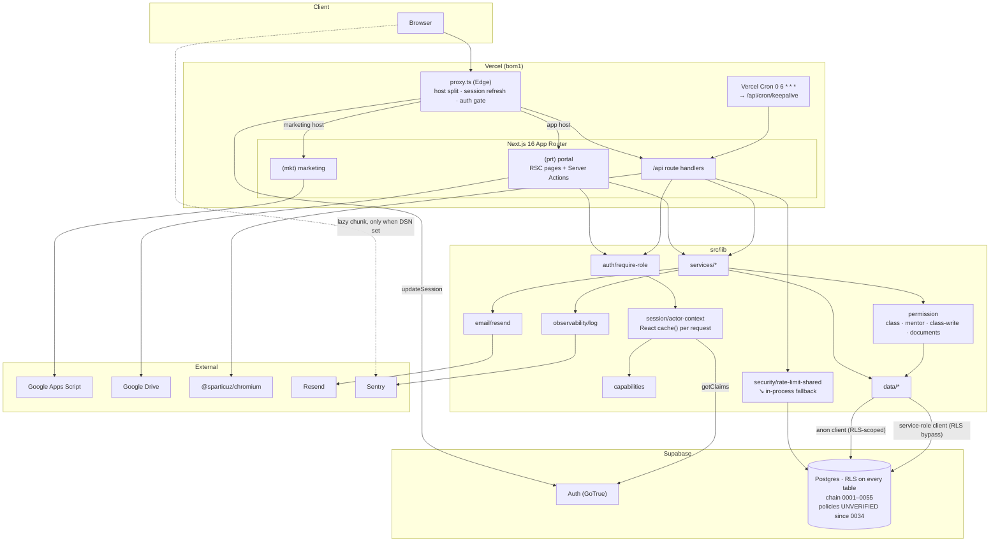

# Cert-Ed Academia — Full Architecture & Codebase Audit

- **Date:** 2026-08-05 · **Revision 7** (living document; supersedes revisions 1–6. Filename reflects the first pass.)
- **Repository:** `c:\laragon\www\wed_cert` (package `cert-ed-academia`)
- **Branch:** `feature/cert-ed-academia-app` @ `f0c687a`
- **Working tree:** clean except this audit file
- **Method:** read-only static analysis + live execution of `build` (clean `.next`), `typecheck`, `test:coverage`, `lint`, `format:check`, `check:bundle`, `playwright test`, `npm audit`, the CI snapshot-freshness shell check, **and `scripts/test-rls.sh` against real Postgres 18**
- **Scope:** Phases 1–19 of the audit brief

---

## 0. Revision 7 — every CI gate is green, and a dead safety net was found

Three commits closed both High findings from revision 6. **For the first time in seven
passes, every gate in CI passes.**

Running the RLS harness for the first time — psql was available in this environment, where it
had not been before — surfaced the one substantial new finding: **`scripts/test-rls.sh` has
been non-functional for 22 migrations**, so the only correctness class mock mode cannot cover
has gone unverified.

### Verification results across all seven passes

| Command                 | R1      | R2      | R3      | R4      | R5       | R6          | R7                     |
| ----------------------- | ------- | ------- | ------- | ------- | -------- | ----------- | ---------------------- |
| `npm run typecheck`     | ❌      | ✅      | ✅      | ✅      | ✅       | ✅          | ✅                     |
| `npm run lint`          | ✅      | ❌      | ✅      | ✅      | ✅       | ✅          | ✅                     |
| `npm run format:check`  | —       | ❌      | ✅      | ✅      | ✅       | ✅          | ✅                     |
| `npm test`              | ❌      | 741     | 754     | 764     | 765      | 789         | ✅ **789 (102 files)** |
| `npm run test:coverage` | —       | —       | —       | ✅      | ✅       | ✅          | ✅ **73.36% lines**    |
| `npm run build`         | ❌      | ✅      | ✅      | ✅      | ✅       | ✅          | ✅                     |
| `npm run check:bundle`  | —       | —       | —       | ❌      | ❌       | ✅          | ✅ **127.4 / 145 KB**  |
| `npx playwright test`   | —       | —       | —       | —       | ✅ 37/37 | ❌ 1 failed | ✅ **37/37**           |
| Snapshot freshness (CI) | warn    | warn    | warn    | warn    | warn     | ❌          | ✅ **0055 = 0055**     |
| `npm audit --omit=dev`  | 2 high  | 2 high  | 2 high  | ✅      | ✅       | ✅          | ✅ **0**               |
| `scripts/test-rls.sh`   | not run | not run | not run | not run | not run  | not run     | ❌ **fails at 0034**   |

### The three new commits

```
f0c687a docs: mark NEW-12/NEW-13 resolved in the architecture audit
16c67ea fix(a11y): let mentee dashboard cards shrink below their content at 320px
1948dda fix(db): regenerate rebuild snapshot to chain head 0055
```

### Findings closed this pass

| ID            | Finding                                        | Evidence                                                                                                                                                                                                                                                                                                                                                                                                                                 |
| ------------- | ---------------------------------------------- | ---------------------------------------------------------------------------------------------------------------------------------------------------------------------------------------------------------------------------------------------------------------------------------------------------------------------------------------------------------------------------------------------------------------------------------------- |
| **NEW-12** 🟠 | Snapshot stale (`0051` vs `0055`), blocking CI | `1948dda` regenerated to `0055`; the freshness check now passes. **And the process gap was closed too** — `docs/migration-checklist.md` gained a **§5 "Rebuild alignment (required in the SAME change that adds a migration)"**, stating that a migration without a regenerated snapshot _"is **not ready to merge**"_. That converts the blocking gate from a discovery mechanism into a backstop, which was the actual recommendation. |
| **NEW-13** 🟠 | Mentor `/dashboard` overflow +52 px at 320 px  | `16c67ea` added `min-w-0` to the `<li>` grid item, with a comment recording the mechanism: _"a grid item defaults to min-width:auto and won't shrink below the row's content width, so the ListRow's own truncate can't engage."_ E2E responsive sweep green — **37/37 passing.**                                                                                                                                                        |

### New finding

| ID         | Finding                                                                                                                                                                                              | Severity |
| ---------- | ---------------------------------------------------------------------------------------------------------------------------------------------------------------------------------------------------- | -------- |
| **NEW-14** | `scripts/test-rls.sh` cannot run. Two independent blockers mean the RLS policy suite has not executed since migration `0034` — 22 migrations of policy changes are unverified against real Postgres. | 🟠 High  |

### Correction to my own prior findings

**§9 (`pg_cron` may break `test-rls.sh` / `supabase db reset`) was unfounded.** I raised it in
revisions 4, 5 and 6 and labelled it _Not verified_ each time. It is now verified, and the
concern was already handled when `0051` was written — three passes before I raised it:

```sql
-- pg_cron is NOT present in a bare local Postgres, so `create extension` there
-- would abort `supabase db reset` / scripts/test-rls.sh at this migration. Guard
-- the whole thing in a block that skips (with a notice) when pg_cron can't be
-- installed, so a fresh local reset succeeds; production Supabase installs it.
do $$ begin
  begin create extension if not exists pg_cron;
  exception when others then raise notice 'pg_cron unavailable ...'; return; end;
```

Confirmed empirically: the full `0001`–`0055` chain applies cleanly on a bare Postgres 18
with no `pg_cron` available (`select extname from pg_extension` → `plpgsql` only). **§9 is
closed as a non-issue** — the author anticipated it and documented the guard.

### Still open

Dark mode (FIND-29, `grep "dark:"` → **0** for the seventh consecutive pass), restore drill
not performed (FIND-35), no `playwright-report/` artifact upload in CI (flagged three passes),
no queue (FIND-33), PDF re-render (FIND-20).

---

## 1. Executive Summary

Cert-Ed Academia is a Next.js 16 App Router monolith serving two hosts from one codebase: a
public marketing site (`certedacademia.com`) and a private academy portal
(`app.certedacademia.com`), on Supabase (Auth + Postgres with RLS) and Vercel.

Seven passes in, **every automated gate the project defines now passes**: 789 unit tests with
a coverage ratchet, 37 E2E specs across five personas, a clean build on the current framework
major, a first-load bundle 17.6 KB under budget, a rebuild snapshot matching the chain head,
and zero dependency vulnerabilities.

The one thing that does not pass is the gate that was never in CI. `scripts/test-rls.sh` —
described in its own header as _"the one class of correctness mock mode CANNOT verify"_ — has
been unable to run since migration `0034`. Two unrelated defects block it, and because it is
not wired into CI, nothing surfaced that. This is the classic shape of a safety net that
quietly stopped catching things.

| #   | Problem                                                                     | Severity  |
| --- | --------------------------------------------------------------------------- | --------- |
| 1   | RLS harness broken since `0034`; 22 migrations of policy changes unverified | 🟠 High   |
| 2   | Restore drill documented but never performed                                | 🟡 Medium |
| 3   | No dark mode, while the app advertises a dark `themeColor`                  | 🟡 Medium |
| 4   | No queue; notification + email fan-out on the request path                  | 🟡 Medium |
| 5   | No `playwright-report/` upload on E2E failure                               | 🟢 Low    |

**Overall project health: 9.2 / 10** (7.4 → 7.9 → 8.6 → 8.9 → 9.1 → 9.2 → 9.2). Flat, and
the reason is worth stating: two High findings closed and every gate green would have moved
this up, but that is offset by learning that a safety net previously assumed functional has
been dead for 22 migrations. The project did not get worse; the picture got more accurate.

---

## 2. Project Overview (Phase 1)

### 2.1 Stack

| Concern       | Technology                                                                                                   |
| ------------- | ------------------------------------------------------------------------------------------------------------ |
| Framework     | Next.js 16.3, App Router, Turbopack build                                                                    |
| Language      | TypeScript 5, `strict: true`                                                                                 |
| UI            | React 19.2, Tailwind CSS v4                                                                                  |
| Runtime       | Node.js (Vercel serverless); `runtime='nodejs'` on the PDF routes                                            |
| Edge          | `src/proxy.ts`                                                                                               |
| Database      | Supabase Postgres, RLS on every table, chain `0001`–`0055`, `pg_cron` retention                              |
| Auth          | Supabase Auth (password + Google OAuth), allowlist-first                                                     |
| Validation    | Zod v4                                                                                                       |
| Calendar      | FullCalendar 6.1.21 (code-split)                                                                             |
| PDF           | `puppeteer-core` + `@sparticuz/chromium`                                                                     |
| Email         | Resend (opt-in, three-variable gate)                                                                         |
| Observability | `logError` → stderr + Sentry (lazy-loaded, off first-load)                                                   |
| Testing       | Vitest 4 (102 files, 789 tests) + coverage ratchet + Playwright (37 specs, gated) + **RLS harness (broken)** |
| CI            | `verify` job (9 steps) + `e2e` job — **all green**                                                           |
| Hosting       | Vercel, region `bom1`, 1 cron                                                                                |

### 2.2 Bundle profile

```
First-load shared JS (gzipped): 127.4 KB across 4 chunks
Budget (firstLoadSharedKb):     145 KB
Headroom:                       17.6 KB  → script suggests ratcheting to 133
```

Unchanged from revision 6 — the three commits were a snapshot regeneration, a one-class CSS
fix, and a docs edit.

### 2.3 Modules & features

**Marketing:** home, about, classes, contact, 3 SEO blog articles, sitemap + robots.

**Portal:** Dashboard (per-persona widgets, interactive KPI cards, dynamic charts); Classroom
per class (Stream, Classwork, People, Attendance with filterable history + per-session summary
and student feedback, Grading, Meet); Assignments; Grades (student-facing filterable card);
Documents (search, categories, staff/class visibility, versions, audited downloads); Tags
(entity-agnostic); Reports; Calendar + Timetable; Messaging; Notifications (in-app + email);
Reminders; Settings; Mentees; Admin (Users, permission overrides, Finance, History, Messaging
matrix); Auth (login, self-registration, forgot/reset, access-pending/revoked).

### 2.4 Authorization model

Two layers ([ADR-0003](docs/adr/0003-personas-as-fixed-identities.md)): fixed `profiles.role`
identity plus `persona_assignments` (global or scoped). On top, 16 capabilities with explicit
precedence ([ADR-0002](docs/adr/0002-capability-first-route-guards.md)):

```
hard rule  >  explicit deny  >  explicit allow  >  persona default
```

**Verification status matters here.** The app-layer half is well covered — unit tests plus 8
`scoping.pw.ts` E2E specs asserting page- and API-level boundaries. The **database half —
the RLS policies that are the second line of defence — is currently unverified** (NEW-14).
The two layers are designed to agree; only one of them is being checked.

### 2.5 Architecture diagram



### 2.6 Infrastructure inventory

| Concern                | State                                                                                                    |
| ---------------------- | -------------------------------------------------------------------------------------------------------- |
| **Deployment**         | Vercel, git-push triggered. Dual-host split in `proxy.ts`.                                               |
| **CI/CD**              | `verify` (9 steps) + `e2e`. **All green.** RLS harness not wired in.                                     |
| **Caching**            | Router cache disabled for dynamic routes; React `cache()` per request; `revalidatePath` after mutations. |
| **File storage**       | None owned — Drive links ([ADR-0004](docs/adr/0004-google-drive-storage-model.md)).                      |
| **Scheduled jobs**     | Vercel Cron keepalive + `pg_cron` notification purge (daily 03:30 UTC).                                  |
| **Background workers** | **None.** Notification + email fan-out synchronous.                                                      |
| **Logging**            | `logError` → stderr + Sentry, severity-split.                                                            |
| **Monitoring**         | Sentry wired; client SDK only emitted when a DSN is set at build.                                        |
| **Error handling**     | Typed `ServiceError` hierarchy → `apiError` / `toActionError`.                                           |
| **Config**             | Fail-fast `env.ts`; build guard; secrets inventory documented.                                           |

---

## 3. Open Findings

---

### NEW-14 · The RLS harness has been dead since migration 0034 — 🟠 High

`scripts/test-rls.sh` describes itself as the check for _"the one class of correctness mock
mode CANNOT verify (the mock has no RLS)"_. Run against real Postgres 18 this pass, it fails
before executing a single assertion. **Two independent blockers.**

#### Blocker 1 — `0034` revokes a function that is never created — ✅ FIXED

> **Resolved.** Line 30 deleted. Independently re-verified: the full `0001`–`0055` chain applies
> to bare Postgres 18 (`ON_ERROR_STOP=1`) with no `rls_auto_enable` stub, producing 33 tables /
> 69 policies / 24 functions — schema byte-identical to the committed snapshot, confirming the
> revoke was a true no-op. Analysis below retained for context.

```
MIGRATION FAILED: supabase/migrations/0034_lock_down_rpc_execute.sql
ERROR: function public.rls_auto_enable() does not exist
```

[0034_lock_down_rpc_execute.sql:30](supabase/migrations/0034_lock_down_rpc_execute.sql#L30):

```sql
revoke execute on function public.rls_auto_enable() from public, anon, authenticated;
```

`grep -rn "rls_auto_enable"` over the **entire repository** returns exactly one hit — that
line. There is no `create function public.rls_auto_enable()` in any migration, and it is
absent from `supabase/rebuild/0000_full_rebuild.sql`. `git log -S` shows it arrived in
`ceb8aee` with no matching definition.

That last point carries an inference worth spelling out: **the rebuild snapshot is a
`pg_dump` of the live, fully-migrated database** (regenerated to `0055` two commits ago). If
`rls_auto_enable()` existed in production, the dump would contain it. It does not — so the
function does not exist in production either. The `revoke` has never done anything anywhere;
it is a stray line referring to a function that was presumably renamed or dropped before the
migration was committed.

**Consequences:**

- The RLS harness aborts at `0034`, so **policies added or changed in `0034`–`0055` have never been exercised against real Postgres.** That includes `0038` (class RLS persona-gating), `0039` (messaging active-self), `0043` (the `teaches_class` mentor widening), `0045` (document visibility), `0046` (announcement reads), `0055` (`entity_tags` hardening) — every RLS change of the last 22 migrations.
- A fresh `supabase db reset` from the authoritative chain would hit the same error. **Not verified** whether the Supabase CLI aborts or continues — but either way the chain is not self-contained.
- This is masked in normal operation because provisioning goes via the snapshot, which is dumped from a live DB rather than replayed from the chain.

**Fix:** delete line 30. It protects nothing. `git rm`-level change, and the probe below
confirms it is the only chain-level blocker.

**Verified:** with that single line neutralised in a scratch copy, the **entire `0001`–`0055`
chain applies cleanly** to a bare Postgres 18 with `ON_ERROR_STOP=1`. No other migration
fails.

#### Blocker 2 — the seed fixture violates the `0052` business rule

With the chain applying, the harness gets one step further and dies on its own fixture:

```
SEED FAILED
ERROR: duplicate key value violates unique constraint "enrollments_one_active_student_per_class"
DETAIL: Key (class_id)=(c0000000-0000-4000-8000-000000000001) already exists.
```

[test-rls.sh:86-89](scripts/test-rls.sh#L86-L89) actively enrols two students in class `…001`:

```sql
insert into enrollments(student_id,class_id,active) values
 ('a0000000-…-000000000030','c0000000-…-000000000001',true),
 ('a0000000-…-000000000031','c0000000-…-000000000001',true),   -- ← now forbidden
```

`0052_one_active_student_per_class` added a partial unique index on `enrollments (class_id)
where active`. The fixture predates it.

**This is more than a seed edit — it is a test-design question the business-rule change
created.** Two students sharing a class was almost certainly the fixture for _"student A must
not see student B's submission in the same class"_. Under the new one-student-per-class rule
that scenario cannot occur in production, so:

- the seed should move `…031` to a third class (or set `active=false`), **and**
- whoever fixes it should check whether any RLS policy still has a same-class-peer branch that is now unreachable, and whether the cross-student isolation the fixture was testing is still expressed somewhere meaningful.

#### Root cause and the durable fix

Both blockers share one cause: **the harness is not in CI**, so nothing tells anyone it
stopped working. Every other gate in this project earns its keep precisely because it runs on
every push — the E2E suite proved that last pass by catching a real regression the moment it
appeared.

**Recommendation:**

1. Delete `0034:30`.
2. Repair the seed fixture and review the isolation-test design against the `0052` rule.
3. **Wire `scripts/test-rls.sh` into CI as a third job** with a `postgres:18` service container. It needs only psql and a database — no Supabase CLI, no build. This is the single highest-value CI addition available: it is the only check that covers the database half of the authorization model, and both defects above would have been caught the day they landed.
4. Add the harness to the migration checklist alongside §5's snapshot requirement, so a migration that breaks the fixture is caught by the author.

**Effort:** ~15 minutes for blocker 1, ~1 hour for blocker 2 plus the design review, ~1 hour
to add the CI job.

---

### Remaining carried findings

| ID                      | Finding                                                                                                     | Severity  | Note                                                                                                                                                                                    |
| ----------------------- | ----------------------------------------------------------------------------------------------------------- | --------- | --------------------------------------------------------------------------------------------------------------------------------------------------------------------------------------- |
| **FIND-35**             | Backup/DR documented; **restore drill still not performed**.                                                | 🟡 Medium | Unblocked — the snapshot is current at `0055` and the regeneration path is proven.                                                                                                      |
| **FIND-29**             | No dark mode — `grep "dark:"` → **0** across seven passes, while `layout.tsx` declares a dark `themeColor`. | 🟡 Medium | The longest-running unaddressed finding. Either implement via semantic tokens (migrate `src/lib/ui` first) or drop the dark `themeColor` — a one-line change that removes the mismatch. |
| **FIND-33**             | No queue; notification + email fan-out on the request path.                                                 | 🟡 Medium | `pg_cron` confirmed working on Supabase; a queue table + scheduled drain needs no new infrastructure.                                                                                   |
| **FIND-20**             | PDF cold-start across 4 endpoints; immutable finance docs re-rendered per download.                         | 🟡 Medium |                                                                                                                                                                                         |
| **H3 (R5/R6)**          | No `playwright-report/` artifact upload on E2E failure.                                                     | 🟢 Low    | Flagged three passes. NEW-13 was the exact case that needed it — the failure was diagnosable locally, but a CI-only failure would not have been.                                        |
| **FIND-15**             | CSP requires `unsafe-inline` + `unsafe-eval`.                                                               | 🟢 Low    | Actionable on Next 16 via nonce support.                                                                                                                                                |
| **NEW-10**              | Turbopack warns on dynamic filesystem access in `brand-assets.ts`.                                          | 🟢 Low    |                                                                                                                                                                                         |
| **FIND-09**             | `src/features` documented in two architecture docs, never built.                                            | 🟢 Low    |                                                                                                                                                                                         |
| **FIND-10**             | Mock harness statically imported into the production module graph.                                          | 🟢 Low    | Now measurable against the first-load metric.                                                                                                                                           |
| **NEW-06**              | Matrix-persona reads sequential (bounded at 5).                                                             | 🟢 Low    |                                                                                                                                                                                         |
| **FIND-32**             | No automated a11y check.                                                                                    | 🟢 Low    | Cheap — the E2E suite is green and gated.                                                                                                                                               |
| **M5**                  | Ratchet `firstLoadSharedKb` 145 → 133.                                                                      | 🟢 Low    | The script computes the value for you.                                                                                                                                                  |
| **FIND-27/31/44/45/46** | No FK inventory; blog JSX; no global search; footer mojibake; no in-app help.                               | 🟢 Low    |                                                                                                                                                                                         |

---

## 4. Security Audit (Phase 3)

### 4.1 Posture

| Control                                       | State                                                                                                                                                                                 |
| --------------------------------------------- | ------------------------------------------------------------------------------------------------------------------------------------------------------------------------------------- |
| **Dependency vulnerabilities**                | ✅ **0**.                                                                                                                                                                             |
| **App-layer authorization**                   | ✅ **Strong and E2E-verified** — 8 `scoping.pw.ts` specs covering page and API boundaries, including the 0043 mentor-scope case and admin-only global events.                         |
| **Database-layer authorization (RLS)**        | ⚠️ **Unverified since `0034`** (NEW-14). The policies are written carefully and reviewed in the RLS inventory, but nothing has executed them against real Postgres for 22 migrations. |
| **Rate limiting degrades, never disables**    | ✅ `inProcessFallback()` on both branches.                                                                                                                                            |
| **Every Server Action / portal page guarded** | Verified.                                                                                                                                                                             |
| **Edge gate**                                 | `proxy.ts` + `public-paths.ts`, unit-tested.                                                                                                                                          |
| **Business rules at the DB**                  | `0052` enforces one-active-student-per-class as a constraint, not just a service check.                                                                                               |
| **`entity_tags` hardened proactively**        | `0055` narrowed an over-broad read policy days after `0054` introduced it.                                                                                                            |
| **Secrets**                                   | None in git; inventory + rotation documented.                                                                                                                                         |
| **Error tracking**                            | Severity-split; client SDK only emitted when configured.                                                                                                                              |

**On the RLS gap specifically:** this is not a claim that the policies are wrong. It is a
claim that the project's own stated verification for them has not run. Given the app layer
and the RLS layer are explicitly designed to agree — [class-write.ts](src/lib/permission/class-write.ts)
documents that `0043` is what makes RLS match the app guard — an untested RLS layer means
that agreement is asserted, not demonstrated.

**OWASP Top 10:**

| Category                      | Status                                                       |
| ----------------------------- | ------------------------------------------------------------ |
| A01 Broken Access Control     | **Strong at the app layer, unverified at the DB layer.**     |
| A02 Cryptographic Failures    | **Adequate.**                                                |
| A03 Injection                 | **Strong.**                                                  |
| A04 Insecure Design           | **Strong.**                                                  |
| A05 Security Misconfiguration | **Adequate.** CSP still needs `unsafe-inline`/`unsafe-eval`. |
| A06 Vulnerable Components     | ✅ **Clean.**                                                |
| A07 Auth Failures             | **Good.**                                                    |
| A08 Data Integrity            | **Strong.**                                                  |
| A09 Logging & Monitoring      | **Good.** Requires a DSN to be live.                         |
| A10 SSRF                      | **Low risk.**                                                |

---

## 5. Performance Audit (Phase 4)

Unchanged from revision 6 and healthy: first-load 127.4 KB with 17.6 KB headroom, Sentry not
emitted in unconfigured builds, FullCalendar isolated to `/calendar`, 38+ purpose-documented
indexes, request-scoped memoisation, batched messaging recipient resolution.

**Open:** PDF re-render (FIND-20), uncached `getOrgSettings()`, bounded matrix-persona loop
(NEW-06), inline email on the notification path (FIND-33).

---

## 6. Maintainability (Phase 5)

| Principle                  | Assessment                                                                                                                                                                                                                                                   |
| -------------------------- | ------------------------------------------------------------------------------------------------------------------------------------------------------------------------------------------------------------------------------------------------------------ |
| **SRP / OCP / DRY / KISS** | **Strong**, unchanged.                                                                                                                                                                                                                                       |
| **YAGNI**                  | Tagging remains generic ahead of a second consumer; defensible with the stated reuse rationale.                                                                                                                                                              |
| **Readability**            | **Exceptional, seventh pass.** `16c67ea`'s comment records the CSS grid `min-width:auto` mechanism rather than just the fix, so the next person adding a grid of cards knows why the class is there.                                                         |
| **Process documentation**  | `docs/migration-checklist.md` §5 now states the snapshot rule _and its consequence_ — _"or the gate blocks the next, unrelated PR (this is exactly how the snapshot…)"_. Encoding the failure history next to the rule is what makes a checklist item stick. |

### Module scorecard

| Module                                                                  | R5  | R6  |   R7   | Note                                                                                  |
| ----------------------------------------------------------------------- | :-: | :-: | :----: | ------------------------------------------------------------------------------------- |
| `src/lib/capabilities`                                                  | 10  | 10  | **10** |                                                                                       |
| `src/lib/permission`                                                    | 10  | 10  | **10** |                                                                                       |
| `src/lib/observability`                                                 | 10  | 10  | **10** |                                                                                       |
| `src/lib/security`                                                      | 10  | 10  | **10** |                                                                                       |
| `src/lib/routing`                                                       | 10  | 10  | **10** |                                                                                       |
| `src/instrumentation-client.ts`                                         |  5  | 10  | **10** |                                                                                       |
| `src/lib/ui`                                                            |  8  |  7  | **8**  | +1: the grid-shrink defect is fixed at the call site with the mechanism documented    |
| `src/app/(prt)`                                                         |  9  |  8  | **9**  | +1: responsive sweep green                                                            |
| `src/lib/data` / `services` / `api` / `auth` / `session` / `validation` |  9  |  9  | **9**  |                                                                                       |
| `src/lib/email` / `reports` / `documents` / `messaging`                 |  9  |  9  | **9**  |                                                                                       |
| `supabase/migrations`                                                   |  9  |  9  | **8**  | −1: `0034` references a function that exists nowhere; the chain is not self-contained |
| `supabase/rebuild`                                                      |  6  |  8  | **10** | Current at `0055`, blocking gate, checklist rule                                      |
| `scripts/`                                                              |  9  | 10  | **7**  | −3: `test-rls.sh` has been non-functional for 22 migrations                           |
| `tests/e2e`                                                             | 10  | 10  | **10** | 37/37, and it caught last pass's regression                                           |
| `.github/`                                                              |  9  |  9  | **9**  | All green; −1 for no RLS job and no report artifact                                   |
| `docs/`                                                                 |  9  |  9  | **10** | Migration checklist now encodes the process rule with its rationale                   |

---

## 7. Documentation (Phase 6)

Strong and current: CONTRIBUTING, API reference, security operations, 5 ADRs,
architecture-rules, application-standards, workflow-invariants, persona-model,
migration-checklist (now with §5 rebuild alignment), schema-reference, RLS inventory, setup
guide, mock-mode.

**One documentation-adjacent risk from NEW-14:** `docs/rls-policy-inventory.md` describes the
policy set, and the harness is what would prove the description matches reality. With the
harness dead, the inventory is a statement of intent rather than a verified record. Worth
noting in the doc until the harness runs again.

---

## 8. Debugging Experience (Phase 7)

Complete at the application layer: swallowed catches → `logError` → structured stderr +
Sentry, severity-split, client SDK loaded only when configured.

**Remaining, both Low:** no request/correlation ID (`x-vercel-id` would do it), and the Sentry
DSNs are **not verified** as configured in Vercel.

---

## 9. Database Review (Phase 8)

**Schema:** 33+ tables, RLS on all, chain `0001`–`0055`, no duplicate versions, snapshot
current, `pg_cron` retention with a correct local-Postgres fallback.

**Verified this pass:** the full chain applies cleanly to bare Postgres 18 — with one
exception, `0034:30` (NEW-14). The `pg_cron` concern I carried for three passes is confirmed
handled by design.

| ID          | Finding                                                                                  | Severity | Status                             |
| ----------- | ---------------------------------------------------------------------------------------- | -------- | ---------------------------------- |
| **NEW-14**  | `0034` revokes a nonexistent function; seed violates the `0052` constraint; harness dead | 🟠 High  | New                                |
| **FIND-27** | No FK/cascade inventory in schema docs                                                   | 🟢 Low   | Open                               |
| **§9**      | `pg_cron` blocks local reset                                                             | —        | ✅ **Closed — was never an issue** |

---

## 10. Frontend Review (Phase 9)

The 320 px overflow is fixed and the full responsive sweep is green across all four personas.
The fix was made at the right level — `min-w-0` on the grid item, where the constraint
actually applies — rather than by forcing a width or hiding overflow.

| ID          | Finding                                                        | Severity  |
| ----------- | -------------------------------------------------------------- | --------- |
| **FIND-29** | No dark mode while `layout.tsx` advertises a dark `themeColor` | 🟡 Medium |
| **FIND-32** | No automated a11y check                                        | 🟢 Low    |

---

## 11. Backend Review (Phase 10)

Unchanged from revision 6. Thin factory-driven route handlers, domain-split services,
one-module-per-table-group data layer, Zod at every boundary, capability + persona +
per-resource permission checks, `proxy.ts` edge gate, shared rate limiting with in-process
fallback, Resend email, `logError` observability, `pg_cron` retention. No queue (FIND-33).

---

## 12. DevOps Review (Phase 11)

**CI is fully green** — `verify` (migration hygiene → snapshot freshness → format → lint →
typecheck → coverage → build → bundle budget) plus `e2e`.

**The gap NEW-14 exposes is a CI gap.** Every check in this project that runs on every push
has proven its worth: migration hygiene caught a duplicate version, snapshot freshness caught
drift within days, the E2E job caught a UI regression the day it appeared. The RLS harness is
the one check that was written but never wired in — and it is the one that silently rotted.

**Recommended additions, in value order:**

1. **RLS harness as a third job** with a `postgres:18` service container (NEW-14).
2. `playwright-report/` artifact upload on E2E failure (flagged three passes).
3. Restore drill (FIND-35) — not CI, but the same "written but never executed" category as the RLS harness, and worth doing for the same reason.

---

## 13. Testing Review (Phase 12)

| Type               | R5            | R6            | R7                                          |
| ------------------ | ------------- | ------------- | ------------------------------------------- |
| Unit / integration | 98 files, 765 | 102, 789      | **102 files, 789 — passing**                |
| Coverage           | 73.16%        | 73.36%        | **73.36% lines, gated**                     |
| E2E                | 37/37         | 36 + 1 failed | **37/37, gated**                            |
| RLS                | not run       | not run       | ❌ **fails at 0034 — dead since `ceb8aee`** |

The unit and E2E layers are in good shape and gated. The RLS layer is the gap, and it is the
layer covering the thing neither of the others can reach: mock mode has no RLS, and the E2E
suite runs against mock mode.

So the current verification picture for authorization is: **app guards — well tested;
RLS policies — not tested at all.** Both halves are designed to agree with each other, which
means the untested half is load-bearing.

Unit coverage is flat at 73.36%. `services/users/directory.ts` (31%) and `self-service.ts`
(32%) remain the obvious ratchet targets.

---

## 14. UX Review (Phase 13)

Responsive parity restored across all four personas at 320 px. No other UX changes this pass.

| ID                | Finding                                           | Severity  |
| ----------------- | ------------------------------------------------- | --------- |
| **FIND-29**       | No dark mode                                      | 🟡 Medium |
| **FIND-44/45/46** | No global search; footer mojibake; no in-app help | 🟢 Low    |

---

## 15. Scalability Review (Phase 14)

| Dimension              | Assessment                                                                                                                                  |
| ---------------------- | ------------------------------------------------------------------------------------------------------------------------------------------- |
| **Concurrency**        | **Good.**                                                                                                                                   |
| **Horizontal scaling** | **Good.**                                                                                                                                   |
| **Vertical scaling**   | Constrained by in-function Chromium across 4 PDF endpoints.                                                                                 |
| **Large database**     | `audit_log` entity index; `notifications` bounded by retention; `audit_log` still unpurged; `entity_tags` index inventory still unexamined. |
| **Client payload**     | ✅ 127.4 KB first-load with headroom.                                                                                                       |
| **Caching**            | Per-request only; `getOrgSettings()` remains the best candidate.                                                                            |
| **Queues**             | **Still none.**                                                                                                                             |

---

## 16. Complexity Analysis (Phase 15)

**Over-engineering:** tagging remains generic ahead of a second consumer. Defensible.

**Under-engineering:** one item, newly visible — a test harness that exists but does not run.

| Was                                                             | R7                                                     |
| --------------------------------------------------------------- | ------------------------------------------------------ |
| No CI                                                           | Two jobs, all green                                    |
| No observability / coverage / bundle budget / email / retention | ✅ All present                                         |
| Stale rebuild snapshot                                          | ✅ Current, blocking gate, checklist rule              |
| E2E ungated                                                     | ✅ Gated, 37/37                                        |
| **RLS harness**                                                 | ❌ **Written, never wired in, dead for 22 migrations** |
| No restore drill                                                | **Still not performed**                                |

The last two rows are the same failure mode: a safeguard that was built but never put on a
schedule that would reveal it had stopped working.

---

## 17. Prioritised Action Plan (Phase 18)

### 🟠 High

**H1 · Revive the RLS harness and put it in CI** — NEW-14 · ~2 h total

|             |                                                                                                                                                                                           |
| ----------- | ----------------------------------------------------------------------------------------------------------------------------------------------------------------------------------------- |
| **Problem** | Two blockers: `0034:30` revokes a function that exists nowhere; the seed fixture violates the `0052` one-active-student constraint. RLS policies unverified for 22 migrations.            |
| **Step 1**  | Delete [0034_lock_down_rpc_execute.sql:30](supabase/migrations/0034_lock_down_rpc_execute.sql#L30) — 15 min. Verified: the whole chain then applies cleanly to bare Postgres 18.          |
| **Step 2**  | Fix the seed (move student `…031` to a third class or mark inactive) **and** review whether the cross-student isolation it was testing is still expressible under the `0052` rule — ~1 h. |
| **Step 3**  | Add a CI job with a `postgres:18` service container running `bash scripts/test-rls.sh` — ~1 h. Needs only psql.                                                                           |
| **Step 4**  | Add "RLS harness passes" to the migration checklist beside §5.                                                                                                                            |
| **Why now** | It is the only check covering the database half of the authorization model, and both defects above would have been caught on the day they landed had it been running.                     |

### 🟡 Medium

| ID  | Action                                                                           | Finding |
| --- | -------------------------------------------------------------------------------- | ------- |
| M1  | Perform the restore drill — unblocked, snapshot current                          | FIND-35 |
| M2  | Dark mode — or remove the dark `themeColor` (seventh pass)                       | FIND-29 |
| M3  | Confirm Sentry DSNs in Vercel                                                    | §8      |
| M4  | Move email off the request path (`pg_cron` queue table)                          | FIND-33 |
| M5  | Store finance PDFs at issue time                                                 | FIND-20 |
| M6  | Purge job for `audit_log`                                                        | §15     |
| M7  | Index review for `entity_tags` as tagging spreads                                | §15     |
| M8  | Raise coverage on `directory.ts` (31%) and `self-service.ts` (32%), then ratchet | §13     |
| M9  | Cache `getOrgSettings()` with tag invalidation                                   | §5      |
| M10 | Nonce-based CSP                                                                  | FIND-15 |
| M11 | Note in `rls-policy-inventory.md` that it is unverified until the harness runs   | §7      |

### 🟢 Low

| ID  | Action                                                    | Finding          |
| --- | --------------------------------------------------------- | ---------------- |
| L1  | `playwright-report/` artifact upload on failure           | H3 (3 passes)    |
| L2  | Ratchet `firstLoadSharedKb` 145 → 133                     | M5 (R6)          |
| L3  | `@axe-core/playwright` assertions                         | FIND-32          |
| L4  | Static asset paths in `brand-assets.ts`                   | NEW-10           |
| L5  | `x-vercel-id` as a Sentry tag + log field                 | §8               |
| L6  | Batch the matrix-persona reads                            | NEW-06           |
| L7  | Check whether the mock harness reaches first-load         | FIND-10          |
| L8  | Mark `src/features` PLANNED or remove it                  | FIND-09          |
| L9  | Blog content → MDX                                        | FIND-31          |
| L10 | Footer mojibake; global search; in-app help; FK inventory | FIND-44/45/46/27 |

---

## 18. Quick Wins

1. **Delete `0034_lock_down_rpc_execute.sql:30`** — 5 min. Removes the chain-level blocker; verified the rest applies cleanly. _(H1)_
2. **Ratchet `firstLoadSharedKb` to 133** — 1 min; the script computes it. _(L2)_
3. **Upload `playwright-report/` on failure** — 5 min; flagged three passes. _(L1)_
4. **Remove the dark `themeColor`** if dark mode isn't planned — 5 min; ends a seven-pass mismatch. _(M2)_
5. **Confirm the Sentry DSNs** — 5 min. _(M3)_
6. **Fix the RLS seed fixture** — ~1 h, then the harness runs for the first time since `0034`. _(H1)_

---

## 19. Long-Term Improvements

1. **A queue.** `pg_cron` is confirmed working; a queue table plus a scheduled drain moves email and notification fan-out off the request path with no new infrastructure.
2. **Nonce-based CSP.** Next 16 supports it; dropping `unsafe-inline`/`unsafe-eval` is the last structural security item.
3. **Ratchet the first-load budget down.** The metric rewards code-splitting; use it.
4. **Multi-tenancy readiness.** The persona/capability model would scale; `org_settings` is single-row by constraint and nothing is tenant-scoped. `0055`'s reference to "cross-academy metadata" suggests this is already being considered — decide before the schema grows further.

---

## 20. Overall Scorecard (Phase 16)

| Dimension                  |   R4    |   R5    |   R6    |   R7    | Justification                                                                                                                                                                                                                                                                                                                                                        |
| -------------------------- | :-----: | :-----: | :-----: | :-----: | -------------------------------------------------------------------------------------------------------------------------------------------------------------------------------------------------------------------------------------------------------------------------------------------------------------------------------------------------------------------- |
| **Architecture**           |    9    |    9    |    9    |  **9**  | Unchanged; layering holds. −1 for the unbuilt `src/features`.                                                                                                                                                                                                                                                                                                        |
| **Security**               |   10    |   10    |   10    |  **9**  | −1: app-layer authorization is strong and E2E-verified, but the RLS layer it is designed to agree with has been unverified for 22 migrations. The design is sound; the demonstration is missing.                                                                                                                                                                     |
| **Maintainability**        |    9    |   10    |   10    | **10**  | The responsive fix documents the CSS mechanism, not just the change.                                                                                                                                                                                                                                                                                                 |
| **Performance**            |    8    |    7    |    9    |  **9**  | 127.4 KB first-load with headroom.                                                                                                                                                                                                                                                                                                                                   |
| **Scalability**            |    8    |    8    |    8    |  **8**  | Still no queue.                                                                                                                                                                                                                                                                                                                                                      |
| **Documentation**          |    9    |    9    |    9    | **10**  | Migration checklist §5 encodes the snapshot rule with its failure history — the reason it will stick.                                                                                                                                                                                                                                                                |
| **Testing**                |    9    |   10    |   10    |  **9**  | −1: unit and E2E are excellent and gated, but a third layer exists on disk and has not run since `0034`.                                                                                                                                                                                                                                                             |
| **Developer Experience**   |    9    |    9    |    9    | **10**  | Every gate green, clean history, commits naming their findings, process rules documented where they are needed.                                                                                                                                                                                                                                                      |
| **User Experience**        |    9    |    9    |    8    |  **9**  | Responsive parity restored across all personas. −1 for no dark mode.                                                                                                                                                                                                                                                                                                 |
| **Code Quality**           |    9    |    9    |    9    | **10**  | All eight CI gates green; both fixes made at the correct level with the mechanism recorded.                                                                                                                                                                                                                                                                          |
|                            |         |         |         |         |                                                                                                                                                                                                                                                                                                                                                                      |
| **Overall Project Health** | **8.9** | **9.1** | **9.2** | **9.2** | Flat, and deliberately so. Two High findings closed and every CI gate green would have moved this up; that is offset by discovering a safety net assumed functional has been dead for 22 migrations. The project did not get worse — the picture got more accurate. Reviving the RLS harness and wiring it into CI is roughly two hours and would move this to ~9.5. |

---

## 21. Strengths

1. **The capability model** — hard capabilities, reason-required overrides, documented precedence, provenance tracking, an ADR, and E2E verification of the app-layer half.
2. **Every CI gate green, for the first time in seven passes** — 789 unit tests, 37 E2E specs, coverage ratchet, bundle budget, snapshot freshness, migration hygiene, build, zero vulnerabilities.
3. **Gates that have each caught something real.** Migration hygiene caught a duplicate version; snapshot freshness caught drift within days of it appearing; the E2E job caught a UI regression the day it landed.
4. **Process rules documented with their failure history.** Migration checklist §5 does not just say "regenerate the snapshot" — it says what happens if you don't, citing the recurrence.
5. **Fixes made at the right level, with the mechanism recorded.** `min-w-0` on the grid item, with a comment explaining `min-width:auto` — so the next person adding a card grid knows why.
6. **Problems anticipated before they were raised.** `0051` guarded `pg_cron` for bare local Postgres three passes before this audit flagged it as a risk — and the guard names both `supabase db reset` and `scripts/test-rls.sh` as the things it protects.
7. **Self-caught security hardening** — `0055` narrowed an over-broad `entity_tags` read policy days after `0054` introduced it, unprompted.
8. **Business rules enforced at the database** — `0052` moves the one-active-student invariant to a constraint so races and direct writes cannot violate it.
9. **Features ship with tests**, seven passes running.
10. **The Google Drive storage model** — sidestepping file storage removes a whole class of cost, quota, backup and data-protection problems.

---

_Revision 7 performed 2026-08-05 against `feature/cert-ed-academia-app` @ `f0c687a`, with a
clean `rm -rf .next` rebuild, the full Playwright suite, and the first execution of
`scripts/test-rls.sh` against real Postgres 18. Items that could not be verified in this
environment — whether Sentry DSNs are configured in Vercel, and whether the Supabase CLI
aborts or continues on the `0034` error — are labelled_ **Not verified**.
