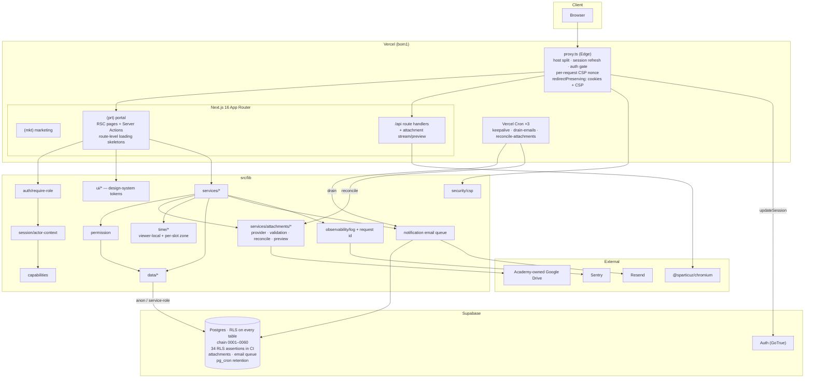

# Cert-Ed Academia — Full Architecture & Codebase Audit

- **Date:** 2026-08-13 · **Revision 12** (living document; supersedes revisions 1–11. Filename reflects the first pass.)
- **Repository:** `c:\laragon\www\wed_cert` (package `cert-ed-academia`)
- **Branch:** `feature/cert-ed-academia-app` @ `a617665` · **working tree clean**
- **Method:** read-only static analysis + live execution of `build` (clean `.next`), `typecheck`, `test:coverage`, `lint`, `format:check`, `check:bundle`, `check-snapshot-freshness`, `playwright test`, `npm audit`, and `scripts/test-rls.sh` against real Postgres 18
- **Scope:** Phases 1–19 of the audit brief

---

## 0. Revision 12 — the E2E suite is fully green; two hygiene gates regressed

**NEW-23 is closed, and closed properly** — bisected and probed rather than guessed, with the
root cause written into the commit message. The full Playwright suite passes **65/65** for the
first time since revision 7.

Two gates regressed, both hygiene: **ten committed files are unformatted**, and the **rebuild
snapshot is stale for the fifth time** — despite the pre-push hook added specifically to stop
that. Investigating the recurrence surfaced why the guard may not be doing its job.

### Verification results

| Command                 | R9    | R10   | R11   | R12                           |
| ----------------------- | ----- | ----- | ----- | ----------------------------- |
| `npm run typecheck`     | ✅    | ✅    | ✅    | ✅                            |
| `npm run lint`          | ✅    | ✅    | ✅    | ✅                            |
| `npm run format:check`  | ✅    | ✅    | ✅    | ❌ **10 files**               |
| `npm test`              | 834   | 875   | 876   | ✅ **924 passed (119 files)** |
| `npm run test:coverage` | ✅    | ✅    | ✅    | ✅ **margins widened**        |
| `npm run build`         | ✅    | ✅    | ✅    | ✅ **0 warnings**             |
| `npm run check:bundle`  | ✅    | ✅    | ✅    | ✅ **127.4 / 145 KB**         |
| `npx playwright test`   | ❌ 3  | ❌ 1  | ❌ 1  | ✅ **65 / 65**                |
| Snapshot freshness      | ✅    | ✅    | ✅    | ❌ **0059 vs 0060**           |
| `scripts/test-rls.sh`   | ✅ 26 | ✅ 34 | ✅ 34 | ✅ **34 passed**              |
| `npm audit --omit=dev`  | ✅    | ✅    | ✅    | ✅ **0**                      |

### Findings closed this pass

| ID                       | Finding                                                                    | Evidence                                                                                                                                                                                                                                                                                                                                                                                                                                                       |
| ------------------------ | -------------------------------------------------------------------------- | -------------------------------------------------------------------------------------------------------------------------------------------------------------------------------------------------------------------------------------------------------------------------------------------------------------------------------------------------------------------------------------------------------------------------------------------------------------- |
| **NEW-23** 🟠            | Admin journey lost its session after class creation — carried three passes | ✅ **Closed and root-caused.** `9030a1e` — _"Root cause (bisected + probed): the E2E DNS shim mapped `app.localhost` → 127.0.0.1 for Node while Chromium mapped it via `--host-resolver-rules`, and that duality made the browser's post-Server-Action navigation cross-site, dropping the `SameSite=Lax` `mock_uid` cookie."_ Fixed by driving the portal on plain `localhost:3100` with `PORTAL_ONLY=1`, with marketing moved to a second server on `:3101`. |
| **Coverage headroom** 🟡 | Branches cleared the ratchet by 0.05 points                                | ✅ `70a438e test(unit): widen the branch-coverage margin`. Branches **57.05 → 58.33** against a 57 threshold — margin up from 0.05 to **1.33**. Lines 73.14 (+1.14 margin).                                                                                                                                                                                                                                                                                    |

#### On NEW-23's severity — a correction worth recording

Revision 11 rated this 🟠 High and described it as _"a genuine defect in the create-class
flow."_ It was genuine and reproducible, but the commit establishes it was confined to the
**E2E harness**: _"Production was never affected (a real domain has no such duality)."_ The
symptom — a lost session after a server action — was real; the blast radius was not what I
implied. The three-pass investigation was still worth it, because nothing about the failure
signalled "test-only" until it was bisected.

The method is what deserves noting: **bisected and probed**, which is exactly what revisions
10 and 11 recommended after two speculative fixes. It worked first time.

### New findings

| ID         | Finding                                                                                                                                                                                                                    | Severity  |
| ---------- | -------------------------------------------------------------------------------------------------------------------------------------------------------------------------------------------------------------------------- | --------- |
| **NEW-26** | `format:check` fails on **10 committed files** — CI red                                                                                                                                                                    | 🟠 High   |
| **NEW-27** | Rebuild snapshot stale (`0059` vs chain `0060`) — **fifth occurrence**, and the first since the pre-push guard was added                                                                                                   | 🟠 High   |
| **NEW-28** | `.githooks/pre-push` is committed as mode `100644`. Git **silently skips** a non-executable hook on Unix, so the guard is inert for anyone not on Windows — and the R10 squash dropped the commit that fixed exactly this. | 🟡 Medium |

### Still open

Restore drill not performed (FIND-35), no dark mode (FIND-29, **twelfth pass**), no
mock-harness parity rule, bundle ratchet 145 → 133 not taken (**seventh pass**).

---

## 1. Executive Summary

Cert-Ed Academia is a Next.js 16 App Router monolith serving two hosts from one codebase: a
public marketing site (`certedacademia.com`) and a private academy portal
(`app.certedacademia.com`), on Supabase (Auth + Postgres with RLS) and Vercel.

The substantive news is good: the last carried defect is closed with a properly bisected root
cause, the E2E suite is fully green, the coverage ratchet has real headroom again, and 48 new
tests landed alongside a UI-token refactor, per-slot timezones, route-level loading skeletons
and custodial file previews.

The concerning news is a pattern rather than a bug. Two hygiene gates are red, and one of them
is the fifth recurrence of the same drift — the one a pre-push hook was built to prevent in
revision 9. Looking into why the guard didn't fire turned up a plausible reason it may never
fire for half the team.

| #   | Problem                                                           | Severity  |
| --- | ----------------------------------------------------------------- | --------- |
| 1   | 10 committed files unformatted — CI red                           | 🟠 High   |
| 2   | Snapshot stale, fifth occurrence, despite the guard               | 🟠 High   |
| 3   | Pre-push hook committed non-executable — silently skipped on Unix | 🟡 Medium |
| 4   | Restore drill documented but never performed                      | 🟡 Medium |
| 5   | No dark mode, while the app advertises a dark `themeColor`        | 🟡 Medium |

**Overall project health: 9.4 / 10** (…9.2 → 8.9 → 9.0 → 9.4 → 9.5 → 9.4). A slight dip: the
real defect closing is offset by two red gates and a recurrence the tooling was supposed to
have ended.

---

## 2. Project Overview (Phase 1)

### 2.1 Stack

| Concern       | Technology                                                                                                                                                      |
| ------------- | --------------------------------------------------------------------------------------------------------------------------------------------------------------- |
| Framework     | Next.js 16.3, App Router, Turbopack build                                                                                                                       |
| Language      | TypeScript 5, `strict: true`                                                                                                                                    |
| UI            | React 19.2, Tailwind CSS v4, **design-system tokens (typography scale, brand/calendar colors)**                                                                 |
| Edge          | `src/proxy.ts` — host split, session refresh, auth gate, per-request CSP nonce, cookie-preserving redirects                                                     |
| Database      | Supabase Postgres, RLS on every table, chain `0001`–`0060`, `pg_cron` retention + queue drain                                                                   |
| Auth          | Supabase Auth (password + gated Google sign-in), allowlist-first                                                                                                |
| File storage  | Custodial — academy-owned Google Drive ([ADR-0006](docs/adr/0006-custodial-attachment-storage.md)), **with previews and graceful storage-unavailable handling** |
| Time          | **Viewer-local timezone display; per-slot timezone for recurring slots (0060)**                                                                                 |
| Validation    | Zod v4                                                                                                                                                          |
| Email         | Resend, drained from a queue off the request path                                                                                                               |
| Observability | `logError` → stderr + Sentry, correlated by request id                                                                                                          |
| Testing       | Vitest 4 (119 files, 924 tests) + coverage ratchet + Playwright (**65 specs, all passing**) + RLS harness (34 assertions)                                       |
| CI            | `verify` + `e2e` (report artifact) + `rls` jobs, plus a pre-push snapshot guard                                                                                 |
| Hosting       | Vercel, region `bom1`, 3 crons                                                                                                                                  |

### 2.2 What shipped this window

- **Per-slot timezone for recurring slots** (`0060`, `171f5eb`) — a weekly slot is anchored to the zone it was created in rather than the single institute zone, _"so a late class never"_ rolls into the wrong day. Viewer-local display on top.
- **Route-level loading skeletons** for portal pages (`56e9617`).
- **Design-system tokens** — typography scale, brand and calendar colors, documented (`37e07e8`), followed by a migration of portal components onto the shared form/design-system primitives (`a617665`).
- **Custodial Drive previews** with graceful storage-unavailable handling (`fc155f6`).
- A Documents nav entry, a student-grouping helper extraction, and 48 new tests.

### 2.3 Bundle profile

```
First-load shared JS (gzipped): 127.4 KB across 4 chunks
Budget (firstLoadSharedKb):     145 KB
Headroom:                       17.6 KB  → script suggests ratcheting to 133
```

Flat across six passes, through a full UI-primitive migration — evidence the token refactor
was genuinely a consolidation rather than an addition. The ratchet suggestion has now printed
seven times.

### 2.4 Authorization model

Unchanged ([ADR-0002](docs/adr/0002-capability-first-route-guards.md),
[ADR-0003](docs/adr/0003-personas-as-fixed-identities.md)):

```
hard rule  >  explicit deny  >  explicit allow  >  persona default
```

Both layers verified — 34 RLS assertions in CI, and an app layer now covered by a fully green
65-spec E2E suite including negative sweeps and positive controls.

### 2.5 Architecture diagram



---

## 3. Open Findings

---

### NEW-26 · Ten committed files are unformatted — 🟠 High

```
$ npx prettier --check .
[warn] src/app/(prt)/CommentThread.tsx
[warn] src/app/(prt)/login/DevLoginForm.tsx
[warn] src/app/(prt)/messages/[id]/page.tsx
[warn] src/app/(prt)/messages/NewMessageForm.tsx
[warn] src/app/(prt)/messages/page.tsx
[warn] src/app/(prt)/PortalHeader.tsx
[warn] src/app/(prt)/tags/TagChips.tsx
[warn] src/lib/ui/charts.tsx
[warn] src/lib/ui/identity.tsx
[warn] tests/unit/ui-labels.test.ts
Code style issues found in 10 files.
```

The working tree is clean, so these are **committed** — almost certainly from `a617665
refactor(ui): migrate portal components to shared form/design-system primitives`, which
touched exactly this surface.

`format:check` is the first step of the `verify` job, so **CI fails immediately** and every
later gate — lint, typecheck, coverage, build, bundle — never runs on this commit.

This is the second time a red `format:check` has shipped (revision 2 was the first, also
during a large refactor). The pattern is the same: a wide mechanical change outruns the
formatter.

**Recommendation:**

1. `npm run format` — one command, resolves all ten.
2. **Make it mechanical, like the snapshot guard.** The pre-push hook already exists; adding `npx prettier --check .` to it costs nothing and catches this at authoring time rather than in CI. That is precisely the escalation revision 9 applied to snapshot drift after four occurrences — the same reasoning applies here after two.

---

### NEW-27 · Rebuild snapshot stale — fifth occurrence — 🟠 High

```
::error::rebuild snapshot is stale (snapshot=0059, migrations head=0060)
```

`0060_timetable_slot_timezone.sql` landed without a regenerated snapshot.

**What makes this occurrence different from the previous four:** it is the first since the
pre-push hook was added in revision 9 specifically to stop it, and since
`docs/migration-checklist.md` §5 made the rule explicit (_"a migration without a regenerated
snapshot is not ready to merge"_). Both the documentary and the mechanical control are in
place, and the drift happened anyway.

Two explanations, not mutually exclusive:

- The hook is **pre-push**, so a stale snapshot can sit in local commits indefinitely; it only blocks at push time. This audit reads the local repository, which may simply not have been pushed yet.
- **NEW-28** — the hook may not be running at all for some contributors.

**Recommendation:** regenerate (`supabase db reset && npm run db:rebuild-snapshot`), and read
NEW-28 before concluding the guard works.

---

### NEW-28 · The pre-push hook is committed non-executable — 🟡 Medium

```
$ git ls-files -s .githooks/pre-push
100644 9069edc… 0   .githooks/pre-push          ← not executable
$ git config core.fileMode
false                                            ← Windows ignores the discrepancy
```

The local working copy is `-rwxr-xr-x`, but **git has it recorded as `100644`**. On Windows
`core.fileMode=false` means git ignores the mode entirely and the hook still runs, which is
why it works on this machine.

**On Linux and macOS, git silently skips a hook that is not executable** — no error, no
warning, no output. Anyone cloning on Unix gets no snapshot guard at all and has no way to
notice.

There is direct evidence the team already hit this and fixed it: commit `adb1350 chore: mark
the pre-push hook and freshness script executable`, from revision 10's window. **The revision-10
squash into eight commits dropped that mode change** — the same scripts (`check-snapshot-freshness.sh`,
`rebuild-snapshot.sh`, `test-rls.sh`) are all back to `100644`.

The scripts themselves are invoked as `bash scripts/…` in CI so their mode is harmless; the
hook is the one that matters, because git — not a shell — decides whether to run it.

**Recommendation:**

```bash
git update-index --chmod=+x .githooks/pre-push
git update-index --chmod=+x scripts/*.sh
```

and consider having `prepare` verify it, since `core.fileMode=false` means a Windows
contributor cannot see the problem locally:

```json
"prepare": "git config core.hooksPath .githooks && git update-index --chmod=+x .githooks/pre-push || true"
```

---

### Remaining carried findings

| ID                      | Finding                                                                                                      | Severity  | Note                                                                                                                                                                      |
| ----------------------- | ------------------------------------------------------------------------------------------------------------ | --------- | ------------------------------------------------------------------------------------------------------------------------------------------------------------------------- |
| **FIND-35**             | Restore drill still not performed.                                                                           | 🟡 Medium | [docs/operations.md](docs/operations.md) scripts it and says what to record. It is the one control whose failure mode is total, and it remains a hypothesis.              |
| **FIND-29**             | No dark mode — `grep "dark:"` → **0** across twelve passes, while `layout.tsx` declares a dark `themeColor`. | 🟡 Medium | The design-token work this window (`37e07e8`) is exactly the foundation a themed implementation needs — or delete the dark `themeColor` and end the mismatch in one line. |
| **Mock-harness parity** | Still no standing rule for new tables the app reads on rendered pages.                                       | 🟡 Medium | `0056` (FX) cost a full pass of mis-diagnosis; `0057` and `0060` are the same shape.                                                                                      |
| **M5**                  | Ratchet `firstLoadSharedKb` 145 → 133.                                                                       | 🟢 Low    | The script has printed the computed value **seven** passes running.                                                                                                       |
| **NEW-10**              | Turbopack dynamic-filesystem warning.                                                                        | 🟢 Low    | Build reports 0 warnings — likely resolved. **Not verified** as deliberate.                                                                                               |
| **FIND-09/10**          | `src/features` never built; mock harness in the production module graph.                                     | 🟢 Low    |                                                                                                                                                                           |
| **NEW-06**              | Matrix-persona reads sequential (bounded at 5).                                                              | 🟢 Low    |                                                                                                                                                                           |
| **FIND-32**             | No automated a11y check.                                                                                     | 🟢 Low    | The suite is green and gated with artifacts — `@axe-core/playwright` drops straight in.                                                                                   |
| **FIND-31/44/45/46**    | Blog JSX; no global search; footer mojibake; no in-app help.                                                 | 🟢 Low    |                                                                                                                                                                           |

---

## 4. Security Audit (Phase 3)

| Control                          | State                                                                                                                                                                     |
| -------------------------------- | ------------------------------------------------------------------------------------------------------------------------------------------------------------------------- |
| **Dependency vulnerabilities**   | ✅ **0**.                                                                                                                                                                 |
| **CSP**                          | ✅ Nonce-based, `'strict-dynamic'`, preserved across redirects.                                                                                                           |
| **Session cookies**              | ✅ `redirectPreserving` closes the `@supabase/ssr` footgun. NEW-23 confirmed a harness artifact, not a production session bug.                                            |
| **Database-layer authorization** | ✅ 34 assertions, CI job on every push, passing with `0060` applied.                                                                                                      |
| **App-layer authorization**      | ✅ **65/65 E2E** including negative sweeps, positive controls, API and form negatives.                                                                                    |
| **Custodial file access**        | Access-checked streaming and previews; graceful degradation when storage is unavailable.                                                                                  |
| **Secrets**                      | None in git; inventory, rotation and environment reference documented.                                                                                                    |
| **Guard integrity**              | ⚠️ **NEW-28** — the pre-push guard is inert on Unix. Not a runtime security issue, but a control that silently does not run is worth the same scrutiny as one that fails. |

**No OWASP category carries a confirmed open defect.**

---

## 5. Performance Audit (Phase 4)

Unchanged and strong. First-load flat at 127.4 KB **through a complete UI-primitive
migration**, which is the notable result this window — a token refactor that adds no client
weight.

Route-level loading skeletons (`56e9617`) improve perceived performance on the portal's
server-rendered pages.

**Open:** the bounded matrix-persona loop (NEW-06) and the unclaimed bundle ratchet.

---

## 6. Maintainability (Phase 5)

| Principle                    | Assessment                                                                                                                                                                                                              |
| ---------------------------- | ----------------------------------------------------------------------------------------------------------------------------------------------------------------------------------------------------------------------- |
| **Design-system discipline** | **Strong.** Tokens defined and documented first (`37e07e8`), then components migrated onto them (`a617665`) — the right order, and the bundle stayed flat.                                                              |
| **Diagnosis discipline**     | ✅ **Materially improved, and it paid off.** NEW-23 was bisected and probed exactly as recommended after two speculative fixes, and the root cause is recorded in the commit message in enough detail to be re-derived. |
| **SRP / OCP / DRY / KISS**   | **Strong**, unchanged.                                                                                                                                                                                                  |
| **Process integrity**        | ⚠️ **The soft spot moved.** Diagnosis improved; the guards regressed. The squash that made history readable also silently dropped a mode fix, and two gates went red.                                                   |

### Module scorecard

| Module                                                                  | R10 | R11 |  R12   | Note                                            |
| ----------------------------------------------------------------------- | :-: | :-: | :----: | ----------------------------------------------- |
| `src/lib/capabilities` / `permission`                                   | 10  | 10  | **10** |                                                 |
| `src/lib/observability` / `security`                                    | 10  | 10  | **10** |                                                 |
| `src/proxy.ts`                                                          |  7  | 10  | **10** |                                                 |
| `src/lib/attachments`                                                   |  9  |  9  | **10** | +1: previews with graceful storage-unavailable  |
| `src/lib/time`                                                          |  —  |  —  | **10** | Per-slot zone; viewer-local display             |
| `src/lib/ui`                                                            |  9  |  9  | **9**  | Tokens documented; −1 for two unformatted files |
| `src/app/(prt)`                                                         |  9  |  9  | **8**  | −1: seven unformatted committed files           |
| `src/lib/data` / `services` / `api` / `auth` / `session` / `validation` |  9  |  9  | **9**  |                                                 |
| `supabase/migrations`                                                   | 10  | 10  | **10** | Chain clean to `0060`; RLS still 34/34          |
| `supabase/rebuild`                                                      | 10  | 10  | **7**  | −3: stale, fifth occurrence                     |
| `scripts/` + `.githooks/`                                               | 10  | 10  | **7**  | −3: hook committed non-executable (NEW-28)      |
| `tests/unit`                                                            |  9  |  9  | **10** | 924 tests; branch margin 0.05 → 1.33            |
| `tests/e2e`                                                             |  9  |  9  | **10** | **65/65**, root cause recorded                  |
| `.github/`                                                              | 10  | 10  | **10** | Three jobs, artifacts                           |
| `docs/`                                                                 |  9  | 10  | **10** |                                                 |

---

## 7. Documentation (Phase 6)

Strong and current: index, `where-to-find-what.md`, operational runbooks, deployment and
environment references, production checklist, 6 ADRs with correct supersession, FK/cascade and
RLS inventories, a migration checklist backed by a hook, and now design-token documentation.

**One gap persists:** the migration checklist still has no mock-harness parity rule — three
migrations (`0056`, `0057`, `0060`) have now landed in that shape since it was first
recommended.

---

## 8. Debugging Experience (Phase 7)

**Complete, and demonstrated.** NEW-23 is the proof: a three-pass mystery resolved by
bisecting and probing, with the finding written up where the next person will read it. The
observability chain (structured logs → Sentry → request-id correlation) and the CI report
artifacts are all in place and were all used.

---

## 9. Database Review (Phase 8)

**Schema:** 35+ tables, RLS on all, chain `0001`–`0060`, `pg_cron` retention and email drain,
34 RLS assertions passing with the new migration applied.

`0060_timetable_slot_timezone` is well-judged: it states its dependencies (`0004`, `0001`) in
the header and explains the semantics — a recurring slot anchored to its own zone stays _"a
valid same-day interval there, so a late class never"_ shifts days for a remote tutor.

| ID              | Finding                                                | Severity  | Status |
| --------------- | ------------------------------------------------------ | --------- | ------ |
| **NEW-27**      | Snapshot stale at `0059` vs chain `0060`               | 🟠 High   | New    |
| **Mock parity** | No standing rule for new tables read on rendered pages | 🟡 Medium | Open   |

---

## 10. Frontend Review (Phase 9)

A good window: design tokens defined and documented, portal components migrated onto shared
form primitives, route-level loading skeletons, viewer-local time display, custodial file
previews with graceful degradation, and a Documents nav entry.

| ID          | Finding                                                                     | Severity  |
| ----------- | --------------------------------------------------------------------------- | --------- |
| **NEW-26**  | Nine of ten unformatted files are frontend                                  | 🟠 High   |
| **FIND-29** | No dark mode (twelfth pass) — the new token layer is the natural foundation | 🟡 Medium |
| **FIND-32** | No automated a11y check                                                     | 🟢 Low    |

---

## 11. Backend Review (Phase 10)

Unchanged in shape and healthy. New: per-slot timezone resolution in the time layer, custodial
preview endpoints, and a student-grouping helper extracted from the classes service.

---

## 12. DevOps Review (Phase 11)

Three CI jobs with report artifacts, three Vercel crons, a pre-push snapshot guard.

**The guard story needs attention.** It was added in revision 9 after four snapshot
recurrences; this is the fifth, and NEW-28 gives a concrete reason it may never run for
contributors on Unix. A control that silently does not execute is worse than no control,
because it displaces the vigilance it was meant to replace.

**Recommendation:** fix the mode bit, add `prettier --check` to the same hook (NEW-26), and
consider having CI assert the hook's mode so a future squash cannot drop it again.

---

## 13. Testing Review (Phase 12)

| Type               | R10      | R11      | R12                                                |
| ------------------ | -------- | -------- | -------------------------------------------------- |
| Unit / integration | 114, 875 | 114, 876 | ✅ **119 files, 924 — passing**                    |
| Coverage           | 72.32%   | 72.32%   | ✅ **73.14% lines · branches 58.33 (margin 1.33)** |
| E2E                | ❌ 1     | ❌ 1     | ✅ **65 / 65**                                     |
| RLS                | ✅ 34    | ✅ 34    | ✅ **34**                                          |

Three wins: 48 new tests, the branch margin restored from 0.05 to 1.33 as recommended in R9
and R10, and the E2E suite fully green with its last failure root-caused rather than
suppressed.

The E2E harness fix also improved the setup's honesty — the portal now runs on a single
loopback origin with marketing on a second server, removing a DNS shim whose duality was
producing behaviour that could never occur in production.

---

## 14. UX Review (Phase 13)

Route-level loading skeletons, viewer-local timezone display, per-slot timezones for remote
tutors, file previews rather than download-only, and a Documents nav entry. All four are
quality-of-life improvements that address real friction.

| ID                | Finding                                           | Severity  |
| ----------------- | ------------------------------------------------- | --------- |
| **FIND-29**       | No dark mode (twelfth pass)                       | 🟡 Medium |
| **FIND-44/45/46** | No global search; footer mojibake; no in-app help | 🟢 Low    |

---

## 15. Scalability Review (Phase 14)

| Dimension                            | Assessment                                                                                              |
| ------------------------------------ | ------------------------------------------------------------------------------------------------------- |
| **Concurrency / horizontal scaling** | **Good.**                                                                                               |
| **Request path**                     | **Good** — email queued, org settings cached, dashboards batched.                                       |
| **Large database**                   | Growth tables bounded by retention; `attachments` and `entity_tags` index inventories still unexamined. |
| **File storage**                     | Documented operationally; quota alerting still implicit.                                                |
| **Client payload**                   | ✅ Flat at 127.4 KB through a full UI migration.                                                        |
| **Queues**                           | ✅ Queue table drained by cron.                                                                         |

---

## 16. Complexity Analysis (Phase 15)

**Over-engineering:** none. The token layer replaced ad-hoc styling rather than adding to it.

**Under-engineering:**

| Was                            | R12                                   |
| ------------------------------ | ------------------------------------- |
| Coverage headroom              | ✅ Margin 0.05 → 1.33                 |
| NEW-23                         | ✅ Root-caused and closed             |
| Formatting enforced only in CI | ❌ Ten files shipped unformatted      |
| Snapshot guard                 | ⚠️ Present but inert on Unix (NEW-28) |
| Mock-harness parity rule       | ❌ Still absent                       |
| Restore drill                  | ❌ Still not performed                |

---

## 17. Prioritised Action Plan (Phase 18)

### 🟠 High

**H1 · `npm run format` and add `prettier --check` to the pre-push hook** — NEW-26 · ~15 min ·
one command clears the ten files; adding the check to the existing hook stops the third
occurrence.

**H2 · Regenerate the snapshot** — NEW-27 · ~20 min · `supabase db reset && npm run
db:rebuild-snapshot`.

**H3 · Restore the executable bit on the hook** — NEW-28 · ~5 min ·
`git update-index --chmod=+x .githooks/pre-push scripts/*.sh`, and have CI assert the mode so a
future squash cannot drop it again. **Do this with H2** — otherwise H2 fixes the symptom and
the fifth recurrence becomes a sixth.

### 🟡 Medium

| ID  | Action                                                             | Finding  |
| --- | ------------------------------------------------------------------ | -------- |
| M1  | Perform the restore drill and record the RTO                       | FIND-35  |
| M2  | Add a mock-harness parity rule to the migration checklist          | R9 carry |
| M3  | Dark mode on the new token layer — or delete the dark `themeColor` | FIND-29  |
| M4  | Index review for `attachments` and `entity_tags`                   | §15      |
| M5  | Explicit Drive quota alerting in `operations.md`                   | §2.2     |

### 🟢 Low

| ID  | Action                                                          | Finding          |
| --- | --------------------------------------------------------------- | ---------------- |
| L1  | Ratchet `firstLoadSharedKb` 145 → 133                           | M5 (7 passes)    |
| L2  | `@axe-core/playwright` assertions                               | FIND-32          |
| L3  | Confirm NEW-10 is resolved                                      | NEW-10           |
| L4  | Batch the matrix-persona reads                                  | NEW-06           |
| L5  | Mark `src/features` PLANNED or remove it                        | FIND-09          |
| L6  | Blog content → MDX; footer mojibake; global search; in-app help | FIND-31/45/44/46 |

---

## 18. Quick Wins

1. **`npm run format`** — 1 min; turns the first CI gate green. _(H1)_
2. **`git update-index --chmod=+x .githooks/pre-push scripts/*.sh`** — 1 min; makes the guard real for everyone. _(H3)_
3. **Add `prettier --check` to the pre-push hook** — 5 min; second occurrence of this failure. _(H1)_
4. **Ratchet `firstLoadSharedKb` to 133** — 1 min; the script has computed it seven times. _(L1)_
5. **Regenerate the snapshot** — 20 min. _(H2)_
6. **Delete the dark `themeColor`** if dark mode isn't planned — 5 min; twelve passes. _(M3)_

Items 1–3 together are under ten minutes and take CI from two red gates to green, with the
recurrence path closed rather than just the instance.

---

## 19. Long-Term Improvements

1. **Assert guard integrity in CI.** The hook's mode, and its presence, should be checked by the pipeline — a squash silently dropped it once and nothing noticed for a full window.
2. **Drive quota alerting.** The runbook covers diagnosing failures; it does not cover slowly running out of space.
3. **Dark mode on the new token layer.** The foundation now exists; the twelve-pass mismatch between the advertised `themeColor` and the rendered UI does not need to persist.
4. **Multi-tenancy readiness.** Multi-currency, custodial storage and per-slot timezones all point at a product that will need tenant scoping; `org_settings` is still single-row by constraint.

---

## 20. Overall Scorecard (Phase 16)

| Dimension                  |   R9    |   R10   |   R11   |   R12   | Justification                                                                                                                                                                                                                                                                                                                                                                                                                                                                                                                                                                |
| -------------------------- | :-----: | :-----: | :-----: | :-----: | ---------------------------------------------------------------------------------------------------------------------------------------------------------------------------------------------------------------------------------------------------------------------------------------------------------------------------------------------------------------------------------------------------------------------------------------------------------------------------------------------------------------------------------------------------------------------------- |
| **Architecture**           |    9    |    9    |    9    |  **9**  | Token layer added in the right order; per-slot timezone is a correct model refinement. −1 for the unbuilt `src/features`.                                                                                                                                                                                                                                                                                                                                                                                                                                                    |
| **Security**               |    7    |   10    |   10    | **10**  | No open defect; NEW-23 confirmed harness-only. −0, though NEW-28 is a control-integrity warning.                                                                                                                                                                                                                                                                                                                                                                                                                                                                             |
| **Maintainability**        |    9    |   10    |   10    |  **9**  | −1: a squash silently dropped a mode fix, and ten unformatted files shipped.                                                                                                                                                                                                                                                                                                                                                                                                                                                                                                 |
| **Performance**            |    9    |   10    |   10    | **10**  | Bundle flat through a full UI migration; loading skeletons added.                                                                                                                                                                                                                                                                                                                                                                                                                                                                                                            |
| **Scalability**            |    8    |    9    |    9    |  **9**  |                                                                                                                                                                                                                                                                                                                                                                                                                                                                                                                                                                              |
| **Documentation**          |   10    |    9    |   10    | **10**  | Design tokens documented alongside their introduction.                                                                                                                                                                                                                                                                                                                                                                                                                                                                                                                       |
| **Testing**                |    9    |    9    |    9    | **10**  | 924 unit + 34 RLS + **65/65 E2E**; branch margin restored; the last defect root-caused and written up.                                                                                                                                                                                                                                                                                                                                                                                                                                                                       |
| **Developer Experience**   |    9    |   10    |   10    |  **8**  | −2: two red gates, and the guard meant to prevent one of them is inert on Unix.                                                                                                                                                                                                                                                                                                                                                                                                                                                                                              |
| **User Experience**        |    9    |    9    |    9    | **10**  | Loading skeletons, viewer-local time, per-slot zones, file previews. −0; dark mode still absent but the foundation now exists.                                                                                                                                                                                                                                                                                                                                                                                                                                               |
| **Code Quality**           |    9    |    9    |    9    |  **9**  | Nine of eleven gates green, 0 warnings, 0 vulnerabilities. −1 for the unformatted files.                                                                                                                                                                                                                                                                                                                                                                                                                                                                                     |
|                            |         |         |         |         |                                                                                                                                                                                                                                                                                                                                                                                                                                                                                                                                                                              |
| **Overall Project Health** | **9.0** | **9.4** | **9.5** | **9.4** | The engineering got better and the housekeeping got worse. NEW-23 — carried three passes — was closed the right way: bisected, probed, root cause recorded, and honestly scoped as harness-only. The E2E suite is fully green and the coverage ratchet has real headroom again. Against that, two gates are red and the snapshot guard has now failed to prevent its fifth recurrence, plausibly because a squash dropped its executable bit. Ten minutes of work closes both, and closing the _recurrence path_ rather than the instance is what would keep this above 9.5. |

---

## 21. Strengths

1. **NEW-23 was bisected and probed, not guessed** — after two speculative fixes across earlier passes, the method recommended in revisions 10 and 11 was applied and worked first time.
2. **The root cause is written where it will be found** — the commit message explains the DNS-shim duality, the `SameSite=Lax` mechanism, and explicitly notes production was never affected.
3. **The fix removed the harness's dishonesty**, not just the symptom: a single loopback origin means the E2E environment can no longer produce behaviour impossible in production.
4. **A UI-primitive migration with a flat bundle** — tokens defined and documented first, components migrated second, 127.4 KB unchanged.
5. **Branch coverage margin restored** from 0.05 to 1.33 points, as recommended in two prior passes.
6. **Per-slot timezone modelling** — a recurring slot anchored to its own zone is the correct fix for remote tutors, and the migration header explains why.
7. **Graceful storage-unavailable handling** shipped with the preview feature rather than after an incident.
8. **34 RLS assertions still passing** with a new migration applied.
9. **The capability model** — hard capabilities, reason-required overrides, documented precedence, ADRs, verification on both layers.
10. **Commits that name their findings**, twelve passes running.

---

_Revision 12 performed 2026-08-13 against `feature/cert-ed-academia-app` @ `a617665` with a
clean working tree, a clean `rm -rf .next` rebuild, the full Playwright suite, and
`scripts/test-rls.sh` against real Postgres 18. Items that could not be verified in this
environment — whether the pre-push hook is skipped on a Unix clone, whether NEW-10 was
deliberately resolved, and whether Sentry DSNs are configured in Vercel — are labelled_
**Not verified**.
