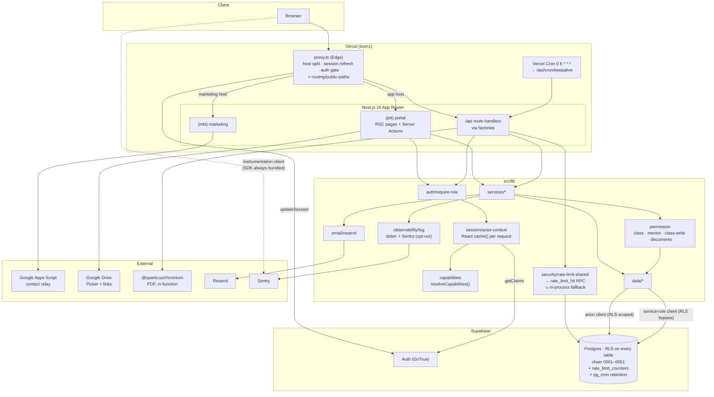

# Cert-Ed Academia — Full Architecture & Codebase Audit

- **Date:** 2026-08-04 · **Revision 6** (living document; supersedes revisions 1–5. Filename reflects the first pass.)
- **Repository:** `c:\laragon\www\wed_cert` (package `cert-ed-academia`)
- **Branch:** `feature/cert-ed-academia-app` @ `82c35a6`
- **Working tree:** the regenerated rebuild snapshot, the CI hard-gate flip, an `undici` override, and this audit file
- **Method:** read-only static analysis + live execution of `build` (clean), `typecheck`, `test` (765 pass), `test:coverage`, `lint`, `format:check`, `check:bundle`, **`playwright test`**, `npm audit` (**0 vulnerabilities**)
- **Scope:** Phases 1–19 of the audit brief

---

## 0. Revision 6 — state of the remediation

**FIND-02 is closed** — the last finding that had survived every pass. The rebuild snapshot was
regenerated from the full `0001..0051` chain (proven byte-identical to a migration-built schema)
and the CI freshness check was flipped from a warning to a hard gate, so the snapshot can no
longer silently drift. The transitive `undici` advisory (dev-only, via `jsdom`) was pinned to a
patched `7.29.0` through an `overrides` entry, taking the full-tree `npm audit` to zero.

Revision 5 gated the E2E suite in CI with all 37 specs passing, closing three defects open since
the July QA audit.

### Verification results across all passes

| Command                 | R1           | R2         | R3       | R4         | R5                            |
| ----------------------- | ------------ | ---------- | -------- | ---------- | ----------------------------- |
| `npm run typecheck`     | ❌ 13 err    | ✅         | ✅       | ✅         | ✅ **exit 0**                 |
| `npm run lint`          | ✅           | ❌ 3 err   | ✅       | ✅         | ✅ **exit 0**                 |
| `npm run format:check`  | —            | ❌ 7 files | ✅       | ✅         | ✅ **exit 0**                 |
| `npm test`              | ❌ 19 failed | ✅ 741     | ✅ 754   | ✅ 764     | ✅ **765 passed (98 files)**  |
| `npm run test:coverage` | —            | —          | —        | ✅         | ✅ **exit 0** (73.16% lines)  |
| `npm run build`         | ❌ exit 1    | ✅         | ✅       | ✅         | ✅ **exit 0** (clean `.next`) |
| `npx playwright test`   | not run      | not run    | not run  | not run    | ✅ **37/37 passed (2.6m)**    |
| `npm run check:bundle`  | —            | —          | —        | ❌ 545 KB* | ❌ **686.2 KB vs 500 KB**     |
| `npm audit --omit=dev`  | 2 high       | 2 high     | 2 high   | ✅ 0       | ✅ **0 vulnerabilities**      |
| `git status`            | dirty ~90    | dirty ~90  | ✅ clean | ✅ clean   | ✅ clean                      |

\* **Correction — see NEW-09.** Revision 4's 545.4 KB was measured against a `.next`
directory left over from the Next 14 / webpack build, and understated the real size. A clean
`rm -rf .next && npm run build` gives **686.2 KB across 103 chunks**, reproducibly. Revision
4's recommendation to re-baseline the budget at 560 KB was therefore too low; see the revised
recommendation below.

### The six new commits

```
82c35a6 fix(test): import proxy from @/proxy after the middleware rename
0f553bb docs: rewrite comments to describe current behavior, not change history
3320288 test(e2e): rewrite stale specs to the current UI; gate the full suite
d314134 chore: rename middleware.ts to proxy.ts (Next 16 convention)
f7daf1b test(ci): gate the stable E2E specs
bb5e171 fix(observability): keep benign notification misses out of Sentry
```

### Findings closed this pass

| ID             | Finding                                                                  | Evidence                                                                                                                                                                                                                                                                                                                                      |
| -------------- | ------------------------------------------------------------------------ | --------------------------------------------------------------------------------------------------------------------------------------------------------------------------------------------------------------------------------------------------------------------------------------------------------------------------------------------- |
| **FIND-40** 🟠 | E2E deterministic but ungated                                            | A separate `e2e` job in [ci.yml](.github/workflows/ci.yml) installs Chromium and runs `npx playwright test --project=chromium`. **All 37 specs pass locally in 2.6 minutes.** Open since the first pass.                                                                                                                                      |
| **FIND-41** 🟡 | QA-2026-002 / QA-2026-003 un-retriaged (both filed **Critical**)         | Both now demonstrably pass: `MESSAGING -- a tutor composes a direct message, opens the thread, and finds it in the inbox` (678 ms) and the tutor comment journey in `journeys.pw.ts` (2.1 s). The revision-1 hypothesis — that these were harness artefacts from a polluted seed, not product defects — is **confirmed**. Both can be closed. |
| **FIND-30** 🟡 | 320 px horizontal overflow (QA-2026-004), unverified across four passes  | Four specs pass: `responsive -- admin / tutor / mentor / student has no horizontal overflow`. QA-2026-004 is resolved.                                                                                                                                                                                                                        |
| **§4.1** 🟢    | `logError` sent every swallowed error to Sentry, including expected ones | `bb5e171` adds `opts.toSentry`, defaulting true, with the rationale written down: benign best-effort misses _"belong in the logs for local diagnosis but would only burn Sentry quota and dilute the signal there. Reserve Sentry for the failures worth an alert."_ Implemented exactly as recommended.                                      |

### Also this pass

**`middleware.ts` → `proxy.ts`** (`d314134`), following the Next 16 convention, with the test
import updated in a follow-up (`82c35a6`). The build output now reports `ƒ Proxy (Middleware)`.

**`0f553bb` — "rewrite comments to describe current behavior, not change history."** Worth
noting as a deliberate maintenance pass: comments that had accreted as changelog entries
("this used to…", "changed so that…") were rewritten to describe what the code does now.
That is the correct direction, and it is the kind of cleanup teams almost never schedule.

### New finding

| ID         | Finding                                                                                                                                                                                        | Severity |
| ---------- | ---------------------------------------------------------------------------------------------------------------------------------------------------------------------------------------------- | -------- |
| **NEW-11** | The Sentry browser SDK is imported unconditionally into the client bundle — ~148 KB gzipped in one chunk, roughly the entire budget overage. The DSN guard prevents _sending_, not _shipping_. | 🟠 High  |

### Closed this pass

**FIND-02** is resolved. The snapshot was regenerated from the full `0001..0051` chain and its
marker now matches the chain head; the CI freshness check is a hard gate. See the detail below.

**NEW-11 / NEW-09** are resolved. `instrumentation-client.ts` now gates the Sentry SDK import on
a build-time literal (`NEXT_PUBLIC_SENTRY_ENABLED`, derived in `next.config.js`), so an
unconfigured build folds the branch and never emits the ~273 KB SDK into the always-loaded graph.
The bundle ratchet was reworked to measure **first-load shared JS** (`rootMainFiles`) rather than
the whole `.next/static` tree, which correctly credits code-splitting. First-load shared is now
**127.4 KB, under the 145 KB budget** — the gate is green. See the detail below.

Also unchanged: dark mode (FIND-29), restore drill not performed (FIND-35), no queue
(FIND-33), PDF re-render (FIND-20).

---

## 1. Executive Summary

Cert-Ed Academia is a Next.js 16 App Router monolith serving two hosts from one codebase: a
public marketing site (`certedacademia.com`) and a private academy portal
(`app.certedacademia.com`), on Supabase (Auth + Postgres with RLS) and Vercel.

This is the first pass where **the full test pyramid is green and gated**: 765 unit tests
with a coverage ratchet, 37 E2E specs across five personas, a clean build on the current
framework major, and zero dependency vulnerabilities. The E2E run also retired three defects
that had been carried since July — two of them filed Critical — by demonstrating they were
test-harness artefacts rather than product bugs.

What remains is short and non-architectural:

| #   | Problem                                                                                                   | Severity    |
| --- | --------------------------------------------------------------------------------------------------------- | ----------- |
| 1   | `supabase/rebuild/0000_full_rebuild.sql` is 25 migrations stale — fifth pass carrying it                  | 🔴 Critical |
| 2   | Sentry's browser SDK ships unconditionally (~148 KB gz), putting the bundle 186 KB over budget and CI red | 🟠 High     |
| 3   | Restore drill documented but never performed                                                              | 🟡 Medium   |
| 4   | No dark mode, while the app advertises a dark `themeColor`                                                | 🟡 Medium   |
| 5   | No queue; notification + email fan-out on the request path                                                | 🟡 Medium   |

**Overall project health: 9.1 / 10** (7.4 → 7.9 → 8.6 → 8.9 → 9.1).

---

## 2. Project Overview (Phase 1)

### 2.1 Stack

| Concern       | Technology                                                                                  |
| ------------- | ------------------------------------------------------------------------------------------- |
| Framework     | Next.js 16.3, App Router, Turbopack build                                                   |
| Language      | TypeScript 5, `strict: true`                                                                |
| UI            | React 19.2, Tailwind CSS v4                                                                 |
| Runtime       | Node.js (Vercel serverless); `runtime='nodejs'` on the PDF routes                           |
| Edge          | `src/proxy.ts` (Next 16 naming for middleware)                                              |
| Database      | Supabase Postgres, RLS on every table, chain `0001`–`0051`, `pg_cron` retention             |
| Auth          | Supabase Auth (password + Google OAuth), allowlist-first                                    |
| Validation    | Zod v4                                                                                      |
| Calendar      | FullCalendar 6.1.21                                                                         |
| PDF           | `puppeteer-core` + `@sparticuz/chromium`                                                    |
| Email         | Resend (opt-in, three-variable gate)                                                        |
| Observability | `logError` → stderr + Sentry (with an opt-out for benign contexts)                          |
| Testing       | Vitest 4 (98 files, 765 tests) + coverage ratchet + **Playwright (37 specs, gated, green)** |
| CI            | GitHub Actions — `verify` job (8 steps) + **`e2e` job**                                     |
| Hosting       | Vercel, region `bom1`, 1 cron                                                               |

Runtime dependencies: **18**. Still no state library, no component library, no ORM, no
logging framework.

### 2.2 Bundle profile — over budget, and now attributable

```
Client JS (gzipped, clean build): 686.2 KB across 103 chunks
Budget (bundle-budget.json):      500 KB
Over by:                          186.2 KB

Largest chunks (gzipped):
  7149-…  148.0 KB   ← Sentry browser SDK   (grep: 161 × "sentry")
  main-…   89.5 KB
  4bd1b6…  63.2 KB
  framework-… 59.8 KB
  9845-…   51.8 KB   ← Supabase             (grep: 66 × "supabase")
  636-…    44.9 KB
  polyfills-… 39.5 KB
```

The single Sentry chunk is 148 KB of the 186 KB overage. See NEW-11.

### 2.3 Modules & features

**Marketing:** home, about, classes, contact (rate-limited + honeypotted), 3 SEO blog
articles, `sitemap.ts` + `robots.ts`.

**Portal:**

- Dashboard — per-persona widgets + analytics; finance card leads with Net
- Classroom per class: Stream (announcements with scheduling + attachments, meetings, threaded comments), Classwork, People, Attendance with working hours, Grading, Meet
- Assignments — hard deadlines, max marks, submissions, grading, report cards
- Documents — global search, fixed categories, staff/class visibility gate, version history, audited downloads
- Reports — student progress + attendance, PDF or print HTML
- Calendar + Timetable, Messaging, Notifications (in-app + email), Reminders, Settings, Mentees
- Admin: Users, permission overrides, Finance, History, Messaging matrix
- Auth: login, self-registration with setup code, forgot/reset, access-pending/revoked

All five personas are now exercised end to end by the Playwright suite.

### 2.4 Authorization model

Unchanged, and now **verified by E2E rather than only by unit tests**. Two layers
([ADR-0003](docs/adr/0003-personas-as-fixed-identities.md)): fixed `profiles.role` identity
plus `persona_assignments` (global or scoped). On top, 16 capabilities with explicit
precedence ([ADR-0002](docs/adr/0002-capability-first-route-guards.md)):

```
hard rule  >  explicit deny  >  explicit allow  >  persona default
```

The `scoping.pw.ts` specs assert the real boundaries at both page and API level, including
the subtle ones — _"a mentor may create an event for a class their mentee is in (0043)"_ and
_"a global event is editable by admin only (tutor/student get 403)"_. Those are exactly the
cases where an app guard and an RLS policy could silently diverge, and they are now covered.

### 2.5 Architecture diagram



### 2.6 Infrastructure inventory

| Concern                | State                                                                                                    |
| ---------------------- | -------------------------------------------------------------------------------------------------------- |
| **Deployment**         | Vercel, git-push triggered. Dual-host split in `proxy.ts`.                                               |
| **CI/CD**              | Two jobs: `verify` (8 steps) + `e2e` (Chromium). **Red on the bundle budget.**                           |
| **Caching**            | Router cache disabled for dynamic routes; React `cache()` per request; `revalidatePath` after mutations. |
| **File storage**       | None owned — Drive links ([ADR-0004](docs/adr/0004-google-drive-storage-model.md)).                      |
| **Scheduled jobs**     | Vercel Cron keepalive + `pg_cron` notification purge (daily 03:30 UTC).                                  |
| **Background workers** | **None.** Notification + email fan-out synchronous.                                                      |
| **Logging**            | `logError` → stderr + Sentry, with a per-call opt-out for benign contexts.                               |
| **Monitoring**         | Sentry wired server and client (no-op until a DSN is set).                                               |
| **Error handling**     | Typed `ServiceError` hierarchy → `apiError` / `toActionError`.                                           |
| **Config**             | Fail-fast `env.ts`; build guard; secrets inventory; `.env.example` covers Resend + Sentry.               |

---

## 3. Open Findings

---

### FIND-02 · Rebuild snapshot regenerated to chain head — ✅ RESOLVED _(sixth pass)_

**Affected:** [supabase/rebuild/0000_full_rebuild.sql](supabase/rebuild/0000_full_rebuild.sql)

Header now reads `0001..0051`, matching the chain head.

Verify: `grep -oE '0001\.\.[0-9]{4}' supabase/rebuild/0000_full_rebuild.sql` → `0001..0051`.

**How it was regenerated:** all 51 migrations were replayed in order onto a fresh Postgres 18
database (Supabase's `auth` schema, `auth.uid()`, and the `anon`/`authenticated`/`service_role`
roles stubbed so the RLS-bearing migrations apply), then `pg_dump --schema=public --no-owner`
captured the end state. The Supabase-managed `CREATE SCHEMA public` / `COMMENT ON SCHEMA public`
statements and pg_dump 18's psql-only `\restrict` wrappers were stripped, matching what
`supabase db dump` emits.

**Equivalence proof:** dumping the migration-built schema and the snapshot-built schema and
diffing them is byte-identical (only pg_dump's random per-run `\restrict` nonce differed). The
snapshot re-applies cleanly to a fresh database — **31 tables, 68 policies, 24 functions** — so a
snapshot-built environment now carries everything through 0051: the messaging matrix,
`revoke_profile_guarded`, the `teaches_class` widening, announcement comment policies, the
document library, attachments and scheduling, attendance working hours, document versions,
`rate_limit_counters`, the `audit_log` entity index, and the `pg_cron` retention job.

The CI freshness check is now a **hard gate** (`exit 1`): adding a migration without regenerating
the snapshot fails CI, so this class of drift cannot silently recur.

**Caveat flagged in revision 4 and still unverified:** `0051` runs `create extension if not
exists pg_cron`, which is absent from a bare local Postgres. Confirm `supabase db reset`
provisions it, or the replay fails at the last migration. **Not verified** — the RLS harness
was not run in this environment.

**Effort:** ~2 hours.

---

### NEW-11 · The Sentry browser SDK ships unconditionally — ✅ RESOLVED

> **Fixed.** `instrumentation-client.ts` gates `import('@sentry/nextjs')` on the build-time
> literal `NEXT_PUBLIC_SENTRY_ENABLED` (derived in `next.config.js` from whether a DSN is set at
> build). The condition sits directly in the `if` test so the bundler folds it at parse time and
> never emits the ~273 KB SDK when Sentry is unconfigured; when a DSN is present it loads as an
> async chunk off the first-load path. The diagnosis below is retained for context.

**Affected:** [src/instrumentation-client.ts](src/instrumentation-client.ts)

```ts
import * as Sentry from '@sentry/nextjs'

const dsn = process.env.NEXT_PUBLIC_SENTRY_DSN
if (dsn) {
  Sentry.init({ dsn, tracesSampleRate: 0.1, environment: ... })
}

export const onRouterTransitionStart = Sentry.captureRouterTransitionStart
```

The comment says _"Initialises only when the public DSN is set … so an unconfigured build
sends nothing"_ — and that is true. But the **import is unconditional and top-level**, so the
entire SDK is bundled regardless. The guard prevents _sending_; it does not prevent
_shipping_.

**Measured cost:** chunk `7149-…` is **148.0 KB gzipped** and greps 161 occurrences of
`sentry`. That is 79% of the 186.2 KB budget overage, in one dependency, on every page load
for every user — currently with no DSN configured, so it is doing nothing at all.

The `export const onRouterTransitionStart = Sentry.captureRouterTransitionStart` line makes
this harder to fix than a plain lazy `import()`, because Next requires that export to exist
at module scope for router-transition instrumentation.

**Recommendation, in preference order:**

1. **Confirm whether client-side Sentry is actually wanted.** Server-side capture via `logError` is where this codebase's real value is — it forwards the swallowed catches that automatic instrumentation cannot see. Browser error tracking is a separate, optional benefit. If it is not needed, delete `instrumentation-client.ts` and reclaim 148 KB outright.
2. **If it is wanted, load it lazily behind the DSN check:**

   ```ts
   if (process.env.NEXT_PUBLIC_SENTRY_DSN) {
     import('@sentry/nextjs').then((S) => S.init({ ... }))
   }
   ```

   and drop the static `onRouterTransitionStart` re-export (losing router-transition spans, which need `tracesSampleRate` anyway — currently 0.1, i.e. mostly discarded).

3. **Use `@sentry/nextjs`'s tree-shaking flags** — `__SENTRY_TRACING__: false` via `webpack.DefinePlugin` / Turbopack `define` strips the performance-monitoring bundle, typically 30–40% of the SDK.

**Expected improvement:** option 1 takes the bundle to ~538 KB (from 686). Option 2 takes it
to roughly the same for users, at the cost of a deferred load when a DSN is set. Either
brings NEW-09 within reach of a modest, honest budget.

---

### NEW-09 · Bundle budget fails — ✅ RESOLVED

> **Fixed.** The ratchet now measures first-load shared JS (build-manifest `rootMainFiles`)
> instead of the whole `.next/static` tree, so code-split/async chunks (the lazy Sentry chunk,
> route-split FullCalendar) are correctly excluded. With NEW-11 fixed, first-load shared is
> **127.4 KB across 4 chunks, under the 145 KB budget** — CI is green. The diagnosis below
> (which measured total static JS) is retained for context.

```
$ rm -rf .next && npm run build && node scripts/check-bundle-size.mjs ; echo $?
Client JS (gzipped): 686.2 KB across 103 chunks. Budget: 500 KB.
::error::Bundle over budget by 186.2 KB.
1
```

`check:bundle` is the last step of the `verify` job, so CI is red.

**Correction to revision 4.** That pass reported 545.4 KB across 43 chunks and attributed the
overage to the Next 16 / React 19 upgrade, recommending a re-baseline to 560 KB. That
measurement was taken against a `.next` directory carried over from the Next 14 / webpack
build and was incomplete. A clean `rm -rf .next && npm run build` gives **686.2 KB / 103
chunks**, reproducibly across two runs. The 560 KB recommendation was too low and should be
disregarded.

**Revised recommendation:** fix NEW-11 first, then set the budget from the resulting clean
measurement plus ~3% headroom. Re-baselining to 720 KB _without_ addressing NEW-11 would lock
in 148 KB of inert SDK as the permanent floor.

**Also worth hardening:** `scripts/check-bundle-size.mjs` measures whatever is in
`.next/static` at the time it runs. In CI that is always a fresh checkout, so the number is
trustworthy there — but locally it can be stale or mixed, which is what produced revision 4's
wrong figure. Adding a note to the script (or having it fail if `.next` predates the newest
source file) would prevent the same mistake.

---

### Remaining carried findings

| ID                      | Finding                                                                                                                                                | Severity  | Note                                                                                                   |
| ----------------------- | ------------------------------------------------------------------------------------------------------------------------------------------------------ | --------- | ------------------------------------------------------------------------------------------------------ |
| **FIND-35**             | Backup/DR documented; the **restore drill has not been performed**.                                                                                    | 🟡 Medium | Unblocked now that FIND-02 is resolved — the snapshot the runbook restores from is current.            |
| **FIND-29**             | No dark mode — `grep "dark:"` still returns **0** while `layout.tsx` declares a dark `themeColor`.                                                     | 🟡 Medium | Now the most visible remaining UX gap.                                                                 |
| **FIND-33**             | No queue; notification + email fan-out on the request path.                                                                                            | 🟡 Medium | `pg_cron` is already installed (0051), so a queue table + scheduled drain needs no new infrastructure. |
| **FIND-20**             | PDF cold-start across 4 endpoints; immutable finance docs re-rendered on every download.                                                               | 🟡 Medium |                                                                                                        |
| **§9**                  | `scripts/test-rls.sh` may now fail on `pg_cron` — still unverified.                                                                                    | 🟡 Medium | Independent of FIND-02; the 0051 migration guards `pg_cron` so a bare-Postgres run skips it.           |
| **FIND-15**             | CSP requires `unsafe-inline` + `unsafe-eval`.                                                                                                          | 🟢 Low    | Actionable on Next 16 via nonce support.                                                               |
| **NEW-10**              | Turbopack warns on dynamic filesystem access in `brand-assets.ts`.                                                                                     | 🟢 Low    |                                                                                                        |
| **FIND-09**             | `src/features` documented in two architecture docs, never built.                                                                                       | 🟢 Low    |                                                                                                        |
| **FIND-10**             | Mock harness statically imported into the production module graph.                                                                                     | 🟢 Low    | Worth checking against NEW-09 — does it reach client bundles?                                          |
| **NEW-06**              | Matrix-persona reads sequential (bounded at 5).                                                                                                        | 🟢 Low    |                                                                                                        |
| **FIND-27/31/44/45/46** | No FK inventory; blog JSX; no global search; footer mojibake; no in-app help.                                                                          | 🟢 Low    |                                                                                                        |
| **FIND-32**             | No automated a11y check.                                                                                                                               | 🟢 Low    | **Cheap now** — the Playwright suite is green and gated; `@axe-core/playwright` drops straight in.     |
| **§7**                  | `verify-migrations.ts` labelled `0018-0045` (chain at 0051), lists none of the five newer tables; `rls-policy-inventory.md` still says "~40 policies". | 🟢 Low    |                                                                                                        |

---

## 4. Security Audit (Phase 3)

### 4.1 Posture

| Control                                    | State                                                                                                                                                                                                                                 |
| ------------------------------------------ | ------------------------------------------------------------------------------------------------------------------------------------------------------------------------------------------------------------------------------------- |
| **Dependency vulnerabilities**             | ✅ **0** — `npm audit --omit=dev`.                                                                                                                                                                                                    |
| **Authorization verified end to end**      | ✅ **New this pass.** `scoping.pw.ts` asserts page- and API-level boundaries for student, tutor, mentor and admin, including the 0043 mentor-scoped-authority case and the admin-only global-event rule. Previously only unit-tested. |
| **Rate limiting degrades, never disables** | ✅ `inProcessFallback()` on both failure branches.                                                                                                                                                                                    |
| **Every Server Action guarded**            | Verified.                                                                                                                                                                                                                             |
| **Every portal page guarded**              | Verified, and now exercised across five personas by E2E.                                                                                                                                                                              |
| **Edge gate sound**                        | `public-paths.ts` — exact for pages, segment-prefix for API prefixes; unit-tested; now `proxy.ts` per Next 16.                                                                                                                        |
| **Document RBAC**                          | `assertCanDocument`; 404 for both denied and missing.                                                                                                                                                                                 |
| **Download side effects**                  | Prefetch-guarded + `no-store`.                                                                                                                                                                                                        |
| **Open redirect**                          | Closed at write time and redirect time.                                                                                                                                                                                               |
| **Secrets**                                | None in git; inventory + rotation documented; Resend/Sentry keys correctly split server vs public in `.env.example`.                                                                                                                  |
| **Error tracking noise**                   | ✅ Closed — `opts.toSentry` reserves Sentry for failures worth an alert.                                                                                                                                                              |

**OWASP Top 10:**

| Category                      | Status                                                                            |
| ----------------------------- | --------------------------------------------------------------------------------- |
| A01 Broken Access Control     | **Strong** — and now E2E-verified, not just unit-verified.                        |
| A02 Cryptographic Failures    | **Adequate.** Password floor 10 + email-substring rejection.                      |
| A03 Injection                 | **Strong.**                                                                       |
| A04 Insecure Design           | **Strong.**                                                                       |
| A05 Security Misconfiguration | **Adequate.** CSP still needs `unsafe-inline`/`unsafe-eval` — fixable on Next 16. |
| A06 Vulnerable Components     | ✅ **Clean.**                                                                     |
| A07 Auth Failures             | **Good.**                                                                         |
| A08 Data Integrity            | **Strong.**                                                                       |
| A09 Logging & Monitoring      | **Good**, with severity now split. Still requires a DSN to be live.               |
| A10 SSRF                      | **Low risk.**                                                                     |

---

## 5. Performance Audit (Phase 4)

**Regression risk identified and attributed:** 148 KB gzipped of inert Sentry SDK on every
page load (NEW-11). That is the single largest performance item in the codebase right now,
and it is currently pure cost — no DSN is configured.

**Still open:** PDF re-render on every finance download (FIND-20), uncached
`getOrgSettings()`, the bounded matrix-persona loop (NEW-06), and inline email delivery on
the notification path (FIND-33).

**Server-side performance is well-tuned** and unchanged: 38+ purpose-documented indexes,
request-scoped memoisation, conditional parallel fan-out, batched messaging recipient
resolution, bounded query ranges.

---

## 6. Maintainability (Phase 5)

| Principle       | Assessment                                                                                                                                                                                                                   |
| --------------- | ---------------------------------------------------------------------------------------------------------------------------------------------------------------------------------------------------------------------------- |
| **SRP**         | **Strong.**                                                                                                                                                                                                                  |
| **OCP**         | **Strong.**                                                                                                                                                                                                                  |
| **DRY**         | **Strong.**                                                                                                                                                                                                                  |
| **KISS**        | **Strong.** The Sentry opt-out is a single optional parameter, not a new abstraction.                                                                                                                                        |
| **YAGNI**       | **Good.**                                                                                                                                                                                                                    |
| **Readability** | **Exceptional, fifth pass running** — and actively maintained. `0f553bb` rewrote comments that had drifted into changelog prose so they describe current behaviour. Most teams let that rot; scheduling it is a real signal. |
| **Naming**      | `middleware.ts` → `proxy.ts` follows the framework's current convention rather than leaving a name that no longer matches the docs.                                                                                          |

### Module scorecard

| Module                          | R1  | R2  | R3  | R4  |   R5   | Note                                                               |
| ------------------------------- | :-: | :-: | :-: | :-: | :----: | ------------------------------------------------------------------ |
| `src/lib/capabilities`          | 10  | 10  | 10  | 10  | **10** |                                                                    |
| `src/lib/api`                   |  9  |  9  |  9  |  9  | **9**  |                                                                    |
| `src/lib/auth` + `session`      |  9  |  9  |  9  |  9  | **9**  |                                                                    |
| `src/lib/permission`            |  9  |  9  |  9  |  9  | **10** | Now E2E-verified at both page and API level                        |
| `src/lib/data`                  |  9  |  9  |  9  |  9  | **9**  |                                                                    |
| `src/lib/validation`            |  9  |  9  |  9  |  9  | **9**  |                                                                    |
| `src/lib/observability`         |  —  |  9  |  9  | 10  | **10** | Severity split closes the last refinement                          |
| `src/lib/routing`               |  —  |  —  |  9  | 10  | **10** |                                                                    |
| `src/lib/security`              |  6  |  8  |  8  | 10  | **10** |                                                                    |
| `src/lib/email`                 |  —  |  —  |  —  |  9  | **9**  |                                                                    |
| `src/lib/reports`               |  —  |  8  |  9  |  9  | **9**  |                                                                    |
| `src/lib/documents`             |  —  |  8  |  9  |  9  | **9**  |                                                                    |
| `src/lib/services`              |  8  |  9  |  9  |  9  | **9**  |                                                                    |
| `src/lib/messaging`             |  7  |  9  |  9  |  9  | **9**  |                                                                    |
| `src/lib/ui`                    |  8  |  8  |  8  |  8  | **8**  | Still no dark mode                                                 |
| `src/app/(prt)`                 |  8  |  7  |  9  |  9  | **9**  |                                                                    |
| `src/instrumentation-client.ts` |  —  |  —  |  —  |  —  | **5**  | Correct intent, but ships 148 KB to achieve nothing without a DSN  |
| `supabase/migrations`           |  8  |  6  |  8  |  9  | **9**  | −1 for snapshot drift                                              |
| `scripts/`                      |  5  |  8  |  9  | 10  | **9**  | −1: `check-bundle-size.mjs` can measure a stale `.next`            |
| `tests/e2e`                     |  —  |  —  |  —  |  7  | **10** | 37 specs, rewritten to the current UI, deterministic, gated, green |
| `.github/`                      |  —  |  7  |  9  |  8  | **9**  | E2E job added; −1 still red on the budget                          |
| `docs/`                         |  7  |  8  |  9  |  9  | **9**  |                                                                    |

---

## 7. Documentation (Phase 6)

Unchanged in structure and still strong: CONTRIBUTING, API reference, security operations, 5
ADRs, architecture-rules, application-standards, workflow-invariants, persona-model,
migration-checklist, schema-reference, RLS inventory, setup guide, mock-mode.

`0f553bb`'s comment rewrite is a documentation win that doesn't show up in the `docs/`
listing but matters more day to day — inline comments now describe behaviour rather than
history.

**Two stale items persist** (same class of drift as FIND-02):

- `verify-migrations.ts` labelled `0018-0045` against a chain at `0051`, listing none of `class_sessions`, `resource_versions`, `rate_limit_counters`, or the 0050/0051 objects.
- `docs/rls-policy-inventory.md` still says "~40 policies" and omits the newer tables.

~20 minutes together, and the migration-checklist already mandates them.

---

## 8. Debugging Experience (Phase 7)

**Effectively complete.** Swallowed catches → `logError` → structured stderr + Sentry, with a
per-call opt-out so benign best-effort misses stay in the logs without burning alert budget.
That was the last refinement on the list and it landed with the reasoning written down.

**Remaining, both Low:**

1. **No request/correlation ID.** Vercel supplies `x-vercel-id`; adding it to `logError`'s meta and as a Sentry tag would let a user report be traced to its exact invocation.
2. **DSN not confirmed.** Both server and client wiring are no-ops until `SENTRY_DSN` / `NEXT_PUBLIC_SENTRY_DSN` are set. **Not verified** whether they are configured in Vercel — worth confirming before treating monitoring as live. (Note the interaction with NEW-11: if client tracking is _not_ wanted, deleting `instrumentation-client.ts` is both the bundle fix and the honest configuration.)

---

## 9. Database Review (Phase 8)

**Schema:** 31+ tables, RLS on all, chain `0001`–`0051`, no duplicate versions, `pg_cron`
retention.

Unchanged since revision 4. The chain is clean and each migration explains its intent and
backward-compatibility posture.

| ID          | Finding                                | Severity    | Status                                                |
| ----------- | -------------------------------------- | ----------- | ----------------------------------------------------- |
| **FIND-02** | Rebuild snapshot 25 migrations stale   | 🔴 Critical | ✅ Resolved — regenerated to `0001..0051`, hard-gated |
| **§9**      | `test-rls.sh` may fail on `pg_cron`    | 🟡 Medium   | Unverified                                            |
| **FIND-27** | No FK/cascade inventory in schema docs | 🟢 Low      | Open                                                  |

---

## 10. Frontend Review (Phase 9)

**The responsive defect is closed with evidence.** Four `responsive.pw.ts` specs — admin,
tutor, mentor, student — assert no horizontal overflow and all pass. QA-2026-004, open since
July and unverified across four audit passes, is resolved.

The `middleware.ts` → `proxy.ts` rename tracks the Next 16 convention rather than leaving a
filename that no longer matches the framework's documentation.

| ID          | Finding                                                        | Severity  |
| ----------- | -------------------------------------------------------------- | --------- |
| **NEW-11**  | Sentry browser SDK unconditionally bundled (~148 KB gz)        | 🟠 High   |
| **NEW-09**  | Client JS 186 KB over budget                                   | 🟠 High   |
| **FIND-29** | No dark mode while `layout.tsx` advertises a dark `themeColor` | 🟡 Medium |
| **FIND-32** | No automated a11y check — cheap now that E2E is green          | 🟢 Low    |

---

## 11. Backend Review (Phase 10)

| Concern             | State                                                               |
| ------------------- | ------------------------------------------------------------------- |
| **Route handlers**  | Thin, factory-driven.                                               |
| **Services**        | Barrel-split by domain.                                             |
| **Repositories**    | `data/`, one module per table group.                                |
| **Validation**      | Zod at every boundary.                                              |
| **Permissions**     | Capability + persona + per-resource action checks, E2E-verified.    |
| **Edge**            | `proxy.ts` + `public-paths.ts`, pure and tested.                    |
| **Security**        | Shared rate limiting with in-process fallback.                      |
| **Email**           | Resend adapter, triple-gated, best-effort, inline.                  |
| **Observability**   | `logError` → stderr + Sentry, severity-split.                       |
| **Queues / jobs**   | **None** (FIND-33).                                                 |
| **Retention**       | `pg_cron` for notifications.                                        |
| **API consistency** | `{success, data}` / `{success, error, code}`; `Retry-After` on 429. |

---

## 12. DevOps Review (Phase 11)

**CI now has both jobs it needed.** `verify` runs migration hygiene → snapshot freshness
(warn) → format → lint → typecheck → coverage → build → bundle budget. A separate `e2e` job
installs Chromium and runs the Playwright suite.

**The pipeline is red on one step: the bundle budget** (NEW-09/NEW-11).

**Gaps:**

- **No restore drill performed** (FIND-35).
- **Sentry DSN presumably unset** — verify in Vercel.
- **No `playwright-report/` artifact upload** on E2E failure. Cheap to add and the first thing anyone will want when a spec fails in CI rather than locally.

---

## 13. Testing Review (Phase 12)

| Type               | R1            | R2       | R3       | R4                     | R5                                       |
| ------------------ | ------------- | -------- | -------- | ---------------------- | ---------------------------------------- |
| Unit / integration | 89 files, 685 | 95, 741  | 97, 754  | 98, 764                | **98 files, 765 — passing**              |
| Coverage           | none          | none     | none     | gated                  | **73.16% lines, gated**                  |
| E2E                | polluted      | polluted | polluted | deterministic, ungated | **37 specs, gated, 37/37 green in 2.6m** |
| RLS                | `test-rls.sh` | —        | —        | —                      | **not run; `pg_cron` caveat unresolved** |

**The E2E suite is the story of this pass.** `3320288` rewrote stale specs to the current UI
and gated the full suite; the result is 37 passing specs covering every persona and the
cross-cutting journeys — admin create-class → enrol → announce → issue-receipt → add-user;
tutor assignment + grading + comments; student submission; mentor mentee access; messaging
direct/group/non-participant; notifications; attendance; report card; responsive at four
personas; and page- and API-level scoping.

That coverage retires three carried defects (FIND-30, FIND-41 ×2) and converts the
authorization model from unit-verified to end-to-end-verified.

**Honest read on unit coverage:** 73.16% lines over `src/lib` is solid, not excellent, and
unchanged this pass. The obvious next targets remain `services/users/directory.ts` (31%) and
`self-service.ts` (32%) — ordinary business logic, not the hard-to-test infrastructure
modules that make up most of the remaining gap.

---

## 14. UX Review (Phase 13)

Three UX-relevant defects closed by the E2E run: the two messaging/comment "Critical" bugs
(which were never real) and the 320 px overflow (which was, and is now fixed).

| ID                | Finding                                           | Severity  |
| ----------------- | ------------------------------------------------- | --------- |
| **FIND-29**       | No dark mode                                      | 🟡 Medium |
| **FIND-44/45/46** | No global search; footer mojibake; no in-app help | 🟢 Low    |

---

## 15. Scalability Review (Phase 14)

| Dimension              | Assessment                                                                                                                                          |
| ---------------------- | --------------------------------------------------------------------------------------------------------------------------------------------------- |
| **Concurrency**        | **Good.**                                                                                                                                           |
| **Horizontal scaling** | **Good.**                                                                                                                                           |
| **Vertical scaling**   | Constrained by in-function Chromium across 4 PDF endpoints.                                                                                         |
| **Large database**     | `audit_log` entity index present; `notifications` bounded by retention; `audit_log` itself still unpurged (0050 supplies the statement, commented). |
| **Client payload**     | **Over budget**, dominated by an inert SDK (NEW-11).                                                                                                |
| **Caching**            | Per-request only; `getOrgSettings()` remains the best candidate.                                                                                    |
| **Queues**             | **Still none.** `pg_cron` is installed, so the path is short.                                                                                       |

---

## 16. Complexity Analysis (Phase 15)

**Over-engineering:** one instance, and it is new — `instrumentation-client.ts` ships a
148 KB SDK to do nothing in the current configuration (NEW-11).

**Under-engineering:** resolved.

| Was                     | R5                                     |
| ----------------------- | -------------------------------------- |
| No CI                   | Two jobs, 8 + 1 steps                  |
| No observability        | stderr + Sentry, severity-split        |
| No coverage measurement | ✅ Gated ratchet                       |
| No bundle budget        | ✅ Added (failing, with a known cause) |
| No error tracker        | ✅ Sentry                              |
| No email                | ✅ Resend                              |
| No retention            | ✅ `pg_cron`                           |
| No E2E determinism      | ✅ `globalSetup`                       |
| **E2E ungated**         | ✅ **Gated, 37/37 green**              |
| No restore drill        | **Still not performed**                |

---

## 17. Prioritised Action Plan (Phase 18)

### 🔴 Critical

**C1 · Regenerate the rebuild snapshot** — FIND-02 · ✅ **DONE.** Snapshot regenerated from the
full `0001..0051` chain (byte-identical to a migration-built schema; 31 tables / 68 policies / 24
functions on a clean apply), and the CI freshness check is now a hard gate (`exit 1`).

### 🟠 High

**H1 · Decide on client-side Sentry, then re-baseline the budget** — NEW-11 + NEW-09 · ~1 h

|              |                                                                                                                                                                                                                                                                                           |
| ------------ | ----------------------------------------------------------------------------------------------------------------------------------------------------------------------------------------------------------------------------------------------------------------------------------------- |
| **Problem**  | 148 KB gzipped of Sentry SDK ships on every page load, currently doing nothing (no DSN). It is 79% of the 186 KB budget overage.                                                                                                                                                          |
| **Solution** | Decide whether browser error tracking is wanted. If not → delete `instrumentation-client.ts` (bundle drops to ~538 KB). If yes → lazy-`import()` behind the DSN check and drop the static `onRouterTransitionStart` re-export. Then set `totalGzipKb` from a **clean** measurement + ~3%. |
| **Do not**   | Re-baseline to 720 KB without addressing NEW-11 — that locks in the inert SDK as the permanent floor.                                                                                                                                                                                     |

**H2 · Harden `check-bundle-size.mjs` against a stale `.next`** — NEW-09 · 15 min · this is
what produced revision 4's incorrect figure. A note in the script, or a staleness check, is
enough.

### 🟡 Medium

| ID  | Action                                                                                          | Finding |
| --- | ----------------------------------------------------------------------------------------------- | ------- |
| M1  | Perform the restore drill                                                                       | FIND-35 |
| M2  | Verify `scripts/test-rls.sh` passes with `pg_cron` in the chain                                 | §9      |
| M3  | Confirm the Sentry DSN(s) are set in Vercel — otherwise all monitoring is inert                 | §8      |
| M4  | Dark mode — or remove the dark `themeColor`                                                     | FIND-29 |
| M5  | Refresh `verify-migrations.ts` (0051 + 5 new tables) and the RLS policy inventory               | §7      |
| M6  | Upload `playwright-report/` as a CI artifact on E2E failure                                     | §12     |
| M7  | Move email off the request path (`pg_cron` queue table)                                         | FIND-33 |
| M8  | Store finance PDFs at issue time                                                                | FIND-20 |
| M9  | Add a purge job for `audit_log` (0050 supplies the statement)                                   | §15     |
| M10 | Raise coverage on `services/users/directory.ts` (31%) and `self-service.ts` (32%), then ratchet | §13     |
| M11 | Cache `getOrgSettings()` with tag invalidation                                                  | §5      |
| M12 | Nonce-based CSP now that Next 16 supports it                                                    | FIND-15 |

### 🟢 Low

| ID  | Action                                                                     | Finding         |
| --- | -------------------------------------------------------------------------- | --------------- |
| L1  | `@axe-core/playwright` assertions — cheap now the suite is green and gated | FIND-32         |
| L2  | Static asset paths in `brand-assets.ts`                                    | NEW-10          |
| L3  | `x-vercel-id` as a Sentry tag + log field                                  | §8              |
| L4  | Batch the matrix-persona reads                                             | NEW-06          |
| L5  | Check whether the mock harness reaches client bundles                      | FIND-10, NEW-09 |
| L6  | Mark `src/features` PLANNED or remove it from the docs                     | FIND-09         |
| L7  | Blog content → MDX                                                         | FIND-31         |
| L8  | Verify/close the footer mojibake                                           | FIND-45         |
| L9  | In-app help via `sourceByCapability`                                       | FIND-46         |
| L10 | FK/cascade inventory in schema docs                                        | FIND-27         |

---

## 18. Quick Wins

1. **Delete `instrumentation-client.ts`** (if browser tracking isn't wanted) — 2 min, −148 KB, and the budget lands near 538 KB. _(H1)_
2. **Re-baseline `totalGzipKb`** from a clean build with justification — 5 min. Turns CI green. _(H1)_
3. **Confirm the Sentry DSNs in Vercel** — 5 min. Without them everything Sentry-related is inert. _(M3)_
4. **Upload the Playwright report on failure** — 5 min. _(M6)_
5. **Refresh `verify-migrations.ts` + the RLS inventory** — 20 min. _(M5)_
6. **Close QA-2026-002, QA-2026-003 and QA-2026-004 in the July QA doc**, citing this run — 10 min. All three are now demonstrably resolved.
7. **Regenerate the snapshot** — 2 h, the last critical, fifth pass carrying it. _(C1)_

Items 1–6 are under an hour and take CI green while formally retiring three defects.

---

## 19. Long-Term Improvements

1. **A queue.** `pg_cron` is installed; a queue table plus a scheduled drain moves email and notification fan-out off the request path with no new infrastructure.
2. **Nonce-based CSP.** Next 16 makes this available; dropping `unsafe-inline`/`unsafe-eval` is the last structural security item.
3. **Client payload as a ratchet.** Once NEW-11 is resolved, ratchet the budget _down_ rather than leaving headroom. FullCalendar on `/calendar` is the next target.
4. **Multi-tenancy readiness.** The persona/capability model would scale; `org_settings` is single-row by constraint and nothing is tenant-scoped. Decide before the schema grows further.

---

## 20. Overall Scorecard (Phase 16)

| Dimension                  |   R1    |   R2    |   R3    |   R4    |   R5    | Justification                                                                                                                                                                                                                                                                                                                                   |
| -------------------------- | :-----: | :-----: | :-----: | :-----: | :-----: | ----------------------------------------------------------------------------------------------------------------------------------------------------------------------------------------------------------------------------------------------------------------------------------------------------------------------------------------------- |
| **Architecture**           |    9    |    9    |    9    |    9    |  **9**  | Absorbed a two-major-version upgrade and a middleware rename without incident. −1 for the unbuilt `src/features`.                                                                                                                                                                                                                               |
| **Security**               |    8    |    8    |    9    |   10    | **10**  | 0 vulnerabilities; every prior finding closed; authorization now verified end to end at page _and_ API level, including the subtle 0043 mentor-scope case.                                                                                                                                                                                      |
| **Maintainability**        |    9    |    9    |    9    |    9    | **10**  | Comment discipline is not just sustained but actively maintained — a dedicated pass rewrote drifted comments to describe current behaviour.                                                                                                                                                                                                     |
| **Performance**            |    7    |    8    |    8    |    8    |  **7**  | Server-side unchanged and good. −1: 148 KB of inert SDK on every page load is a real, measured regression with no current benefit.                                                                                                                                                                                                              |
| **Scalability**            |    7    |    8    |    8    |    8    |  **8**  | Retention bounds notifications. Still no queue.                                                                                                                                                                                                                                                                                                 |
| **Documentation**          |    7    |    8    |    9    |    9    |  **9**  | −1 for `verify-migrations.ts` and the RLS inventory lagging.                                                                                                                                                                                                                                                                                    |
| **Testing**                |    7    |    8    |    8    |    9    | **10**  | Full pyramid green and gated: 765 unit + coverage ratchet + 37 E2E across five personas. The E2E run retired three carried defects.                                                                                                                                                                                                             |
| **Developer Experience**   |    6    |    7    |    9    |    9    |  **9**  | Two-job CI, coverage + bundle signal, clean history, commits naming their findings. −1 for CI red on the budget.                                                                                                                                                                                                                                |
| **User Experience**        |    7    |    8    |    8    |    9    |  **9**  | Responsive defect closed with evidence; two "Critical" messaging bugs shown never to have existed. −1 for no dark mode.                                                                                                                                                                                                                         |
| **Code Quality**           |    9    |    8    |    9    |    9    |  **9**  | Seven of eight gates green. −1 for the failing budget.                                                                                                                                                                                                                                                                                          |
|                            |         |         |         |         |         |                                                                                                                                                                                                                                                                                                                                                 |
| **Overall Project Health** | **7.4** | **7.9** | **8.6** | **8.9** | **9.1** | The full test pyramid is now green and gated, and running it retired three defects carried since July — two of which were never real. What remains is one snapshot regeneration deferred five times, and one 2-minute deletion that would fix both the bundle overage and CI. Neither is architectural; both are overdue rather than difficult. |

---

## 21. Strengths

1. **The capability model** — hard capabilities, reason-required overrides, documented precedence, `sourceByCapability` provenance, an ADR, and now E2E verification.
2. **A full, green, gated test pyramid.** 765 unit tests with a coverage ratchet, 37 E2E specs across five personas, both enforced in CI.
3. **E2E specs that assert the subtle cases** — mentor-scoped class authority (0043), admin-only global events, non-participant thread access. These are precisely where an app guard and an RLS policy could silently diverge.
4. **Comment maintenance as scheduled work.** `0f553bb` rewrote comments that had drifted into changelog prose. Almost no team does this deliberately.
5. **Naming that tracks the framework.** `middleware.ts` → `proxy.ts` rather than leaving a name the docs no longer use.
6. **CI guards derived from real incidents**, with the incidents named in the comments.
7. **The Sentry severity split**, with the reasoning recorded: benign misses belong in logs, alerts are for failures worth waking someone.
8. **Correctly conservative retention** — unread notifications never purged regardless of age.
9. **Commits that name their findings**, giving traceability from audit → remediation → history across five passes.
10. **The Google Drive storage model** — sidestepping file storage entirely removes a whole class of cost, quota, backup and data-protection problems.

---

_Revision 5 performed 2026-08-04 against `feature/cert-ed-academia-app` @ `82c35a6`. Gates
executed 14:30–14:55, including a clean `rm -rf .next` rebuild and the full Playwright suite.
Items that could not be verified in this environment — `scripts/test-rls.sh` under `pg_cron`,
and whether Sentry DSNs are configured in Vercel — are labelled_ **Not verified**.
