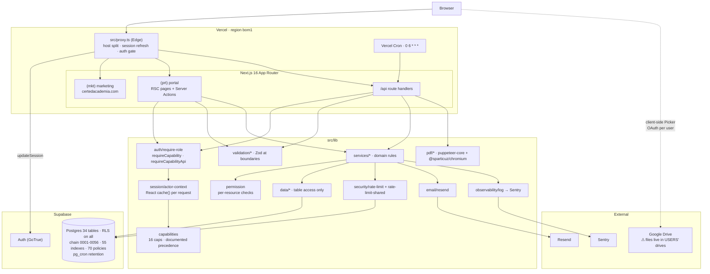
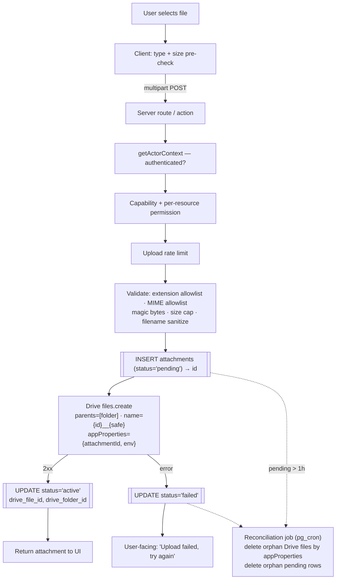

# Cert-Ed Academia — Production Readiness Audit

- **Date:** 2026-08-11 · **Revision 10**
- **Repository:** `c:\laragon\www\wed_cert` (package `cert-ed-academia`)
- **Branch:** `feature/cert-ed-academia-app` @ `67d2cf1` **plus a large uncommitted working tree** (36 modified files, 6 new files — the grade-trajectory / student-report feature)
- **Method:** read-only static analysis plus live execution of `typecheck`, `lint`, `format:check`, `test:coverage`, a clean `rm -rf .next && build`, `check:snapshot`, `npm audit --omit=dev`, and the full Playwright suite
- **Scope:** production-readiness for an initial **~100-user** deployment, covering architecture, database capacity, security, Google Drive attachment storage, deployment platform, and documentation
- **Supersedes:** revisions 1–9 (`2026-08-03-architecture-audit.md`) for the areas it covers

---

## 0. Verdict

**The application is not ready to deploy to production today, but it is close, and none of the blockers are architectural.**

The codebase is genuinely well built. The authorization model, the RLS layering, the fail-loud data layer, the migration discipline and the test design are all above what a project this age usually has. Nine prior audit passes have left real, durable machinery behind — a coverage ratchet, a bundle budget, a snapshot-freshness pre-push hook that shares one script with CI.

What stands between it and production is a short list of concrete items, and they fall into three groups:

1. **The working tree is red.** The uncommitted feature work broke one unit test and two E2E specs. Nothing can ship until the tree is green.
2. **Three production-environment gaps** that no amount of code quality fixes: no database backups on the Supabase Free tier, an auth-email path that will fail at 100 users, and a Vercel plan that does not license commercial use.
3. **The attachment model does not do what you now need it to do.** This is the biggest piece of new work in this report, and it is a genuine design change, not a bug fix.

**Two findings I want to put in front of everything else, because they are easy to miss and expensive to discover late:**

- **Student and staff files are currently stored in end users' personal Google Drives and shared "Anyone with the link."** The academy has no custody of a single uploaded file, and every submission is readable by anyone who obtains the URL. Both properties are the opposite of what you asked for. See §7.
- **The Supabase project region must match the Vercel region (`bom1`).** The app's mentor dashboard issues ~140 sequential-ish queries per load (§5.1). At 20 ms of round-trip latency that is 2.8 s; at 250 ms — a cross-continent mismatch — it is 35 s and the page times out. Region co-location is not a tuning detail here; it is load-bearing. **Not verified** — I cannot see your Supabase project settings from the repo.

Overall project health: **8.6 / 10** (was 9.0 at R9). The drop is the red working tree and the newly-surfaced production-environment gaps, not a regression in engineering quality.

---

## 1. Verification results

Run on this working tree, this machine, 2026-08-11.

| Gate                            | Result | Note                                                        |
| ------------------------------- | ------ | ----------------------------------------------------------- |
| `npm run typecheck`             | ✅     | clean                                                       |
| `npm run lint`                  | ✅     | clean                                                       |
| `npm run format:check`          | ❌     | 2 files — `DashboardCharts.tsx`, `reminder-panel-parts.tsx` |
| `npm run test:coverage`         | ❌     | **1 failed / 837 passed** (108 files)                       |
| `npm run build` (clean `.next`) | ✅     | succeeds                                                    |
| `npm run check:snapshot`        | ✅     | snapshot current at `0056`                                  |
| `npx playwright test`           | ❌     | **14 failed / 46 passed** — 2 real, 12 cascade (see §1.2)   |
| `npm audit --omit=dev`          | ⚠️     | **1 high** (`nanoid`) — was 0 at R9                         |
| `npm run check:bundle`          | —      | not run in isolation; the E2E build consumed `.next`        |

### 1.1 Closed since revision 9 — both of R9's headline defects

| ID                                                                        | R9 status                              | R10 status                                                                                                                                                                                                                                                                                                     |
| ------------------------------------------------------------------------- | -------------------------------------- | -------------------------------------------------------------------------------------------------------------------------------------------------------------------------------------------------------------------------------------------------------------------------------------------------------------- |
| **NEW-15** — student renders the grader-only class Grading queue          | 🔴 Critical, survived two fix attempts | ✅ **Closed.** `197f87e` landed the `notFound()` guard; the negative-access and scoping page specs now pass, and the grading spec is absent from the failure list.                                                                                                                                             |
| **NEW-22** — admin dashboard crashes into its error boundary in mock mode | 🟠 High                                | ✅ **Closed, and fixed better than recommended.** Rather than seeding an `exchange_rates` table, the working tree mocks the `finance_totals_base` RPC directly in [client.ts](src/lib/mock/client.ts) — mirroring migration `0056`'s function contract instead of its storage. `dashboard-cards.pw.ts` passes. |
| **NEW-21** — `/grades` listed as a tutor route                            | 🟢 Low                                 | ✅ Closed by `67d2cf1`.                                                                                                                                                                                                                                                                                        |
| **FIND-09** — `src/features` never built                                  | 🟢 Low                                 | ✅ Closed — the directory no longer exists.                                                                                                                                                                                                                                                                    |

Worth crediting the NEW-22 fix specifically: mocking at the RPC boundary rather than the table boundary is the more faithful seam, because it is the contract the application actually depends on.

### 1.2 The E2E failures — one root cause, plus an environment artifact

14 specs failed. **12 of them are cascade**: the `next start` server died partway through the run and every subsequent spec failed with `net::ERR_CONNECTION_REFUSED`. I could not reproduce the server death deterministically and there is no OOM evidence in the artifacts; my first run had also been disturbed by a concurrent build of mine that raced on `.next`. **Treat the server death as unexplained-but-probably-local, and re-run on a clean machine before reading anything into it.** It is _not_ evidence of a product defect, and I am not recording it as a finding.

**The 2 real failures share a single root cause: the new seed fixtures contradict the existing specs.**

The working tree adds grade-trajectory data to [seed.ts](src/lib/mock/seed.ts):

- Sara's Math submission `fa…0001` changed from `status: 'submitted'` to `status: 'graded', score: 7`
- a **new** submission `fa…0002` was added against the **Science** "Lab report" assignment
- the Science assignment gained `max_marks: 20`

Consequences:

| Spec                                                  | Failure                                                              | Cause                                                                                                                                                                                                                                                                                                            |
| ----------------------------------------------------- | -------------------------------------------------------------------- | ---------------------------------------------------------------------------------------------------------------------------------------------------------------------------------------------------------------------------------------------------------------------------------------------------------------- |
| `journeys.pw.ts:98` — STUDENT submits an assignment   | `locator.fill` timeout waiting for `Paste your Google Drive link...` | The spec's premise — _"Science (Sara enrolled, not yet submitted)"_ — is now false. The new seed gives Sara a Science submission, so the page renders the submitted state and the paste field never appears. The placeholder string itself is unchanged in `SubmitForm.tsx`; the form is simply not on the page. |
| `personas.pw.ts:72` and `:131` — grading a submission | `toHaveValue` expected `"18"`, received `"7"`, input `max="10"`      | `gradeSeededMathSubmission` defaults to `score = '18'` and asserts it back. The seeded Math submission now arrives pre-graded at 7 out of a max of 10, so the `.first()` locator resolves to a row the spec did not expect.                                                                                      |

**This is the same class of defect as the unit failure** (§1.3): a feature landed with its fixtures updated but its dependent tests not. The specs' use of `.first()` makes them order-sensitive to seed contents — a fragility worth fixing on its own merits, independent of this change.

### 1.3 The unit failure

`tests/unit/services/dashboard.test.ts > loads the sub-admin dashboard counts only` — asserts `expect(listEvents).not.toHaveBeenCalled()`.

The working tree deliberately extends `loadSubAdminDashboardViewData` to fetch `upcoming`, `reminders` and `pastReminders`, so `listEvents` **is** now called. **The product change is intentional and the test is stale** — the test encodes the old "counts only" contract. Update the test to the new contract; do not revert the service.

### 1.4 The dependency regression

`npm audit --omit=dev` reports **1 high**: `nanoid <3.3.17`, reached via `next@16.3.0 → postcss → nanoid` and `@tailwindcss/postcss → postcss → nanoid`.

This is a **build-time-only** path — `postcss` runs during the build, and the advisory (an infinite loop when `size` is zero) requires calling `nanoid` with attacker-controlled size, which no build-time CSS pipeline does. **Real exploitability here is essentially nil.** But it breaks the clean-audit gate that has held for nine passes, and the fix is one line:

```json
"overrides": { "undici": "^7.29.0", "nanoid": "^3.3.17" }
```

Classify **LOW** on risk, **do it anyway** on hygiene.

---

## 2. Production blockers

These are the items that must be resolved before a production deployment. Everything else in this report is improvement; this section is the gate.

| #      | Blocker                                                             | Severity | Why it blocks                                                                                                                                                                                                                                                         | Effort                   |
| ------ | ------------------------------------------------------------------- | -------- | --------------------------------------------------------------------------------------------------------------------------------------------------------------------------------------------------------------------------------------------------------------------- | ------------------------ |
| **B1** | Working tree is red — 1 unit test, 2 E2E specs, 2 format violations | 🔴       | CI will reject it; shipping around a red suite discards the project's main safety net                                                                                                                                                                                 | ~1 h                     |
| **B2** | **Supabase Free has no automatic backups**                          | 🔴       | The app is the system of record for receipts and payslips — financial documents. Operating with zero backups is not a risk posture, it is an absence of one. A dropped table or a bad migration is unrecoverable.                                                     | Upgrade to Pro (~$25/mo) |
| **B3** | **Auth email runs on Supabase's built-in SMTP**                     | 🔴       | `resetPasswordForEmail` ([auth-client.ts:108](<src/app/(prt)/auth-client.ts#L108>)) uses Supabase Auth's default sender, which is rate-limited to a handful of emails per hour and is documented as non-production. At 100 users, password resets will silently fail. | ~30 min, free            |
| **B4** | **Vercel Hobby does not license commercial use**                    | 🔴       | A fee-collecting academy portal is commercial. This is a terms violation, not a technical limit.                                                                                                                                                                      | Upgrade to Pro ($20/mo)  |
| **B5** | **Supabase region not verified against Vercel `bom1`**              | 🟠       | A region mismatch multiplies every query round-trip; §5.1's 140-query dashboard makes the app pathologically sensitive to it.                                                                                                                                         | ~5 min to verify         |
| **B6** | **No production/preview environment separation**                    | 🟠       | One Supabase project is referenced throughout. A preview deploy pointed at production data can mutate live records.                                                                                                                                                   | ~2 h                     |
| **B7** | Restore drill never performed                                       | 🟠       | Carried from R9 (FIND-35). A backup you have never restored is a hypothesis. Blocked on B2.                                                                                                                                                                           | ~2 h                     |

**B2 + B4 together cost roughly $45/month.** That is the honest price of running this application in production, and I would not try to talk you under it. Everything else on this list is free.

---

## 3. Architecture

### 3.1 Assessment

**The architecture is appropriate, and it is not over-engineered.** I looked specifically for the failure modes you asked about and did not find them:

- **Unnecessary abstractions:** none material. The layering (`app → services → data → supabase`) is three hops, each of which earns its place: `services` holds authorization and domain rules, `data` holds table access and nothing else. The split is enforced by convention and documented in [ADR-0001](docs/adr/0001-adopt-data-layer.md).
- **Inappropriate dependencies:** none found. `src/lib/data/*` imports `server-only` and never reaches upward into services. No client component imports the admin client.
- **Components that should be consolidated:** the `submissions` data module is split across five files (`submissions.ts`, `-reads`, `-writes`, `-shared`, `-service-reads`). That is at the edge of useful, but each file is small and the names are honest, so I would leave it.
- **Components that should be split:** none urgent.
- **Architectural bottleneck:** one, and it is real — the mentor dashboard's per-mentee fan-out (§5.1).

The one structural gap is the absence of a **queue**. Notification email fan-out happens inline on the request path (§5.2). `pg_cron` is already proven working in production, so the remedy needs no new infrastructure.

### 3.2 System map



### 3.3 Subsystem responsibilities

| Subsystem           | Where                                         | Responsibility                                                                                                                          | Depends on                                                 | On failure                                                                                                                                                 |
| ------------------- | --------------------------------------------- | --------------------------------------------------------------------------------------------------------------------------------------- | ---------------------------------------------------------- | ---------------------------------------------------------------------------------------------------------------------------------------------------------- |
| **Host routing**    | `src/proxy.ts`, `lib/routing/host.ts`         | Splits marketing vs portal by hostname; gates unauthenticated portal paths; returns 401 JSON for `/api`                                 | `updateSession`                                            | Dormant pass-through if Supabase env is absent — deliberate                                                                                                |
| **Session / actor** | `lib/session/actor-context.ts`                | The single request-scoped resolver for user → profile → personas → capabilities. `React.cache()`-wrapped, so one resolution per request | Supabase Auth, `data/profiles`, `data/personas`            | **Throws** — fails closed. Deliberate: coercing a failed persona read to `[]` would both blank a healthy user's nav and silently drop admin DENY overrides |
| **Capabilities**    | `lib/capabilities/`                           | 16 capabilities; persona baseline resolved against admin overrides with precedence `hard rule > deny > allow > persona default`         | —                                                          | Pure function; unrecognised persona aggregates to zero capabilities (fail-closed)                                                                          |
| **Authorization**   | `lib/auth/require-role.ts`, `lib/permission/` | Coarse capability gate at the route, per-resource check in the service                                                                  | actor-context                                              | `redirect('/dashboard?denied=1')` on pages, 403 on API                                                                                                     |
| **Data layer**      | `lib/data/*` (42 modules)                     | Table access only. Chooses RLS-scoped vs service-role client per [ADR-0005](docs/adr/0005-rls-with-service-role-layering.md)            | Supabase clients                                           | **Throws with a `module.fn: message` prefix** — fail-loud by convention                                                                                    |
| **Rate limiting**   | `lib/security/rate-limit*.ts`                 | In-process limiter for authenticated user-keyed throttles; Postgres-backed `rate_limit_hit` RPC for unauthenticated IP-keyed ones       | `rate_limit_counters`                                      | **Degrades, never disables** — falls back to the per-instance limiter and logs `rpc-missing` distinctly                                                    |
| **PDF**             | `lib/pdf/`, 4 `/api/**/pdf` routes            | Headless-Chromium render of receipts, payslips, report cards; 304 on unchanged documents                                                | `@sparticuz/chromium` (67 MB), `outputFileTracingIncludes` | 502; `maxDuration = 60` guards cold-start                                                                                                                  |
| **Observability**   | `lib/observability/log.ts`                    | `logError` → stderr + Sentry, severity-split; client SDK only bundled when the DSN is set at build                                      | Sentry                                                     | Degrades to stderr                                                                                                                                         |

---

## 4. Database

### 4.1 Shape

34 tables, RLS on every one, migration chain `0001`–`0056`, rebuild snapshot current, 55 indexes, 70 policies, 25 functions, 3 triggers, `pg_cron` retention on notifications.

**The schema is in good condition.** Reviewing against your checklist:

| Check                         | Finding                                                                                                                                                                                                        |
| ----------------------------- | -------------------------------------------------------------------------------------------------------------------------------------------------------------------------------------------------------------- |
| Redundant tables              | **None.** Every one of the 34 is reachable from application code.                                                                                                                                              |
| Redundant columns             | **None material.** `resources.file_type` is derivable from the link but is a cached display hint — acceptable.                                                                                                 |
| Duplicate concepts            | **One, by design and documented:** `profiles.role` (fixed identity) and `persona_assignments` (assignable) overlap deliberately — see [ADR-0003](docs/adr/0003-personas-as-fixed-identities.md). Not a defect. |
| Foreign keys / cascades       | Present and used. **No FK/cascade inventory in the docs** — carried finding FIND-27, still open.                                                                                                               |
| Constraints                   | Good: status `CHECK`s, partial unique index for global personas, one-active-student-per-class (`0052`), global persona uniqueness (`0025`).                                                                    |
| Indexes                       | 55, purpose-documented. Distribution is sane; `persona_assignments` carries 6, which is high for a small table but each supports a distinct access path. **No excessive indexing.**                            |
| Dev/test tables in production | **None.** The mock harness is a JSON file, not a schema.                                                                                                                                                       |
| Migration hygiene             | **Strong** — CI blocks duplicate version prefixes (a bug that recurred twice), and a pre-push hook blocks snapshot drift.                                                                                      |
| Large text/JSON fields        | Two `jsonb` columns: `announcements.attachments` and `org_settings.messaging_matrix`. Both small and bounded. See §4.4.                                                                                        |
| Orphaned structures           | None found.                                                                                                                                                                                                    |

### 4.2 Capacity — can Supabase Free's 500 MB hold this?

You asked me not to simply assert "500 MB should be enough". Here is the arithmetic, for **100 users over one year** (assume 60 students, 30 tutors/mentors, 10 admins, 20 active classes, 40 sessions per class per year).

| Table                                                                              |      Rows / yr | ~Bytes/row |         Size |
| ---------------------------------------------------------------------------------- | -------------: | ---------: | -----------: |
| `audit_log` (**never purged**)                                                     |        125,000 |        200 |  **25.0 MB** |
| `notifications` (90-day read retention)                                            | ~30,000 steady |        300 |       9.0 MB |
| `messages`                                                                         |         20,000 |        400 |       8.0 MB |
| `submissions`                                                                      |         12,000 |        400 |       4.8 MB |
| `comments`                                                                         |          5,000 |        300 |       1.5 MB |
| `attendance`                                                                       |          7,200 |        200 |       1.4 MB |
| `receipts` + `payslips` + lines                                                    |          3,000 |        400 |       1.2 MB |
| `resources` + `resource_versions`                                                  |          2,000 |        500 |       1.0 MB |
| `calendar_events` + `timetable_slots` + `reminders`                                |          3,000 |        300 |       0.9 MB |
| `announcements`                                                                    |          1,000 |        800 |       0.8 MB |
| `entity_tags` + `tags`                                                             |          5,000 |        150 |       0.8 MB |
| everything else (profiles, classes, enrollments, personas, sessions, FX, counters) |         ~2,500 |          — |       0.6 MB |
| **Heap subtotal**                                                                  |                |            |   **~55 MB** |
| Indexes (55, across this mix)                                                      |                |            |       ~40 MB |
| Catalog, bloat, WAL headroom                                                       |                |            |       ~50 MB |
| **Year-1 total**                                                                   |                |            | **≈ 145 MB** |

**Conclusion: the 500 MB Free-tier database limit is genuinely not a constraint.** Year-1 lands around 145 MB, roughly 29% of the ceiling. Steady-state growth is ~90 MB/year, dominated by `audit_log` (~25 MB/yr) and `messages` (~8 MB/yr). **You have about three years of runway** before size alone forces an upgrade.

This holds on one condition: **no file bytes ever enter Postgres.** The Drive design in §7 preserves that.

**The largest table is `audit_log`, and it has no retention policy.** Migration `0051` documents that as a deliberate compliance choice, which is defensible. But "indefinitely" and "for compliance" are different retention periods. Recommend: decide an explicit horizon (24 months is typical for an education provider), then add a `pg_cron` purge or an archive-to-cold-storage step beside the existing notifications job. **Not urgent at 100 users** — it is a year-two item, but decide it now while the table is small.

### 4.3 Concurrency at 100 users

Your scenario: 100 registered, ~50 active, 25–50 simultaneous.

**Connection exhaustion is not a risk here.** The app talks to Postgres through PostgREST over HTTP, not through direct Postgres connections; PostgREST maintains its own internal pool. The Free tier's direct-connection ceiling is therefore not on the critical path. This is a genuine strength of the Supabase-client architecture and it means the classic "serverless melts the connection pool" problem does not apply.

The real constraint is **shared CPU on the Free tier combined with query volume per page**. That makes §5.1 the thing to fix, not the connection settings.

| Scenario                       | Assessment                                                                                                                                                       |
| ------------------------------ | ---------------------------------------------------------------------------------------------------------------------------------------------------------------- |
| 50 concurrent dashboard loads  | ⚠️ A mentor dashboard is ~140 queries. 10 concurrent mentors = 1,400 queries in flight. **This is the one scenario that will visibly degrade on Free-tier CPU.** |
| Browsing resources / documents | ✅ Paginated via the shared `pageSlice`; indexed                                                                                                                 |
| Simultaneous searches          | ✅ Bounded; indexed                                                                                                                                              |
| Uploads / downloads            | ✅ Rate-limited (20/min per user on downloads)                                                                                                                   |
| Authentication                 | ✅ `getClaims()` verifies JWTs locally when asymmetric signing keys are used — no Auth round-trip per request. Well done.                                        |
| CRUD                           | ✅ Atomic RPCs for the operations that need them (submission replace, finance issuance, admin revoke)                                                            |
| Notifications                  | ⚠️ Inline email fan-out (§5.2)                                                                                                                                   |

### 4.4 `jsonb` usage

- `announcements.attachments jsonb DEFAULT '[]'` — an array of Drive links. **This should be normalized into the new `attachments` table** proposed in §7.4. Doing so removes a denormalized store, gives attachments referential integrity and lifecycle status, and unifies three attachment paths (announcements, resources, submissions) behind one model. **REFACTOR.**
- `org_settings.messaging_matrix jsonb` — a small `{"a|b": true}` map on a single-row table. Normalizing this would cost more than it returns. **KEEP.**

---

## 5. Performance

### 5.1 🟠 HIGH — mentor dashboard N+1

**[mentees-dashboard.ts:108](src/lib/services/mentees-dashboard.ts#L108)**

```ts
const signals = await Promise.all(ids.map((id) => menteeSignals(id)))
```

`menteeSignals` issues **7 queries per mentee**: one for class ids, five in a `Promise.all`, and one more for assignment metadata. Around that, `getMentorDashboard` also calls `getProfilesByIds` and `buildStudentRelationshipSubtitles`.

| Mentees | Queries per dashboard load |
| ------: | -------------------------: |
|       5 |                        ~37 |
|      10 |                        ~72 |
|      20 |                   **~142** |

`Promise.all` makes them concurrent, not fewer. Every one crosses the network to PostgREST. **This is the single hottest inefficiency in the application**, it is on a page that loads at every mentor login, and its cost scales with exactly the thing that grows as the academy does.

**Fix:** invert the loop. Every underlying query already accepts a set — `selectActiveAssignmentsByClassIdsAsService(classIds)` takes an array; the per-student reads (`selectActiveSubmissionsForStudentAsService`, `selectRowsForStudentAsService`) need `.in('student_id', ids)` variants. Fetch once for all mentees, then group in memory. That turns ~142 queries into **~7, flat**, regardless of mentee count. Estimated ~4 h including tests.

### 5.2 🟡 MEDIUM — email fan-out on the request path

**[notifications.ts:69](src/lib/services/notifications.ts#L69)** — `await dispatchEmail(ids, input)` runs inside the request that triggered the notification.

An announcement to a 30-student class fires 30 Resend calls before the user's action returns. Resend's free tier rate-limits to ~2 requests/second, so a 30-recipient announcement both stalls the request and starts shedding sends. The in-app write is correctly protected (email failures are caught and logged, never failing the core action) — the problem is latency and delivery, not correctness.

**Fix:** a `pending_emails` table drained by `pg_cron`. `pg_cron` is already proven working in this project (`0051`), so this needs no new infrastructure. Carried finding FIND-33, now with a concrete cost attached.

### 5.3 🟡 MEDIUM — unbounded aggregation reads

[analytics.ts](src/lib/data/analytics.ts) contains four reads with **no date bound and no limit**:

| Function                                       | Scans                                                   |
| ---------------------------------------------- | ------------------------------------------------------- |
| `sumResourceDownloads()`                       | every active resource row, summed in JavaScript         |
| `selectSessionsForClasses(classIds)`           | every session row for those classes, all time           |
| `selectTimedAttendanceForStudent(studentId)`   | every attendance row for that student, all time         |
| `selectAttendanceStatusesForClasses(classIds)` | every attendance row across a tutor's classes, all time |

These are correct today and cheap at year-one volumes — the head-only `countRows` helper alongside them is exactly right, and the `if (ids.length === 0) return []` guards show care. But they grow monotonically and they sit on the dashboard.

**Fix:** bound them by the current academic term or a rolling window, and push `sumResourceDownloads` into a `SUM()` in Postgres instead of transferring every row to sum in JS. Do this before year two, not before launch.

### 5.4 🟢 LOW — `getOrgSettings()` uncached

13 modules read it; every page render pays an extra round-trip for a single-row table that changes perhaps monthly. Wrap in `unstable_cache` with a tag invalidated on settings update. Carried from R9.

### 5.5 Frontend

Healthy and unchanged: first-load shared JS was 127.4 KB against a 145 KB budget at R9, code-split by route, Sentry's ~145 KB SDK folded out of the bundle entirely when unconfigured via a build-time literal. That last detail is a genuinely nice piece of engineering.

**No dark mode** — `grep "dark:"` returns 0 for the tenth consecutive pass, while `layout.tsx` still advertises a dark `themeColor`. Either implement it or drop the one line. Ten passes is long enough.

---

## 6. Security

### 6.1 Findings

| Sev             | ID     | Finding                                                                                                                                                                                                                                                                                                                                                                                                                                                                                                                                                                                     |
| --------------- | ------ | ------------------------------------------------------------------------------------------------------------------------------------------------------------------------------------------------------------------------------------------------------------------------------------------------------------------------------------------------------------------------------------------------------------------------------------------------------------------------------------------------------------------------------------------------------------------------------------------- |
| 🔴 **CRITICAL** | **S1** | **Uploaded files are shared "Anyone with the link."** [drive-share.ts](src/lib/google/drive-share.ts) posts `{role: 'reader', type: 'anyone'}` to the Drive permissions API. Every student submission and shared document is readable by anyone who obtains the URL — no authentication, no expiry, no revocation. Drive URLs leak through browser history, referrer headers, chat forwards and screenshots. For student work and any document containing personal data this is a disclosure risk and, depending on jurisdiction, a data-protection one. **Remove entirely** as part of §7. |
| 🟠 **HIGH**     | **S2** | **The academy has no custody of any uploaded file.** Files live in each user's personal Drive under `drive.file` scope. A student who deletes a file, unshares it, or graduates and loses their account takes the submission evidence with them. There is no backup and no recovery path. This is the requirement you identified, and it is correctly identified.                                                                                                                                                                                                                           |
| 🟠 **HIGH**     | **S3** | **Auth email on Supabase's built-in SMTP** (B3). Beyond the rate limit, the default sender is a shared Supabase domain with poor deliverability — reset mails land in spam.                                                                                                                                                                                                                                                                                                                                                                                                                 |
| 🟡 **MEDIUM**   | **S4** | **No environment separation** (B6). One Supabase project. A preview deployment can write to production data.                                                                                                                                                                                                                                                                                                                                                                                                                                                                                |
| 🟡 **MEDIUM**   | **S5** | `/api/health` is public, unauthenticated, and touches the database on every request, with no rate limit. Deliberate (an external uptime pinger needs it) and low-impact at this scale, but it is a free DB round-trip for any anonymous caller. Cache the result for ~30 s or rate-limit by IP.                                                                                                                                                                                                                                                                                             |
| 🟢 **LOW**      | **S6** | CSP requires `unsafe-inline` and `unsafe-eval`. Next 16 supports nonces; this is the last structural item. Carried FIND-15.                                                                                                                                                                                                                                                                                                                                                                                                                                                                 |
| 🟢 **LOW**      | **S7** | `nanoid` advisory (§1.4) — build-time only.                                                                                                                                                                                                                                                                                                                                                                                                                                                                                                                                                 |
| ℹ️ **INFO**     | **S8** | `/api/dev/login` and `/api/dev/logout` exist in the production tree but return **404 unless `isMock()`**. I checked this specifically: it is correctly gated and is **not** an auth bypass. Still worth excluding from the production build eventually, on the principle that test-only code should not be reachable.                                                                                                                                                                                                                                                                       |

### 6.2 Controls that are in good shape

I want to be specific about what is genuinely well done here, because it is a lot:

- **RLS on all 34 tables**, 70 policies, with a 26-assertion harness (`scripts/test-rls.sh`) verified green at R9 against real Postgres 18. Not re-run here (needs a local Postgres).
- **Service-role usage is deliberate and documented**, with each call site justified against ADR-0005. Aggregation reads scope by the caller's own membership before fanning out.
- **The download route is a model of the pattern** ([download/route.ts](src/app/api/resources/[id]/download/route.ts)): capability gate, per-document RBAC, rate limit, host re-validation at redirect time so it cannot become an open-redirect gadget, identical 404 for both "missing" and "forbidden" so it does not leak existence, `no-store`, and a speculative-fetch check so a link prefetch cannot inflate the download counter. That last one is a detail most codebases miss.
- **Constant-time secret comparison** in the cron guard, with the length checked first so `timingSafeEqual` cannot throw.
- **Fail-closed everywhere it matters** — unset `CRON_SECRET` makes the endpoint 401 rather than public; unrecognised personas grant nothing; failed persona reads throw rather than degrading to "no capabilities".
- **Security headers**: HSTS, `X-Frame-Options: DENY`, `nosniff`, COOP, CORP on `/api`, and a CSP. The comments explaining _why_ `form-action` is omitted and why COOP is `same-origin-allow-popups` are the kind of thing that prevents a future regression.
- **No secrets in git.** Inventory and rotation runbook in [security-operations.md](docs/security-operations.md).

### 6.3 Checked, not found

SQL injection (no string-built SQL; PostgREST + parameterised RPCs), XSS (React escaping; `escapeHtml` on the one HTML-email path), CSRF (Server Actions carry Next's origin check; the one cross-host form is deliberately exempted from `form-action` with a documented reason), path traversal (no user-controlled filesystem paths), SSRF (the Drive host allowlist is the only outbound user-influenced URL and it is enforced twice), open redirect (same allowlist), privilege escalation via client-side role checks (all gates are server-side; the client never decides).

---

## 7. Google Drive — persistent attachment storage

This is the largest piece of new work in the report. **The current model is not a weak version of what you want; it is a different thing.** [ADR-0004](docs/adr/0004-google-drive-storage-model.md) chose "a document is a link" deliberately, to avoid storage cost and data-protection surface. That was a reasonable call for a prototype. Your new requirement — persistent, custodial storage — invalidates its premise, so ADR-0004 should be **superseded**, not amended.

### 7.1 What exists today

```
Student → client-side Google Picker (drive.file scope, user's own OAuth)
        → file stays in THE STUDENT'S Drive
        → shareAnyoneWithLink() makes it public
        → app stores only a URL string in submissions.drive_link
```

Three storage paths, all link-only, all with the same custody gap:

| Path          | Column                                | Problem                                         |
| ------------- | ------------------------------------- | ----------------------------------------------- |
| Submissions   | `submissions.drive_link`, `file_name` | Student owns the file                           |
| Resources     | `resources.drive_link`                | Staff member owns the file; leaves when they do |
| Announcements | `announcements.attachments jsonb`     | Denormalized array of links                     |

### 7.2 Credential model — service account vs OAuth

**Recommendation: a service account writing into a Google Shared Drive.**

|                           | Service account + Shared Drive    | OAuth per user (current)   | Dedicated account + stored refresh token |
| ------------------------- | --------------------------------- | -------------------------- | ---------------------------------------- |
| File ownership            | **The organisation**              | The individual user        | A single Google account                  |
| Survives a user leaving   | ✅                                | ❌                         | ✅                                       |
| Credential on the server  | ✅ JSON key, never in the browser | ❌ Client ID in the bundle | ⚠️ Refresh token, needs rotation         |
| Storage quota             | Workspace pool                    | Each user's 15 GB          | That account's 15 GB                     |
| Requires Google Workspace | **Yes**                           | No                         | No                                       |
| Unattended operation      | ✅                                | ❌ needs the user present  | ✅                                       |

The decisive point is one that trips people up: **a service account has no storage quota of its own and cannot own files in a My Drive.** It must write into a **Shared Drive**, where the _drive_ owns the files and the service account is added as a **Content Manager**. Shared Drives require Google Workspace.

**So the choice depends on a fact I cannot see from the repository:**

- **If the academy has Google Workspace** → service account + Shared Drive. Cleanest, no token rotation, org-owned files, unattended.
- **If it only has a free Gmail account** → create a dedicated `files@` account, run the OAuth consent flow **once** by hand, store the refresh token as a server secret, and have the upload service mint access tokens from it. Functionally equivalent for your scale; the cost is that the refresh token is a rotating secret and the 15 GB quota is shared with that account's mail.

**Never** keep per-user OAuth for custodial storage — that is the current design and it is the direct cause of S1 and S2.

Credentials are server-only in both cases. Nothing Google-related except (optionally) a Picker key may remain in the client bundle.

### 7.3 Target flow



**The `appProperties` tag is the load-bearing detail.** Stamping `{attachmentId, env}` onto each Drive file makes reconciliation possible in _both_ directions: given a failed DB row you can find and delete its Drive file, and given an untracked Drive file you can prove no DB row claims it. Without it, orphan cleanup is guesswork. It also makes the environment visible on the file itself, so a staging upload can never be mistaken for a production one.

This satisfies each of your stated requirements:

| Requirement             | How                                                                                             |
| ----------------------- | ----------------------------------------------------------------------------------------------- |
| No orphaned DB records  | `pending` rows older than 1 h are swept                                                         |
| No orphaned Drive files | `appProperties.attachmentId` lets the sweeper match files to rows                               |
| No duplicate uploads    | `drive_file_id` is `UNIQUE`; optional `checksum_sha256` catches re-uploads of identical content |
| No partial uploads      | The row is not `active` until Drive returns a file id                                           |
| No broken references    | `status` is explicit; the UI renders only `active`                                              |

### 7.4 Schema

Your proposed shape was close. Two changes I would make.

**First, do not use a polymorphic `owner_type`/`owner_id` pair.** It cannot carry a foreign key, so nothing stops an attachment pointing at a deleted assignment. Use mutually-exclusive nullable FKs with a check constraint — you keep referential integrity and cascade behaviour, at the cost of one column per owner type.

**Second, store `file_size` as `bigint`** and constrain it, so the cap is enforced in the database and not only in application code.

```sql
create table public.attachments (
  id                uuid primary key default gen_random_uuid(),

  -- Exactly one owner. Separate FK columns (not a polymorphic pair) so the
  -- database can enforce referential integrity and cascade on delete.
  submission_id     uuid references public.submissions(id)   on delete cascade,
  resource_id       uuid references public.resources(id)     on delete cascade,
  announcement_id   uuid references public.announcements(id) on delete cascade,

  uploaded_by       uuid not null references public.profiles(id) on delete restrict,
  original_filename text not null,
  mime_type         text not null,
  file_size         bigint not null,
  checksum_sha256   text,

  storage_provider  text not null default 'google_drive',
  drive_file_id     text unique,
  drive_folder_id   text,

  status            text not null default 'pending',
  created_at        timestamptz not null default now(),
  updated_at        timestamptz not null default now(),
  deleted_at        timestamptz,

  constraint attachments_one_owner check (
    (submission_id   is not null)::int
  + (resource_id     is not null)::int
  + (announcement_id is not null)::int = 1
  ),
  constraint attachments_status_check
    check (status in ('pending','active','failed','deleted')),
  constraint attachments_size_check
    check (file_size > 0 and file_size <= 26214400),   -- 25 MB
  constraint attachments_provider_check
    check (storage_provider in ('google_drive')),
  -- An active attachment must know where its bytes are.
  constraint attachments_active_has_file
    check (status <> 'active' or drive_file_id is not null)
);
```

The full migration — indexes, RLS policies and the `updated_at` trigger — is delivered separately as `C:\Users\Shamil\Documents\0057_attachments_custodial_storage.sql`, ready for the Supabase SQL editor.

**It has been verified, not just written.** I applied the full `0001`–`0056` chain to a scratch Postgres 18 database, applied `0057` on top (clean), and asserted each behaviour:

| Assertion                                                      | Result |
| -------------------------------------------------------------- | ------ |
| Zero owners rejected                                           | ✅     |
| Two owners rejected                                            | ✅     |
| File over 25 MB rejected                                       | ✅     |
| `status='active'` without a `drive_file_id` rejected           | ✅     |
| `pending` → `active` lifecycle succeeds, `updated_at` advances | ✅     |
| Duplicate `drive_file_id` rejected                             | ✅     |
| Deleting the owning resource cascades the attachment away      | ✅     |

The three RLS read branches mirror `submissions_read`, `resources_read` and `announcements_read` **exactly** — including the mentor branch on submissions and the `publish_at`/`expires_at` window on announcements, both of which I got wrong on the first pass and corrected against the live policy definitions. A drifted mirror is precisely the bug this design is meant to avoid.

**No file bytes in Postgres**, per your instruction and per §4.2's capacity budget. The table adds roughly 300 bytes per attachment — 12,000 submissions a year is ~3.6 MB, immaterial.

### 7.5 Folder design

**Recommendation:**

```
Cert-Ed Academia (Shared Drive)
└── production/                 ← environment first: staging can never write here
    ├── submissions/2026/08/
    ├── resources/2026/08/
    └── announcements/2026/08/
```

Not this:

```
Application/Resources/{Year}/{Category}/{Subject}/   ← don't
```

**Why date-partitioned and not classification-partitioned:** category, subject and visibility are _mutable metadata_. If they live in the folder path, editing a resource's category means moving a Drive file, which is a second failure mode on every edit and can leave the DB and Drive disagreeing. Dates are immutable, so the path is write-once. The database stays the single source of truth for all classification, exactly as you specified.

Year/month partitioning also keeps any one folder well under Drive's per-folder item limits and keeps admin browsing usable. Environment at the top level makes cross-environment accidents structurally impossible rather than merely unlikely.

**Drive filename:** `{attachment_id}__{sanitized_original_name}`. The UUID guarantees uniqueness and links the file back to its row at a glance; the original name keeps the folder human-auditable.

### 7.6 Download and access

**Recommendation: proxy the bytes through the application. Do not redirect.**

| Approach                                    | Security                                                                | Performance                                    | Complexity | Verdict                                                                                                                         |
| ------------------------------------------- | ----------------------------------------------------------------------- | ---------------------------------------------- | ---------- | ------------------------------------------------------------------------------------------------------------------------------- |
| Redirect to Drive                           | ❌ Requires the file be publicly shared — this _is_ S1                  | Best (no egress)                               | Lowest     | **Rejected** — reintroduces the vulnerability                                                                                   |
| "Anyone with the link" URL stored in the DB | ❌ Same                                                                 | Best                                           | Lowest     | **Rejected**                                                                                                                    |
| Signed URL                                  | —                                                                       | —                                              | —          | **Not available.** Drive has no true signed-URL primitive for private files; `webContentLink` still requires a permission grant |
| **Stream/proxy through the app**            | ✅ File stays private; every byte passes a server-side permission check | Adequate — one extra hop; ~1 s for a 5 MB file | Moderate   | ✅ **Recommended**                                                                                                              |

Because the service account is the only principal with access, streaming is not merely the safest option — it is the only one that preserves privacy. Egress is trivial at this scale (Vercel Pro includes 1 TB/month; 100 users downloading 50 MB/month each is 5 GB).

Keep the existing `/api/resources/[id]/download` route _shape_ — its permission checks, rate limit, audit write and identical-404 behaviour are all correct and worth preserving. Replace only the final step: instead of `302 → drive_link`, fetch from Drive with the service-account token and pipe the response body, setting `Content-Type` from `mime_type` and `Content-Disposition` from `original_filename`.

**Preview:** Drive's embed viewer requires the _viewer_ to have Drive access, which private files by definition do not grant. So drop the embed viewer and stream inline instead — `Content-Disposition: inline` lets browsers render PDFs and images natively. Simpler and more private than what exists now.

### 7.7 Validation

| Control                                                                                                                                    | Launch | Later |
| ------------------------------------------------------------------------------------------------------------------------------------------ | ------ | ----- |
| Extension allowlist (`pdf, doc(x), xls(x), ppt(x), png, jpg, zip`)                                                                         | ✅     |       |
| MIME allowlist, cross-checked against the extension                                                                                        | ✅     |       |
| Magic-byte sniff for the common types                                                                                                      | ✅     |       |
| Size cap (25 MB) — enforced in the DB _and_ the app                                                                                        | ✅     |       |
| Filename sanitization — strip path separators and control characters, reject leading dots and double extensions, NFC-normalize, cap length | ✅     |       |
| Server-side auth + per-resource permission before the byte is read                                                                         | ✅     |       |
| Upload rate limit (e.g. 10/hour/user)                                                                                                      | ✅     |       |
| Orphan reconciliation job                                                                                                                  | ✅     |       |
| `checksum_sha256` duplicate detection                                                                                                      |        | ✅    |
| Virus/malware scanning                                                                                                                     |        | ✅    |
| Resumable uploads for large files                                                                                                          |        | ✅    |

Virus scanning is the one I would consciously defer: it needs an external service, and at 100 known, authenticated, allowlisted users of a closed academy portal the threat model does not yet justify it. Revisit if uploads ever open to unauthenticated users.

### 7.8 Migration from the current model

**Existing links cannot be migrated automatically, and it is important to be clear about that.** Those files live in users' personal Drives; the application has never had credentials that can read them. There is no backfill.

Recommended path:

1. Ship the `attachments` table and the new upload path. Route all _new_ uploads through it.
2. Keep the existing `drive_link` columns readable, marked legacy in the UI ("stored outside the academy").
3. Give staff a "re-upload to academy storage" action on active resources, so the important material migrates by hand over a term.
4. After a defined cutover date, stop rendering legacy links for submissions (the ones most likely to have rotted).
5. Drop the `drive_link` columns and `announcements.attachments` only once the legacy set is empty.

---

## 8. Deployment platform

### 8.1 Is Vercel right? Yes — but not on Hobby

**Vercel is the correct platform for this application**, and I would not move it. The app is a Next.js 16 App Router monolith using RSC, Server Actions, `outputFileTracingIncludes`, per-route `runtime`/`maxDuration`, and `vercel.json` crons. Vercel is the reference implementation for all of that. Moving would mean rebuilding the deployment layer for no benefit at 100 users.

**But the current deployment is a testing deployment, and you were right to treat it as one.** Specific gaps:

| Item                     | State                                                                                                           | Action                                                                                                                                                                                                                                                                                                                                 |
| ------------------------ | --------------------------------------------------------------------------------------------------------------- | -------------------------------------------------------------------------------------------------------------------------------------------------------------------------------------------------------------------------------------------------------------------------------------------------------------------------------------- |
| **Plan**                 | Hobby (assumed)                                                                                                 | 🔴 **Hobby prohibits commercial use.** Upgrade to **Pro ($20/mo)**.                                                                                                                                                                                                                                                                    |
| **Region**               | `bom1` (Mumbai) in `vercel.json` ✅                                                                             | 🟠 **Verify the Supabase project is in the same region.** See §0.                                                                                                                                                                                                                                                                      |
| **Function memory**      | Default                                                                                                         | The 4 PDF routes launch Chromium (67 MB package, ~512 MB+ resident). Raise memory on those routes and load-test one report-card render.                                                                                                                                                                                                |
| **`maxDuration`**        | 60 s on all 4 PDF routes ✅                                                                                     | Correct, and the comment explaining the cold-start reasoning is good.                                                                                                                                                                                                                                                                  |
| **Env separation**       | ❌ None                                                                                                         | 🟠 Separate Supabase projects and Google Drive folders per environment (B6).                                                                                                                                                                                                                                                           |
| **`NEXT_PUBLIC_*` vars** | Guarded at build ✅                                                                                             | `next.config.js` logs loudly when they are missing, with an accurate explanation of the "Sensitive vars are withheld from the build" trap. **Promote that `console.error` to a `throw`** — a warning in a build log is easy to miss, and the failure mode (sign-in silently broken for every user, nothing in runtime logs) is severe. |
| **Error monitoring**     | Sentry wired, DSN presence unverified                                                                           | 🟡 Confirm both DSNs are set in the Vercel project. Carried from R9.                                                                                                                                                                                                                                                                   |
| **Rollback**             | Vercel instant rollback available                                                                               | Document it in the runbook.                                                                                                                                                                                                                                                                                                            |
| **Build script parity**  | ⚠️ `scripts/fix-next-proxy-build.mjs` runs in the Playwright `webServer` command but **not** in `npm run build` | Confirm the proxy-trace patch is genuinely unnecessary on Vercel. **Not verified.** If it _is_ needed, production is building differently from every place it has been tested.                                                                                                                                                         |

### 8.2 Alternatives

| Platform           | Cost/mo | Next 16 fit        | Chromium PDF                                                                               | Ops burden                                           | Verdict                                                                              |
| ------------------ | ------- | ------------------ | ------------------------------------------------------------------------------------------ | ---------------------------------------------------- | ------------------------------------------------------------------------------------ |
| **Vercel Pro**     | $20     | ★★★★★ native       | ✅ works today                                                                             | Lowest                                               | ✅ **Recommended**                                                                   |
| Cloudflare Workers | $5      | ★★★☆☆ via OpenNext | ❌ No Node `fs`; needs the separate Browser Rendering product — a rewrite of the PDF layer | Medium                                               | ❌ The PDF routes alone rule it out                                                  |
| Netlify            | $19     | ★★★★☆              | ⚠️ possible, less trodden                                                                  | Low                                                  | ➖ Equivalent cost, worse Next 16 support. No reason to move.                        |
| Render             | $7–25   | ★★★★☆ container    | ✅ easy in a container                                                                     | Medium                                               | ➖ Viable and cheaper; you trade Vercel's CDN/preview ergonomics and take on scaling |
| Railway            | ~$5–20  | ★★★★☆ container    | ✅                                                                                         | Medium                                               | ➖ As Render                                                                         |
| VPS (Hetzner/DO)   | $5–12   | ★★★☆☆ manual       | ✅                                                                                         | **Highest** — you own patching, TLS, backups, uptime | ❌ Cheapest in dollars, most expensive in attention. Wrong trade for a small team.   |

Against your own stated criterion — _lowest reasonable complexity + reliable performance + sustainable cost + easy maintenance_ — **Vercel Pro wins on three of four and ties on the fourth.** Render is the only serious runner-up and it saves at most $13/month in exchange for real operational work.

### 8.3 Supabase Free — sufficient?

**No, but only for one reason: backups.**

| Dimension        | Free tier                 | Needed                             | Verdict                                  |
| ---------------- | ------------------------- | ---------------------------------- | ---------------------------------------- |
| Database size    | 500 MB                    | ~145 MB year 1 (§4.2)              | ✅ ~3 years of runway                    |
| Bandwidth        | 5 GB/mo                   | well under                         | ✅                                       |
| MAU              | 50,000                    | 100                                | ✅                                       |
| Connections      | PostgREST-pooled          | not on the critical path           | ✅                                       |
| **Backups**      | **none**                  | daily + PITR for financial records | 🔴 **Blocker**                           |
| Auth email       | ~2–4/hour, non-production | 100 users' resets                  | 🔴 **Blocker — but fixable free** (§8.4) |
| Inactivity pause | 7 days                    | mitigated by the keepalive cron ✅ | ✅                                       |
| CPU              | shared                    | fine _after_ §5.1 is fixed         | ⚠️                                       |

**Upgrade to Supabase Pro (~$25/mo) for the backups, not for the capacity.** I want to be precise about that, because you asked me not to recommend an upgrade as a precaution: the 500 MB limit is genuinely fine and I would not upgrade for it. Daily backups on a system holding receipts and payslips are not a precaution — they are the minimum standard of care.

### 8.4 Auth email — fix this regardless of tier

Configure **custom SMTP in Supabase Auth pointing at Resend**, which is already a dependency with a verified sender. This works on the Free tier, costs nothing, and fixes deliverability as well as the rate limit. ~30 minutes. Do it before any real user is invited.

---

## 9. Redundancy and dead code

| Item                                                                      | Evidence                                                                                       | Class                                                                                                           |
| ------------------------------------------------------------------------- | ---------------------------------------------------------------------------------------------- | --------------------------------------------------------------------------------------------------------------- |
| `design_assets/` — 14 tracked binaries (`.ai`, `.eps`, `.pdf`), **19 MB** | Runtime assets already exist as PNG/SVG in `docs/assets/internal/brand-package/` and `public/` | **REMOVE** — 19 MB of a 21.7 MB repo. Move to a design drive; every clone and CI checkout pays for these today. |
| `receipt/Receipt Templates.dc.html` — 44 KB                               | Stray scratch template at repo root, referenced nowhere                                        | **REMOVE**                                                                                                      |
| `.agents/`                                                                | Empty directory                                                                                | **REMOVE**                                                                                                      |
| `announcements.attachments jsonb`                                         | §4.4                                                                                           | **REFACTOR** into `attachments`                                                                                 |
| `src/lib/google/drive-share.ts`                                           | Implements the S1 vulnerability                                                                | **REMOVE** with §7                                                                                              |
| `/api/dev/login`, `/api/dev/logout`                                       | Correctly `isMock()`-gated (S8)                                                                | **KEEP** for now; exclude from the production build later                                                       |
| `src/lib/mock/*` in the production module graph                           | Carried FIND-10                                                                                | **INVESTIGATE** — tree-shaken in practice, but confirm it contributes nothing to the server bundle              |
| `submissions` data module split across 5 files                            | Small, honestly named                                                                          | **KEEP**                                                                                                        |
| `profiles.role` vs `persona_assignments`                                  | ADR-0003, deliberate                                                                           | **KEEP**                                                                                                        |
| `/AGENTS.md`, `/CLAUDE.md` gitignored                                     | Regenerated by `next dev`                                                                      | **KEEP** — correct call                                                                                         |

**Removing `design_assets/` and `receipt/` cuts the repository from 21.7 MB to under 3 MB.** Note that `git rm` alone will not shrink history; it stops the growth and speeds up checkouts, which is worth it on its own. A history rewrite is not warranted.

I found **no** unused exports, dead branches, commented-out code blocks or stray debug logging in `src/`. `console.log` appears nowhere in application code — everything routes through `logError`. That is unusually clean.

---

## 10. Testing

| Type               | State                                                                |
| ------------------ | -------------------------------------------------------------------- |
| Unit / integration | 108 files, 838 tests, **1 failing** (stale, §1.3)                    |
| Coverage           | Ratchet enforced; margins were thin at R9 (lines cleared by 0.53 pt) |
| E2E                | 60 specs; 2 real failures (§1.2)                                     |
| RLS                | 26 assertions, green at R9 — **still not wired into CI**             |
| A11y               | None automated                                                       |

**The E2E suite's design continues to earn its place** — its negative-access matrix and positive controls have caught real defects across several passes. But two structural weaknesses showed up this time:

1. **Order-sensitive locators.** `.first()` against a seeded list breaks whenever seed data changes. Prefer locators anchored to a stable identifier (`data-testid`, or the assignment title) so a new fixture cannot silently retarget an assertion.
2. **No mock-parity rule.** R9 recommended adding one to the migration checklist after NEW-22; this pass produced the mirror-image failure — a seed change that broke specs. The rule should run both ways: _a change to seed fixtures requires re-running the E2E suite before commit._

**Recommended minimum suite for production** — most of this already exists; the gaps are marked:

| Flow                                                                | Status                                         |
| ------------------------------------------------------------------- | ---------------------------------------------- |
| Login, logout, session                                              | ✅                                             |
| Permission matrix (positive + negative, per persona)                | ✅ Strong                                      |
| Resource CRUD, search, filter                                       | ✅                                             |
| Upload / download / delete                                          | ⚠️ Link-only today; **needs rewriting for §7** |
| **Google Drive failure paths** (API down, quota, permission denied) | ❌ **Missing — add with §7**                   |
| Database failure                                                    | ✅ Fail-loud convention is tested              |
| Unauthorized access                                                 | ✅                                             |
| Concurrent operations                                               | ⚠️ Atomic RPCs exist; no concurrency test      |
| RLS                                                                 | ✅ green — ❌ **not in CI**                    |

---

## 11. Observability and debugging

Good at the application layer: swallowed catches route to `logError` → stderr + Sentry, severity-split, client SDK only bundled when configured, data-layer errors carry a `module.function: message` prefix that identifies the source immediately.

**Two gaps:**

- **No request/correlation ID.** Adding `x-vercel-id` as a Sentry tag and a log field would let you follow one user's request across the proxy, the page render and the data layer. ~1 h, high diagnostic value. Carried from R9.
- **No `playwright-report/` artifact upload in CI.** Flagged for six passes now. Every E2E diagnosis in this pass — including the seed root cause in §1.2 — came from reading `test-results/*/error-context.md` locally. A CI-only failure would today be diagnosed from a single assertion line.

### Debugging guide — "file upload failed" (post-§7)

1. **Authentication** — did `getActorContext()` resolve a profile? Check for a thrown persona read.
2. **Authorization** — capability present, and does the per-resource check pass for this owner?
3. **Rate limit** — was the upload limiter hit? Look for the shared-limiter log line.
4. **Validation** — extension, MIME, magic bytes, size. The rejection reason should name which one.
5. **Credentials** — is the service-account key present and unexpired? A `401` from Drive means the key; a `403` means the Shared Drive permission.
6. **Drive API** — quota (`403 userRateLimitExceeded`) vs permission (`403 insufficientFilePermissions`). These are different problems with the same status code; log `error.errors[0].reason`, not just the status.
7. **DB record** — is there a `pending` row? Its `id` is the `appProperties.attachmentId` on any partially-uploaded Drive file.
8. **Reconciliation** — has the sweeper run since?

---

## 12. Prioritised plan

### Before any production deployment

| #   | Action                                                                                                    | Finding | Effort |
| --- | --------------------------------------------------------------------------------------------------------- | ------- | ------ |
| 1   | Update `dashboard.test.ts` to the new sub-admin contract                                                  | §1.3    | 15 min |
| 2   | Re-align `journeys.pw.ts` and `personas.pw.ts` with the new seed; replace `.first()` with stable locators | §1.2    | 1–2 h  |
| 3   | `npm run format` on the two files                                                                         | §1      | 1 min  |
| 4   | Add the `nanoid` override                                                                                 | §1.4    | 5 min  |
| 5   | **Configure Supabase custom SMTP → Resend**                                                               | B3      | 30 min |
| 6   | **Upgrade Supabase to Pro** (backups)                                                                     | B2      | 15 min |
| 7   | **Upgrade Vercel to Pro** (commercial licence)                                                            | B4      | 15 min |
| 8   | **Verify the Supabase region matches `bom1`**                                                             | B5      | 5 min  |
| 9   | Create a separate staging Supabase project + Drive folder                                                 | B6      | 2 h    |
| 10  | Promote the `NEXT_PUBLIC_*` build guard from `console.error` to `throw`                                   | §8.1    | 5 min  |
| 11  | Confirm both Sentry DSNs are set in Vercel                                                                | §8.1    | 10 min |
| 12  | **Perform a restore drill**                                                                               | B7      | 2 h    |

### Google Drive rebuild — the main project

| #   | Action                                                                                              | Effort |
| --- | --------------------------------------------------------------------------------------------------- | ------ |
| 13  | Decide the credential model (§7.2) — **needs your answer on Google Workspace**                      | —      |
| 14  | Provision the Google Cloud project, enable the Drive API, create the service account / Shared Drive | 2 h    |
| 15  | Apply the `attachments` migration                                                                   | 1 h    |
| 16  | Build the upload service (validate → pending → Drive → active)                                      | 1–2 d  |
| 17  | Convert the download route from redirect to stream                                                  | 4 h    |
| 18  | **Delete `drive-share.ts`** and every "anyone with link" grant (S1)                                 | 1 h    |
| 19  | Reconciliation job on `pg_cron`                                                                     | 3 h    |
| 20  | E2E coverage including Drive failure paths                                                          | 1 d    |
| 21  | Supersede ADR-0004 with a new ADR                                                                   | 30 min |

### Performance, before the user base grows

| #   | Action                                                            | Finding | Effort |
| --- | ----------------------------------------------------------------- | ------- | ------ |
| 22  | Batch the mentor dashboard fan-out — ~142 queries → ~7            | §5.1    | 4 h    |
| 23  | Move email fan-out to a `pg_cron`-drained queue                   | §5.2    | 4 h    |
| 24  | Bound the analytics reads by term; push the download sum into SQL | §5.3    | 3 h    |
| 25  | Cache `getOrgSettings()` with tag invalidation                    | §5.4    | 1 h    |

### Hygiene

| #   | Action                                                         | Finding | Effort |
| --- | -------------------------------------------------------------- | ------- | ------ |
| 26  | Wire the RLS harness into CI (`postgres:18` service container) | §10     | 1 h    |
| 27  | Upload `playwright-report/` on E2E failure                     | §11     | 5 min  |
| 28  | Add `x-vercel-id` as a Sentry tag and log field                | §11     | 1 h    |
| 29  | `git rm -r design_assets receipt .agents`                      | §9      | 10 min |
| 30  | Rate-limit or cache `/api/health`                              | S5      | 30 min |
| 31  | Decide an `audit_log` retention horizon                        | §4.2    | 1 h    |
| 32  | Dark mode — or drop the dark `themeColor` (tenth pass)         | §5.5    | —      |
| 33  | Nonce-based CSP                                                | S6      | 3 h    |
| 34  | FK/cascade inventory in the schema docs                        | FIND-27 | 2 h    |

---

## 13. Production deployment checklist

**Code**

- [ ] Dead code removed (`design_assets/`, `receipt/`, `.agents/`, `drive-share.ts`)
- [ ] No debug logging — ✅ already true
- [ ] Dependencies clean — `npm audit --omit=dev` returns 0
- [ ] `npm run build` passes from a clean `.next` — ✅
- [ ] `npm run lint` passes — ✅
- [ ] `npm run typecheck` passes — ✅
- [ ] `npm run format:check` passes — ❌ 2 files
- [ ] `npm run test:coverage` passes — ❌ 1 test
- [ ] `npx playwright test` passes — ❌ 2 specs
- [ ] `npm run check:bundle` within budget
- [ ] `npm run check:snapshot` current — ✅

**Database**

- [ ] Schema audited — ✅ §4
- [ ] Redundancies removed (`announcements.attachments` → `attachments`)
- [ ] Indexes reviewed — ✅ 55, no excess
- [ ] RLS reviewed — ✅ 70 policies, 26 assertions
- [ ] RLS harness running in CI
- [ ] Migrations applied `0001` → head, in order
- [ ] **Backups enabled (Supabase Pro)**
- [ ] **Restore drill performed and documented**
- [ ] `audit_log` retention horizon decided

**Google Drive**

- [ ] Google Cloud project created
- [ ] Drive API enabled
- [ ] Credential model chosen (§7.2) and key stored server-side only
- [ ] Shared Drive (or dedicated account) created; service account granted Content Manager
- [ ] Production folder tree created, environment-partitioned
- [ ] **No file carries an "anyone with link" permission**
- [ ] Upload tested — happy path
- [ ] Upload tested — Drive API failure leaves `failed`, no orphan
- [ ] Download tested — authorized and unauthorized
- [ ] Delete tested — soft-delete + Drive removal
- [ ] Reconciliation job scheduled and verified

**Vercel**

- [ ] **Pro plan (commercial licence)**
- [ ] Production project separate from preview
- [ ] Env vars set; `NEXT_PUBLIC_*` **not** marked Sensitive
- [ ] Custom domains configured, HTTPS + HSTS verified
- [ ] **Region matches the Supabase region**
- [ ] Function memory raised for the 4 PDF routes; one render load-tested
- [ ] Cron configured and a run confirmed
- [ ] Sentry DSNs set (server + client)
- [ ] Rollback procedure documented and rehearsed

**Supabase**

- [ ] **Pro plan**
- [ ] **Custom SMTP → Resend configured and a reset email received**
- [ ] Separate staging project
- [ ] Service-role key server-only
- [ ] First admin seeded via `scripts/seed-production-allowlist.mjs`
- [ ] Keepalive cron verified

**Operational**

- [ ] Secrets inventory current — ✅ [security-operations.md](docs/security-operations.md)
- [ ] Rotation procedure rehearsed
- [ ] Incident runbook current
- [ ] "Where to find what" guide reviewed — [where-to-find-what.md](../where-to-find-what.md)

---

## 14. Scalability outlook

| Stage           | Architecture                                                                          | First bottleneck                                                                                 |
| --------------- | ------------------------------------------------------------------------------------- | ------------------------------------------------------------------------------------------------ |
| **100 users**   | ✅ Current architecture holds, after the §12 blockers                                 | Mentor dashboard N+1 on shared Free-tier CPU                                                     |
| **500 users**   | ✅ No rewrite. Needs §5.1–5.3 done, `getOrgSettings` cached, the email queue in place | `audit_log` growth (~125 MB/yr at this scale) and PostgREST request volume                       |
| **1,000 users** | ✅ No rewrite. Supabase compute upgrade; consider read replicas                       | Postgres CPU; `audit_log` retention becomes mandatory; PDF rendering may want a dedicated worker |

**The architecture scales to 1,000 users without a rewrite.** That is a real and slightly unusual property for a project at this stage, and it comes from three decisions: RLS as the security boundary (so scaling out the app tier does not weaken authorization), PostgREST over HTTP (so there is no connection-pool cliff), and the strict `services`/`data` split (so query optimisation is local).

The multi-tenancy question is the one genuine architectural fork ahead. `org_settings` is single-row by constraint, and the multi-currency FX work in `0056` hints at a direction that will eventually force the decision. Nothing to do now — but decide it deliberately rather than discovering it.

---

## 15. Scorecard

| Dimension            |   R9    |   R10   | Justification                                                                                                                                                                                                                                                                                                       |
| -------------------- | :-----: | :-----: | ------------------------------------------------------------------------------------------------------------------------------------------------------------------------------------------------------------------------------------------------------------------------------------------------------------------- |
| Architecture         |    9    |  **9**  | Layering holds; `src/features` gone. −1 for the absent queue.                                                                                                                                                                                                                                                       |
| Security             |    7    |  **6**  | NEW-15 closed (+2), but "anyone with the link" (S1) is a live disclosure path and the custody gap (S2) is worse than a missing feature.                                                                                                                                                                             |
| Maintainability      |    9    |  **9**  | Excellent process machinery. −1: a feature landed with fixtures updated but tests not, twice in one tree.                                                                                                                                                                                                           |
| Performance          |    9    |  **8**  | −1 for quantifying the 142-query mentor dashboard.                                                                                                                                                                                                                                                                  |
| Scalability          |    8    |  **8**  | Holds to 1,000 users; still no queue.                                                                                                                                                                                                                                                                               |
| Documentation        |   10    | **10**  | Strong and current; now with a navigation guide.                                                                                                                                                                                                                                                                    |
| Testing              |    9    |  **8**  | −1: order-sensitive locators, RLS still not in CI.                                                                                                                                                                                                                                                                  |
| Developer Experience |    9    |  **9**  | Pre-push hook, shared freshness script. −1: no CI failure artifacts.                                                                                                                                                                                                                                                |
| User Experience      |    9    |  **9**  | No regressions; still no dark mode.                                                                                                                                                                                                                                                                                 |
| Code Quality         |    9    |  **9**  | No dead code, no stray logging, honest comments.                                                                                                                                                                                                                                                                    |
| **Overall**          | **9.0** | **8.6** | Both R9 headline defects closed, and NEW-22 fixed better than recommended. Down on a red working tree, a quantified hot path, and the storage model's collision with the new custodial requirement. **None of it is architectural** — the foundation is sound and the path to production is a list, not a redesign. |

---

## 16. Strengths

1. **Both R9 critical/high defects closed** — and NEW-22 was fixed at the RPC boundary rather than the table boundary, which is the more faithful seam.
2. **The download route** is a small masterclass: dual host validation, identical 404s for missing and forbidden, speculative-fetch suppression, `no-store`, rate limit, audit.
3. **Fail-closed by default, everywhere it counts** — and the comments explain the outage each guard was written in response to.
4. **`getClaims()` for local JWT verification** — no Auth round-trip per request, which is why the auth layer will not be the bottleneck at any scale discussed here.
5. **Process machinery that actually runs**: coverage ratchet, bundle budget, snapshot pre-push hook sharing one script with CI, duplicate-migration-prefix guard in CI.
6. **Rate limiting that degrades rather than disabling**, with a distinct log for the "migration never applied" case.
7. **A data layer that throws** — every read failure is loud and prefixed with its origin.
8. **No dead code, no `console.log`, no commented-out blocks** across 455 source files.
9. **Documentation that records why**, including ADRs that name their own follow-up work.
10. **Migration discipline** — 56 migrations, chain-clean, snapshot-verified, with CI guarding the two failure modes that had previously bitten.

---

_Revision 10 performed 2026-08-11 against `feature/cert-ed-academia-app` @ `67d2cf1` plus uncommitted working-tree changes, with a clean `rm -rf .next` rebuild and the full Playwright suite. Items that could not be verified in this environment — the Supabase project region, plan and SMTP configuration; whether Sentry DSNs are set in Vercel; whether the academy holds Google Workspace; whether `fix-next-proxy-build.mjs` is needed on Vercel; and the cause of the E2E server death — are labelled_ **Not verified** _in place._
